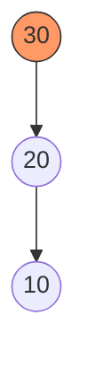
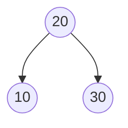
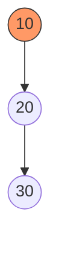

# AVL Tree (Self-Balancing BST)

AVL Tree (Adelson-Velsky and Landis Tree) হলো একটি **Self-Balancing Binary Search Tree**। এটিই কম্পিউটার সায়েন্সের ইতিহাসে আবিষ্কৃত প্রথম সেলফ-ব্যালেন্সিং ট্রি। সাধারণ Binary Search Tree (BST)-তে ডেটা ইনসার্ট বা ডিলিট করার পর ট্রি-টি ভারসাম্যহীন (unbalanced) বা Skewed হয়ে যেতে পারে, যার ফলে সার্চ টাইম O(n) হয়ে যায়। কিন্তু AVL Tree প্রতিটা ইনসারশন বা ডিলিটশন অপারেশনের পর নিজেকে অটোমেটিক্যালি ব্যালেন্স করে নেয়, ফলে এর হাইট সবসময় O(log n) থাকে।

## ১. AVL Tree কেন প্রয়োজন?

সাধারণ BST-তে যদি আমরা ১, ২, ৩, ৪, ৫ এভাবে ক্রমানুসারে ডেটা ইনসার্ট করি, তবে সেটি একটি **Right Skewed Tree** হয়ে যায়, যা দেখতে অনেকটা লিঙ্কড লিস্টের মতো। তখন এর মধ্যে কিছু খুঁজতে গেলে সময় লাগে O(n)।

কিন্তু AVL Tree নিশ্চিত করে যে, ট্রির হাইট সবসময় log n থাকে। তাই এতে **Search/Insert/Delete** অপারেশনের টাইম কমপ্লেক্সিটি সবসময় O(log n)।

## ২. Balance Factor (ব্যালেন্স ফ্যাক্টর)

AVL Tree-র প্রতিটি নোড একটি প্রপার্টি মেনে চলে, যাকে বলা হয় **Balance Factor**।

**Balance Factor = Height of Left Subtree - Height of Right Subtree**

একটি নোডকে তখনই ব্যালেন্সড বলা হবে যদি তার Balance Factor **-1, 0, অথবা 1** হয়। যদি কোনো নোডের ব্যালেন্স ফ্যাক্টর এই রেঞ্জের বাইরে চলে যায় (যেমন 2 বা -2), তবে ট্রি-টি আনব্যালেন্সড হয়ে গেছে এবং **Rotation** এর মাধ্যমে ঠিক করতে হবে।

## ৩. রোটেশন (Rotations)

যখন AVL Tree আনব্যালেন্সড হয়ে যায়, তখন ৪ ধরণের রোটেশনের মাধ্যমে একে ব্যালেন্স করা হয়:

1.  **Left-Left (LL) Case** → Right Rotation
2.  **Right-Right (RR) Case** → Left Rotation
3.  **Left-Right (LR) Case** → Left Rotation then Right Rotation
4.  **Right-Left (RL) Case** → Right Rotation then Left Rotation

### ৩.১ Left-Left (LL) & Right Rotation

যখন আনব্যালেন্সড নোডের **বামের বামে (Left child of Left child)** নতুন নোড যুক্ত হয়।

**সমাধান:** **Right Rotation** করতে হবে।



_চিত্র: ১০ ইনসার্ট করার পর ৩০ নোডটি আনব্যালেন্সড (Balance Factor = 2)।_

**Right Rotate করার পর:**



### ৩.২ Right-Right (RR) & Left Rotation

যখন আনব্যালেন্সড নোডের **ডানের ডানে (Right child of Right child)** নতুন নোড যুক্ত হয়।

**সমাধান:** **Left Rotation** করতে হবে।



_চিত্র: ৩০ ইনসার্ট করার পর ১০ নোডটি আনব্যালেন্সড (Balance Factor = -2)।_

**Left Rotate করার পর:**


### ৩.৩ Left-Right (LR) Case

যখন আনব্যালেন্সড নোডের **বামের ডানে (Right child of Left child)** নতুন নোড যুক্ত হয়।

**সমাধান:** প্রথমে বাম চাইল্ডকে **Left Rotate** করতে হবে, তারপর মূল আনব্যালেন্সড নোডকে **Right Rotate** করতে হবে।

### ৩.৪ Right-Left (RL) Case

যখন আনব্যালেন্সড নোডের **ডানের বামে (Left child of Right child)** নতুন নোড যুক্ত হয়।

**সমাধান:** প্রথমে ডান চাইল্ডকে **Right Rotate** করতে হবে, তারপর মূল আনব্যালেন্সড নোডকে **Left Rotation** করতে হবে।

## ৪. AVL Tree ইমপ্লিমেন্টেশন

নিচে Python এবং Java তে সম্পূর্ণ AVL Tree এর ইমপ্লিমেন্টেশন দেওয়া হলো। এটিতে Insertion, Deletion এবং Traversal দেখানো হয়েছে।

### Python Implementation

```python
class Node:
    def __init__(self, key):
        self.key = key
        self.left = None
        self.right = None
        self.height = 1

class AVLTree:
    def insert(self, root, key):
        # 1. Perform normal BST insertion
        if not root:
            return Node(key)
        elif key < root.key:
            root.left = self.insert(root.left, key)
        else:
            root.right = self.insert(root.right, key)

        # 2. Update height of this ancestor node
        root.height = 1 + max(self.getHeight(root.left), self.getHeight(root.right))

        # 3. Get the balance factor
        balance = self.getBalance(root)

        # 4. If the node is unbalanced, then try out the 4 cases

        # Case 1 - Left Left
        if balance > 1 and key < root.left.key:
            return self.rightRotate(root)

        # Case 2 - Right Right
        if balance < -1 and key > root.right.key:
            return self.leftRotate(root)

        # Case 3 - Left Right
        if balance > 1 and key > root.left.key:
            root.left = self.leftRotate(root.left)
            return self.rightRotate(root)

        # Case 4 - Right Left
        if balance < -1 and key < root.right.key:
            root.right = self.rightRotate(root.right)
            return self.leftRotate(root)

        return root

    def delete(self, root, key):
        # 1. Perform standard BST delete
        if not root:
            return root

        if key < root.key:
            root.left = self.delete(root.left, key)
        elif key > root.key:
            root.right = self.delete(root.right, key)
        else:
            if root.left is None:
                temp = root.right
                root = None
                return temp
            elif root.right is None:
                temp = root.left
                root = None
                return temp

            temp = self.getMinValueNode(root.right)
            root.key = temp.key
            root.right = self.delete(root.right, temp.key)

        if root is None:
            return root

        # 2. Update height
        root.height = 1 + max(self.getHeight(root.left), self.getHeight(root.right))

        # 3. Get balance factor
        balance = self.getBalance(root)

        # 4. Balance the tree
        # Left Left
        if balance > 1 and self.getBalance(root.left) >= 0:
            return self.rightRotate(root)

        # Left Right
        if balance > 1 and self.getBalance(root.left) < 0:
            root.left = self.leftRotate(root.left)
            return self.rightRotate(root)

        # Right Right
        if balance < -1 and self.getBalance(root.right) <= 0:
            return self.leftRotate(root)

        # Right Left
        if balance < -1 and self.getBalance(root.right) > 0:
            root.right = self.rightRotate(root.right)
            return self.leftRotate(root)

        return root

    def leftRotate(self, z):
        y = z.right
        T2 = y.left

        y.left = z
        z.right = T2

        z.height = 1 + max(self.getHeight(z.left), self.getHeight(z.right))
        y.height = 1 + max(self.getHeight(y.left), self.getHeight(y.right))

        return y

    def rightRotate(self, z):
        y = z.left
        T3 = y.right

        y.right = z
        z.left = T3

        z.height = 1 + max(self.getHeight(z.left), self.getHeight(z.right))
        y.height = 1 + max(self.getHeight(y.left), self.getHeight(y.right))

        return y

    def getHeight(self, root):
        if not root:
            return 0
        return root.height

    def getBalance(self, root):
        if not root:
            return 0
        return self.getHeight(root.left) - self.getHeight(root.right)

    def getMinValueNode(self, root):
        if root is None or root.left is None:
            return root
        return self.getMinValueNode(root.left)

    def preOrder(self, root):
        if not root:
            return
        print("{0} ".format(root.key), end="")
        self.preOrder(root.left)
        self.preOrder(root.right)

# Driver Code
tree = AVLTree()
root = None

# Inserting nodes
nums = [10, 20, 30, 40, 50, 25]
for num in nums:
    root = tree.insert(root, num)

print("Preorder traversal of constructed AVL tree is:")
tree.preOrder(root)
print()

# Deleting node
root = tree.delete(root, 10)
print("Preorder traversal after deletion of 10:")
tree.preOrder(root)
print()
```

### Java Implementation

```java
class Node {
    int key, height;
    Node left, right;

    Node(int d) {
        key = d;
        height = 1;
    }
}

class AVLTree {
    Node root;

    // Get height of the node
    int height(Node N) {
        if (N == null)
            return 0;
        return N.height;
    }

    // Get larger of two integers
    int max(int a, int b) {
        return (a > b) ? a : b;
    }

    // Right Rotate
    Node rightRotate(Node y) {
        Node x = y.left;
        Node T2 = x.right;

        // Rotation
        x.right = y;
        y.left = T2;

        // Update heights
        y.height = max(height(y.left), height(y.right)) + 1;
        x.height = max(height(x.left), height(x.right)) + 1;

        return x;
    }

    // Left Rotate
    Node leftRotate(Node x) {
        Node y = x.right;
        Node T2 = y.left;

        // Rotation
        y.left = x;
        x.right = T2;

        // Update heights
        x.height = max(height(x.left), height(x.right)) + 1;
        y.height = max(height(y.left), height(y.right)) + 1;

        return y;
    }

    // Get Balance factor
    int getBalance(Node N) {
        if (N == null)
            return 0;
        return height(N.left) - height(N.right);
    }

    Node insert(Node node, int key) {
        // 1. Normal BST insertion
        if (node == null)
            return (new Node(key));

        if (key < node.key)
            node.left = insert(node.left, key);
        else if (key > node.key)
            node.right = insert(node.right, key);
        else // Duplicate keys not allowed
            return node;

        // 2. Update height
        node.height = 1 + max(height(node.left), height(node.right));

        // 3. Get balance factor
        int balance = getBalance(node);

        // 4. If unbalanced, handle 4 cases

        // Left Left Case
        if (balance > 1 && key < node.left.key)
            return rightRotate(node);

        // Right Right Case
        if (balance < -1 && key > node.right.key)
            return leftRotate(node);

        // Left Right Case
        if (balance > 1 && key > node.left.key) {
            node.left = leftRotate(node.left);
            return rightRotate(node);
        }

        // Right Left Case
        if (balance < -1 && key < node.right.key) {
            node.right = rightRotate(node.right);
            return leftRotate(node);
        }

        return node;
    }

    // Print tree (Preorder)
    void preOrder(Node node) {
        if (node != null) {
            System.out.print(node.key + " ");
            preOrder(node.left);
            preOrder(node.right);
        }
    }

    public static void main(String[] args) {
        AVLTree tree = new AVLTree();

        /* Constructing tree given in the above figure */
        tree.root = tree.insert(tree.root, 10);
        tree.root = tree.insert(tree.root, 20);
        tree.root = tree.insert(tree.root, 30);
        tree.root = tree.insert(tree.root, 40);
        tree.root = tree.insert(tree.root, 50);
        tree.root = tree.insert(tree.root, 25);

        /* The constructed AVL Tree would be
             30
            /  \
          20   40
         /  \     \
        10  25    50
        */
        System.out.println("Preorder traversal of constructed tree is : ");
        tree.preOrder(tree.root);
    }
}
```

## ৫. টাইম কমপ্লেক্সিটি (Time Complexity)

| অপারেশন    | টাইম কমপ্লেক্সিটি |
| :--------- | :---------------- |
| **Search** | O(log n)          |
| **Insert** | O(log n)          |
| **Delete** | O(log n)          |
| **Space**  | O(n)              |

যেহেতু AVL Tree সবসময় ব্যালেন্সড থাকে, তাই এর হাইট কখনোই log n এর বেশি হয় না।

## ৬. ব্যবহার (Applications)

1.  **Database Indexing:** যেখানে ফ্রিকুয়েন্ট সার্চিং প্রয়োজন কিন্তু ইনসারশন/ডিলিটশন কম হয়।
2.  **Sets and Maps:** অনেক প্রোগ্রামিং ল্যাঙ্গুয়েজের (যেমন C++ এর `std::set`, `std::map`) ইমপ্লিমেন্টেশনে ভারসাম্যপূর্ণ ট্রি ব্যবহার করা হয় (যদিও এখন Red-Black Tree বেশি জনপ্রিয়)।
3.  **In-Memory Databases:** দ্রুত ডেটা রিট্রিভালের জন্য।

> [!TIP]
> **AVL Tree vs Red-Black Tree:** AVL Tree অনেক বেশি স্ট্রিক্টলি ব্যালেন্সড, তাই সার্চিং ফাস্ট। কিন্তু Red-Black Tree-তে রোটেশন কম হয়, তাই ইনসারশন/ডিলিটশন ফাস্ট। সাধারণত লাইব্রেরি ফাংশনে Red-Black Tree বেশি ব্যবহার করা হয়।
