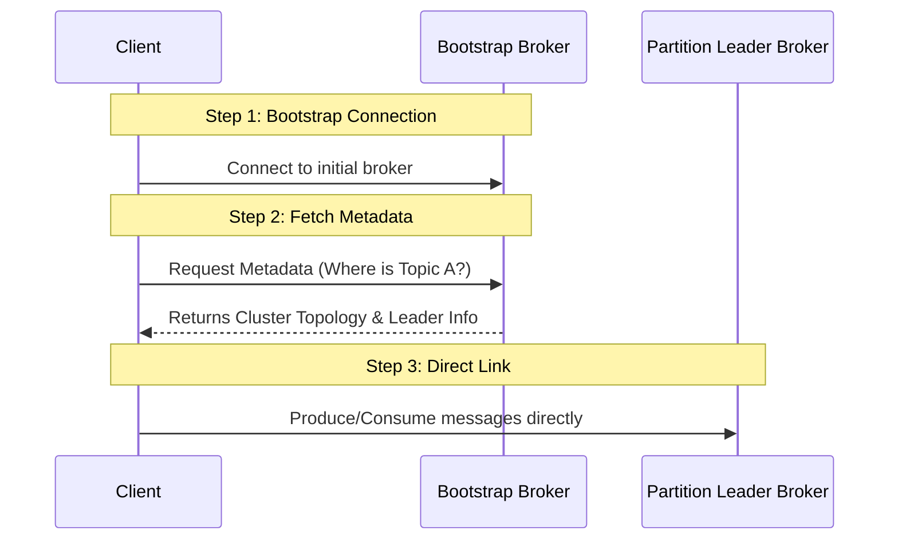

# মডিউল ৬: ক্লায়েন্ট - সার্ভার আর্কিটেকচার (Client - Server Architecture)

কাফকা একটি ডিস্ট্রিবিউটেড সিস্টেম হিসেবে কাজ করে যেখানে ক্লায়েন্ট এবং সার্ভারের মধ্যে একটি নির্দিষ্ট প্রটোকল মেনে যোগাযোগ হয়। এই মডিউলে আমরা দেখব কিভাবে এই আর্কিটেকচারটি কাজ করে।

## ১. কাফকা সার্ভার (Kafka Server / Broker)

কাফকা সার্ভার বা **Broker** হলো সেই অংশ যা ডেটা গ্রহণ করে, স্টোর করে এবং পরবর্তীতে কনজিউমারকে প্রদান করে।

- **Cluster**: অনেকগুলো ব্রোকার মিলে একটি কাফকা ক্লাস্টার তৈরি করে।
- **Storage**: ব্রোকার ফাইল সিস্টেমে ডেটা পার্মানেন্টলি সেভ করে রাখে।
- **State**: প্রতিটি ব্রোকার জানে ক্লাস্টারের অন্যান্য ব্রোকারগুলো কোথায় এবং সচল আছে কি না।

## ২. কাফকা ক্লায়েন্ট (Kafka Client)

কাফকা ক্লায়েন্ট মূলত দুই ধরনের হয়:

- **Producers**: যারা টপিকে মেসেজ পাঠায়।
- **Consumers**: যারা টপিক থেকে মেসেজ পড়ে।
  ক্লায়েন্টগুলো সাধারণত লাইব্রেরি (যেমন `kafkajs`, `aiokafka`, `spring-kafka`) ব্যবহার করে কাফকার সাথে যুক্ত হয়।

---

## ৩. ক্লায়েন্ট কিভাবে ক্লাস্টারের সাথে কানেক্ট হয়? (How Client Connects)

কাফকার সবচেয়ে ইন্টারেস্টিং বিষয় হলো, ক্লায়েন্ট কিভাবে জানে কোন ব্রোকারে ডেটা পাঠাতে হবে? এই প্রক্রিয়াটি ৩টি ধাপে সম্পন্ন হয়।

### ধাপ ১: বুটস্ট্র্যাপ সার্ভার (Bootstrap Servers)

ক্লায়েন্ট যখন স্টার্ট হয়, তখন তাকে ক্লাস্টারের সব ব্রোকারের অ্যাড্রেস দেওয়ার প্রয়োজন হয় না। সে শুধুমাত্র ১ বা ২ টি ব্রোকারের অ্যাড্রেস দিলেই কানেক্ট হতে পারে। একে বলা হয় **Bootstrap Servers**। এটি শুধুমাত্র ক্লাস্টারের সাথে প্রাথমিক যোগাযোগের গেটওয়ে হিসেবে কাজ করে।

### ধাপ ২: মেটাডেটা রিকোয়েস্ট (Metadata Request)

কানেক্ট হওয়ার পর ক্লায়েন্ট সেই ব্রোকারের কাছে একটি "Metadata Request" পাঠায়। এই রিকোয়েস্টের মাধ্যমে ক্লায়েন্ট জানতে পারে:

- ক্লাস্টারে কতগুলো ব্রোকার আছে।
- প্রতিটি টপিক কোন কোন ব্রোকারে (Partition Leader) আছে।

### ধাপ ৩: সরাসরি কানেকশন (Direct Connection)

মেটাডেটা পাওয়ার পর ক্লায়েন্ট আর বুটস্ট্র্যাপ সার্ভারের ওপর নির্ভর করে না। সে সরাসরি সেই ব্রোকারের সাথে কানেক্ট হয় যেখানে তার কাঙ্ক্ষিত টপিক বা পার্টীশনটি রয়েছে।

## গুরুত্বপূর্ণ পয়েন্ট:

- **Dynamic Awareness**: যদি ক্লাস্টারে নতুন কোনো ব্রোকার যোগ হয় বা কোনো ব্রোকার ডাউন হয়, কাফকা ক্লায়েন্ট মেটাডেটা আপডেট করার মাধ্যমে স্বয়ংক্রিয়ভাবে তা বুঝতে পারে।
- **Leader vs Replica**: প্রডিউসার সবসময় **Leader** পার্টীশনে ডেটা পাঠায়। রিপ্লিকাগুলো শুধুমাত্র ব্যাকআপ হিসেবে কাজ করে।

---

> [!TIP]
> কনফিগারেশনে ১টির বেশি বুটস্ট্র্যাপ সার্ভার দেওয়া ভালো। যদি একটি ব্রোকার ডাউন থাকে, তবে ক্লায়েন্ট অন্যটির মাধ্যমে মেটাডেটা সংগ্রহ করতে পারবে।
