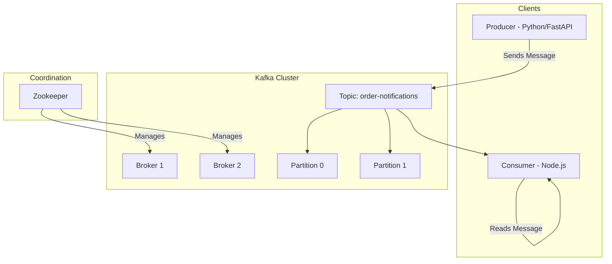

# মডিউল ২: কাফকা কম্পোনেন্ট (Kafka Components - Theory)

কাফকা কিভাবে কাজ করে তা বোঝার জন্য এর প্রধান কম্পোনেন্ট বা অংশগুলো সম্পর্কে জানা খুবই জরুরি। এই মডিউলে আমরা গুরুত্বপূর্ণ ৭টি কম্পোনেন্ট নিয়ে আলোচনা করব।

## ১. ব্রোকার (Broker)

পুরো কাফকা ক্লাস্টারের প্রতিটি সার্ভারকে একেকটি **Broker** বলা হয়। এটি মূলত একটি মেসেজ স্টোরেজ ইঞ্জিন হিসেবে কাজ করে।

- একটি ক্লাস্টারে অনেকগুলো ব্রোকার থাকতে পারে।
- ব্রোকাররা একে অপরের সাথে যোগাযোগ করে ডেটা শেয়ার করে।

## ২. জু-কিপার (Zookeeper)

জু-কিপার হলো কাফকা ক্লাস্টারের 'ম্যানেজার' বা 'কো-অর্ডিনেটর'।

- এটি ব্রোকারদের লিস্ট মেনটেইন করে।
- কোন টপিক কোন ব্রোকারে আছে এবং কোন ব্রোকার সচল আছে তা ট্রাক করে।
  > [!NOTE]
  > আধুনিক কাফকা ভার্সনে (KRaft mode) জু-কিপারের প্রয়োজনীয়তা আস্তে আস্তে কমে আসছে, তবে এখনো অনেক জায়গায় এটি ব্যবহৃত হয়।

## ৩. টপিক (Topics)

কাফকায় ডেটাগুলো যে নামে বা ক্যাটাগরিতে সেভ করা হয় তাকে **Topic** বলে। যেমন: `user-logs`, `order-details` ইত্যাদি।

## ৪. পার্টীশন (Partition)

একটি টপিককে অনেকগুলো ছোট ছোট অংশে ভাগ করা হয়, যাকে **Partition** বলে।

- পার্টীশনের মাধ্যমে আপনি সমান্তরালভাবে (Parallel) ডেটা রিড এবং রাইট করতে পারেন।
- ডেটা সবসময় পার্টীশনের শেষে যুক্ত হয় (Append-only)।

## ৫. রেপ্লিকেশন (Replication)

ডেটার নিরাপত্তা নিশ্চিত করতে প্রতিটি পার্টীশনের একাধিক কপি বা ব্যাকআপ অন্য ব্রোকারে রাখা হয়। একেই **Replication** বলে। এর ফলে একটি ব্রোকার ডাউন হলেও ডেটা হারিয়ে যায় না।

## ৬. প্রডিউসার (Producer)

যে অ্যাপ্লিকেশন বা সার্ভিস কাফকা টপিকে মেসেজ পাঠায় তাকে **Producer** বলে।

### Python (FastAPI) উদাহরণ:

এখানে আমরা একটি FastAPI সার্ভিস থেকে কাফকায় মেসেজ পাঠাব।

```python
# requirements: pip install aiokafka fastapi
from fastapi import FastAPI
from aiokafka import AIOKafkaProducer
import json
import asyncio

app = FastAPI()
LOOP = asyncio.get_event_loop()
KAFKA_SERVER = "localhost:9092"
TOPIC = "order-notifications"

@app.on_event("startup")
async def startup_event():
    global producer
    producer = AIOKafkaProducer(
        loop=LOOP, bootstrap_servers=KAFKA_SERVER,
        value_serializer=lambda v: json.dumps(v).encode('utf-8')
    )
    await producer.start()

@app.post("/send-order/")
async def send_order(order_id: int):
    data = {"order_id": order_id, "status": "processed"}
    await producer.send_and_wait(TOPIC, data)
    return {"message": "Order sent to Kafka!"}
```

## ৭. কনজিউমার (Consumer)

যে অ্যাপ্লিকেশন কাফকা টপিক থেকে মেসেজ পড়ে এবং সেটি প্রসেস করে তাকে **Consumer** বলে।

### Node.js (KafkaJS) উদাহরণ:

এখানে আমরা একটি Node.js সার্ভিস ব্যবহার করব যা উপরের পাঠানো অর্ডার মেসেজগুলো গ্রহণ করবে।

```javascript
// requirements: npm install kafkajs
const { Kafka } = require("kafkajs");

const kafka = new Kafka({
  clientId: "my-app",
  brokers: ["localhost:9092"],
});

const consumer = kafka.consumer({ groupId: "order-group" });

const run = async () => {
  await consumer.connect();
  await consumer.subscribe({
    topic: "order-notifications",
    fromBeginning: true,
  });

  await consumer.run({
    eachMessage: async ({ topic, partition, message }) => {
      const data = JSON.parse(message.value.toString());
      console.log(
        `অর্ডার পাওয়া গেছে: ${data.order_id}, স্ট্যাটাস: ${data.status}`,
      );
    },
  });
};

run().catch(console.error);
```

---

## কম্পোনেন্টগুলোর মধ্যে সম্পর্ক (Architecture Diagram)



> [!TIP]
> রিয়েল-টাইম প্রজেক্টে সাধারণত ব্যাকএন্ড সার্ভিস (যেমন Python বা Node.js) প্রডিউসার হিসেবে কাজ করে এবং ডেটাবেস সিঙ্ক বা ইমেইল সার্ভিস কনজিউমার হিসেবে কাজ করে।
