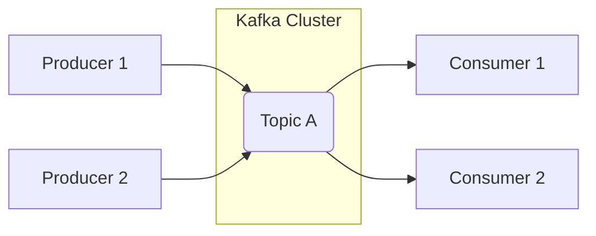

# মডিউল ১: কাফকা পরিচিতি (Introduction to Kafka)

এই মডিউলে আমরা অ্যাপাচি কাফকার বেসিক কনসেপ্ট, এর গুরুত্ব এবং এটি কিভাবে কাজ করে তা জানব।

## অ্যাপাচি কাফকা কী? (What is Apache Kafka?)

**Apache Kafka** হলো একটি **Distributed Event Store** এবং **Stream-Processing Platform**। এটি মূলত হাই-পারফরম্যান্স ডেটা পাইপলাইন, স্ট্রিমিং অ্যানালিটিক্স এবং ডেটা ইন্টিগ্রেশনের জন্য ব্যবহৃত হয়।

সহজ ভাষায় বলতে গেলে, কাফকা হলো একটি বিশাল পাইপলাইনের মতো যেখানে একদিক থেকে ডেটা পাঠানো হয় এবং অন্যদিকে সেই ডেটা রিয়েল-টাইমে প্রসেস করা হয়।

### রিয়েল-লাইফ উদাহরণ: Uber (উবার)

উবারে যখন আপনি রাইড খুঁজতে থাকেন, তখন আপনার লোকেশন প্রতি সেকেন্ডে উবারের সার্ভারে পাঠানো হয়। এই লক্ষ লক্ষ মানুষের লোকেশন ডেটা কাফকা গ্রহণ করে এবং রিয়েল-টাইমে প্রসেস করে আপনার আশেপাশে থাকা ড্রাইভারকে খুঁজে দেয়।

## কাফকার বৈশিষ্ট্য এবং টার্মিনোলজি (Features & Terminologies)

১. **Distributed (ডিস্ট্রিবিউটেড):** কাফকা অনেকগুলো সার্ভারে ছড়িয়ে থাকে, তাই এটি অনেক বেশি ভরসাযোগ্য।
২. **Fault-Tolerant (ফল্ট-টলারেন্ট):** যদি একটি সার্ভার নষ্ট হয়ে যায়, তবুও ডেটা হারাবে না কারণ অন্য সার্ভারে ডেটার কপি থাকে।
৩. **Scalability (স্কেলেবিলিটি):** খুব সহজেই নতুন সার্ভার যুক্ত করে এর ক্ষমতা বাড়ানো যায়।
৪. **High Throughput (হাই থ্রুপুট):** কাফকা সেকেন্ডে লক্ষ লক্ষ ডেটা হ্যান্ডেল করতে পারে।

### গুরুত্বপূর্ণ টার্মসমূহ:

- **Producer (প্রডিউসার):** যে ডেটা তৈরি করে এবং কাফকায় পাঠায় (যেমন: একটি অ্যাপ বা সেন্সর)।
- **Consumer (কনজিউমার):** যে কাফকা থেকে ডেটা গ্রহণ করে বা পড়ে।
- **Topic (টপিক):** যেখানে ডেটাগুলো ক্যাটাগরি অনুযায়ী জমা থাকে।
- **Broker (ব্রোকার):** কাফকা ক্লাস্টারের প্রতিটি সার্ভারকে ব্রোকার বলা হয়।

## কাফকা আর্কিটেকচার (High-level Kafka Architecture)

কাফকা মূলত একটি **Pub-Sub (Publish-Subscribe)** মডেলে কাজ করে।

১. **Producers** ডেটা 'Publish' করে নির্দিষ্ট একটি 'Topic'-এ।
২. **Kafka Cluster** সেই ডেটা স্টোর করে।
৩. **Consumers** সেই 'Topic'-এ 'Subscribe' করে এবং ডেটাগুলো নিয়ে প্রসেস করে।

## রিয়েল-লাইফ কেস স্টাডি (Real-life Kafka Case Studies)

### ১. LinkedIn (লিঙ্কডইন)

কাফকা আসলে লিঙ্কডইন-এই তৈরি হয়েছিল। তারা এটি ব্যবহার করে ইউজার অ্যাক্টিভিটি ট্রাক করতে (যেমন: কে কার প্রোফাইল দেখছে, কোন পোস্টে ক্লিক করছে)। এই রিয়েল-টাইম ডেটা ব্যবহার করে তারা আমাদের নিউজফিড কাস্টমাইজ করে।

### ২. Netflix (নেটফ্লিক্স)

নেটফ্লিক্স তাদের ভিডিও স্ট্রিমিংয়ের রিয়েল-টাইম মনিটরিংয়ের জন্য কাফকা ব্যবহার করে। আপনি যখন ভিডিও দেখেন এবং মাঝপথে বন্ধ করেন, এই সব ইভেন্ট কাফকায় যায় এবং পরবর্তীতে আপনাকে রিকমেন্ডেশন দিতে সাহায্য করে।

### ৩. ব্যাংক ট্রানজ্যাকশন ফ্রড ডিটেকশন

ব্যাংকিং সিস্টেমে প্রতিটি লেনদেনের ডেটা সাথে সাথে কাফকায় পাঠানো হয়। একটি স্ট্রিম-প্রসেসিং ইঞ্জিন সেই ডেটা চেক করে দেখে যে এটি কোনো ফ্রড (Fraud) ট্রানজ্যাকশন কি না। যদি হয়, তবে সাথে সাথে সেটি ব্লক করে দেওয়া সম্ভব হয়।

---

> [!NOTE]
> কাফকা শুধুমাত্র একটি মেসেজ কিউ নয়, এটি একটি সম্পূর্ণ ইভেন্ট স্ট্রিমিং প্ল্যাটফর্ম যা ডেটাকে পার্মানেন্টলি স্টোর করতে পারে।
