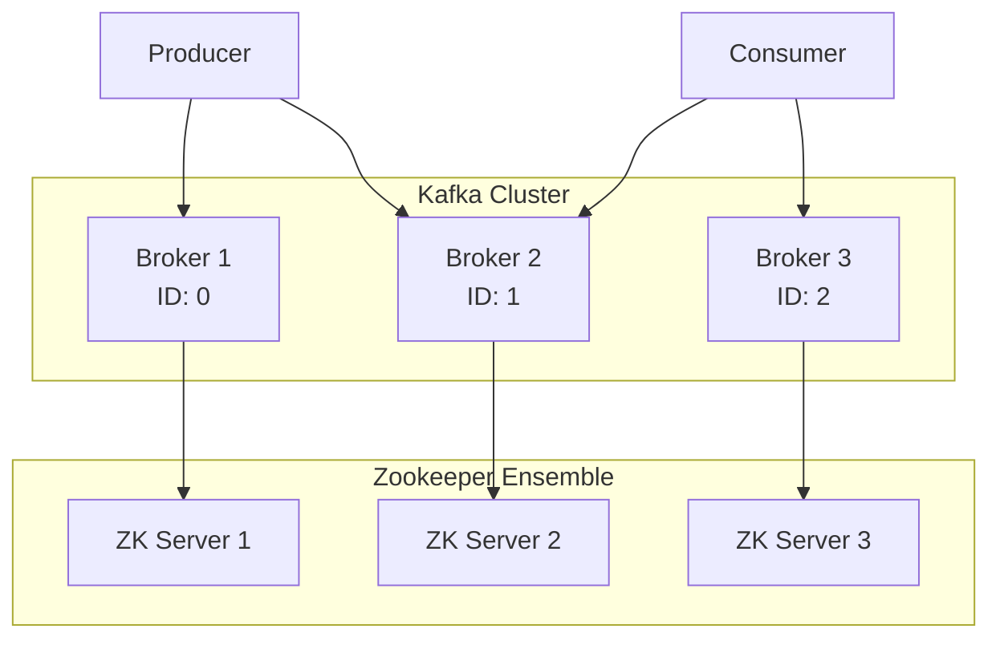

# মডিউল ১০: কাফকা মাল্টি নোড ক্লাস্টার সেটআপ

প্রোডাকশন এনভায়রনমেন্টে কাফকা সবসময় একাধিক সার্ভারে (Multi-node) চালানো হয় যাতে হাই-অ্যাভেইল্যাবিলিটি এবং ফল্ট-টলারেন্স নিশ্চিত করা যায়। এই মডিউলে আমরা জু-কিপার কোরাম এবং কাফকা ব্রোকার ক্লাস্টার সেটআপ করার পদ্ধতি শিখব।

---

## পার্ট ১: জু-কিপার কোরাম সেটআপ (Zookeeper Quorum Setup)

### জু-কিপার কী? (What is Zookeeper?)

**Apache ZooKeeper** হলো একটি ডিস্ট্রিবিউটেড কো-অর্ডিনেশন সার্ভিস যা ডিস্ট্রিবিউটেড সিস্টেমগুলোর জন্য কনফিগারেশন ম্যানেজমেন্ট, নেমিং, সিনক্রোনাইজেশন এবং গ্রুপ সার্ভিস প্রদান করে।

সহজ ভাষায়, জু-কিপার হলো একটি "ম্যানেজার" যা কাফকা ক্লাস্টারের সব ব্রোকারদের ট্র্যাক রাখে এবং তাদের মধ্যে সমন্বয় করে।

### কাফকা ক্লাস্টারে জু-কিপারের ভূমিকা (Zookeeper Role in Kafka Cluster)

জু-কিপার কাফকা ক্লাস্টারে নিচের কাজগুলো করে:

- **Broker Registration**: কোন ব্রোকার সচল আছে এবং কোনটি ডাউন তা ট্র্যাক করে।
- **Leader Election**: যদি কোনো পার্টীশনের লিডার ব্রোকার ডাউন হয়ে যায়, তবে জু-কিপার নতুন লিডার নির্বাচন করে।
- **Metadata Storage**: টপিক, পার্টীশন এবং কনফিগারেশন সংক্রান্ত মেটাডেটা স্টোর করে।
- **Consumer Group Coordination**: কনজিউমার গ্রুপের অফসেট ম্যানেজমেন্ট (পুরনো ভার্সনে)।

> [!NOTE]
> আধুনিক কাফকা ভার্সনে (KRaft mode) জু-কিপারের প্রয়োজনীয়তা ধীরে ধীরে কমছে, তবে এখনো বেশিরভাগ প্রোডাকশন সিস্টেমে এটি ব্যবহৃত হয়।

### জু-কিপার কোরাম সাইজিং (Zookeeper Quorum Sizing)

জু-কিপার সবসময় **বিজোড় সংখ্যায়** (Odd number) চালানো উচিত। কারণ জু-কিপার **Majority Voting** সিস্টেম ব্যবহার করে।

- **১টি জু-কিপার**: শুধুমাত্র ডেভেলপমেন্ট/টেস্টিং এর জন্য। কোনো ফল্ট-টলারেন্স নেই।
- **৩টি জু-কিপার**: সবচেয়ে কমন প্রোডাকশন সেটআপ। ১টি ডাউন হলেও সিস্টেম চলতে থাকে।
- **৫টি জু-কিপার**: বড় এন্টারপ্রাইজ সেটআপ। ২টি ডাউন হলেও সিস্টেম চলতে থাকে।

**ফর্মুলা**: `(N/2) + 1` টি জু-কিপার সচল থাকলে ক্লাস্টার কাজ করবে।

### জু-কিপার কনফিগারেশন (Zookeeper Configuration)

প্রতিটি জু-কিপার সার্ভারের জন্য `zoo.cfg` ফাইলে নিচের কনফিগারেশন করতে হবে:

```properties
# Data directory
dataDir=/var/lib/zookeeper

# Client port
clientPort=2181

# Cluster configuration (for 3-node setup)
server.1=zk1.example.com:2888:3888
server.2=zk2.example.com:2888:3888
server.3=zk3.example.com:2888:3888
```

প্রতিটি সার্ভারে `dataDir`-এ একটি `myid` ফাইল তৈরি করতে হবে যেখানে সার্ভার নম্বর লেখা থাকবে (১, ২, বা ৩)।

---

## পার্ট ২: ব্রোকার ক্লাস্টার সেটআপ (Broker Cluster Setup)

### পরিচিতি এবং আর্কিটেকচার (Introduction and Architecture)

একটি কাফকা ক্লাস্টারে একাধিক ব্রোকার থাকে যারা একসাথে কাজ করে। প্রতিটি ব্রোকারের একটি ইউনিক `broker.id` থাকে।



### কাফকা ক্লাস্টার সাইজ আলোচনা (Kafka Cluster Size Discussion)

ক্লাস্টারের সাইজ নির্ভর করে:

- **Throughput**: কত মেসেজ প্রতি সেকেন্ডে হ্যান্ডেল করতে হবে।
- **Replication Factor**: সাধারণত ৩ রাখা হয়, তাই কমপক্ষে ৩টি ব্রোকার প্রয়োজন।
- **Fault Tolerance**: কয়টি ব্রোকার ডাউন হলেও সিস্টেম চলবে।

**সাধারণ সেটআপ**:

- **Small**: ৩ ব্রোকার (মিনিমাম প্রোডাকশন)
- **Medium**: ৫-৭ ব্রোকার
- **Large**: ১০+ ব্রোকার

### কাফকা কনফিগারেশন (Kafka Configuration)

প্রতিটি ব্রোকারের `server.properties` ফাইলে:

```properties
# Unique broker ID for each server
broker.id=0  # Change to 1, 2, 3 for other brokers

# Zookeeper connection
zookeeper.connect=zk1.example.com:2181,zk2.example.com:2181,zk3.example.com:2181

# Listeners
listeners=PLAINTEXT://broker1.example.com:9092

# Log directories
log.dirs=/var/lib/kafka-logs

# Replication settings
default.replication.factor=3
min.insync.replicas=2
```

### কাফকা মাল্টি-ব্রোকার সেটআপ (Kafka Multi-broker Setup)

**ধাপ ১**: প্রতিটি সার্ভারে কাফকা ইন্সটল করুন (মডিউল ৩ অনুসরণ করুন)।

**ধাপ ২**: প্রতিটি ব্রোকারের জন্য আলাদা `broker.id` সেট করুন।

**ধাপ ৩**: সব ব্রোকারে একই `zookeeper.connect` স্ট্রিং ব্যবহার করুন।

**ধাপ ৪**: প্রতিটি ব্রোকার স্টার্ট করুন:

```bash
bin/kafka-server-start.sh config/server.properties
```

**ধাপ ৫**: ক্লাস্টার যাচাই করুন:

```bash
# Check broker list
bin/zookeeper-shell.sh localhost:2181 ls /brokers/ids
```

---

> [!IMPORTANT]
> মাল্টি-নোড ক্লাস্টার সেটআপে নেটওয়ার্ক কনফিগারেশন অত্যন্ত গুরুত্বপূর্ণ। সব সার্ভার যেন একে অপরের সাথে যোগাযোগ করতে পারে তা নিশ্চিত করুন।

> [!TIP]
> প্রোডাকশনে সবসময় `replication.factor=3` এবং `min.insync.replicas=2` ব্যবহার করুন যাতে ডেটা লস না হয়।
