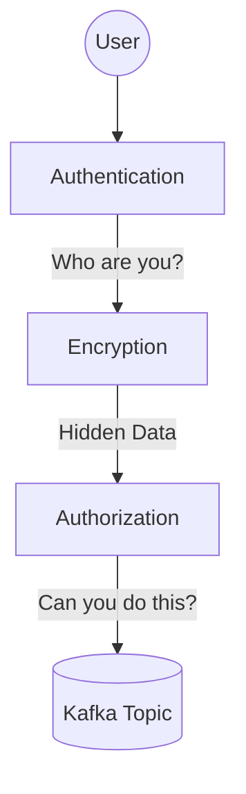

# মডিউল ৯: কাফকা সিকিউরিটি (Kafka Security)

এন্টারপ্রাইজ লেভেলে কাফকা ব্যবহার করার সময় ডেটার নিরাপত্তা নিশ্চিত করা অত্যন্ত জরুরি। এই মডিউলে আমরা কাফকা সিকিউরিটির ৩টি প্রধান স্তম্ভ (Pillars) নিয়ে আলোচনা করব।

---

## ১. এনক্রিপশন - SSL/TLS (Encryption)

এনক্রিপশন নিশ্চিত করে যে নেটওয়ার্কের মাধ্যমে আদান-প্রদান করা ডেটা কেউ মাঝপথে চুরি করতে পারবে না (Encryption in transit)।

- **SSL/TLS**: কাফকা ক্লায়েন্ট এবং ব্রোকারের মধ্যে যোগাযোগ এনক্রিপ্ট করার জন্য SSL বা TLS ব্যবহার করা হয়।
- **Setup Concept**:
  ১. **Certificate Authority (CA)** তৈরি করা।
  ২. প্রতিটি ব্রোকারের জন্য **Keystore** এবং **Truststore** তৈরি করা।
  ৩. ব্রোকারের `server.properties` ফাইলে SSL কনফিগারেশন যোগ করা।

---

## ২. অথেনটিকেশন (Authentication)

অথেনটিকেশন নিশ্চিত করে যে শুধুমাত্র বৈধ ব্যবহারকারী বা অ্যাপ্লিকেশনই কাফকা ক্লাস্টারের সাথে কানেক্ট হতে পারবে।

কাফকায় জনপ্রিয় অথেনটিকেশন পদ্ধতিগুলো হলো:

- **SSL Client Authentication**: ক্লায়েন্টকেও ব্রোকারের কাছে একটি সার্টিফিকেট প্রদান করতে হয়।
- **SASL/PLAIN**: ইউজারনেম এবং পাসওয়ার্ড ভিত্তিক সহজ অথেনটিকেশন।
- **SASL/SCRAM**: ইউজারনেম এবং পাসওয়ার্ড দিয়ে অধিকতর সুরক্ষিত পদ্ধতি।
- **SASL/GSSAPI (Kerberos)**: বড় এন্টারপ্রাইজে ডিরেক্টরি সার্ভিসের মাধ্যমে অথেনটিকেশন।

---

## ৩. অথোরাইজেশন - ACL (Authorization)

অথেনটিকেটেড হওয়ার পর কোনো একজন ইউজার কোন কাজ করতে পারবে (যেমন: ডেটা রিড করা নাকি রাইট করা)—এটি নির্ধারণ করে **ACL (Access Control Lists)**।

কমান্ড লাইনের মাধ্যমে ACL সেট করা হয়:

### প্রডিউসারকে রাইট করার অনুমতি দেওয়া:

`alice` নামের ইউজারকে `my-topic`-এ রাইট করার পারমিশন দিতে নিচের কমান্ডটি ব্যবহার করা হয়:

```bash
bin/kafka-acls.sh --bootstrap-server localhost:9092 \
--add --allow-principal User:alice \
--operation Write --topic my-topic
```

### কনজিউমারকে রিড করার অনুমতি দেওয়া:

`bob` নামের ইউজারকে `my-topic`-এ রিড করার পারমিশন দিতে:

```bash
bin/kafka-acls.sh --bootstrap-server localhost:9092 \
--add --allow-principal User:bob \
--operation Read --topic my-topic \
--group my-group
```

---

## সিকিউরিটি লেয়ারের সারাংশ



> [!CAUTION]
> ডিফল্টভাবে কাফকা কোনো সিকিউরিটি ছাড়াই রান হয়। প্রোডাকশনে অবশ্যই এনক্রিপশন এবং অথেনটিকেশন চালু রাখা উচিত।

> [!IMPORTANT]
> যদি আপনি `auto.create.topics.enable=true` রাখেন, তবে যে কেউ আপনার সিস্টেমে টপিক তৈরি করে ফেলতে পারে। সিকিউরিটি নিশ্চিত করতে এটি `false` রাখা রি-কমেন্ডেড।
