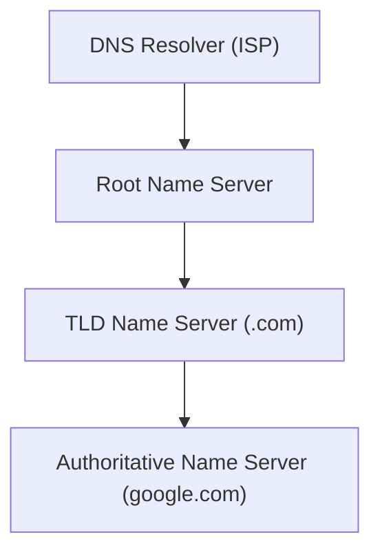

# DNS Basics: The Phonebook of the Internet (ডিএনএস এর মূল ধারণা)

আমরা যখন ব্রাউজারে `google.com` লিখি, তখন কম্পিউটার আসলে জানে না এটি কোথায়। কম্পিউটার বোঝে শুধু আইপি অ্যাড্রেস (যেমন: `172.217.166.110`)। মানুষের জন্য আইপি মনে রাখা কঠিন, তাই **DNS (Domain Name System)** তৈরি করা হয়েছে। ডিএনএস নামের বিপরীতে আইপি খুঁজে বের করে দেয়।

---

## ১. ডোমেইন নামের গঠন (Domain Name Structure)
একটি ডোমেইন নাম মূলত কয়েকটি অংশে বিভক্ত থাকে:
- **Root Domain:** ডোমেইনের একদম শেষের ডট (.) যা আমরা সাধারণত দেখি না।
- **TLD (Top-Level Domain):** ডোমেইনের এক্সটেনশন যেমন: `.com`, `.org`, `.gov`, `.io`।
- **Domain Name:** আপনার কেনা মূল নামটি (যেমন: `google`)।
- **Sub-domain:** মূল নামের আগের অংশ (যেমন: `blog.google.com` এ `blog` হলো সাব-ডোমেইন)।

---

## ২. ডিএনএস হায়ারার্কি (DNS Hierarchy)
ডিএনএস একটি ডিস্ট্রিবিউটেড সিস্টেম হিসেবে কাজ করে। এর প্রধান ৪টি ধাপ হলো:

1.  **DNS Resolver:** আপনার পিসি বা পকেটের আইএসপি যেখানে প্রথম রিকোয়েস্টটি পাঠায়।
2.  **Root Name Server:** এটি সরাসরি আইপি জানে না, তবে সে জানে ডট কম সার্ভার কোথায় আছে।
3.  **TLD Name Server:** এটি জানে ডোমেইন রেজিস্টারের ইনফরমেশন।
4.  **Authoritative Name Server:** এটিই সেই সার্ভার যা শেষ পর্যন্ত আপনার ডোমেইনের প্রকৃত আইপি অ্যাড্রেস বা রেকর্ড জানে।

---

## ৩. ডিএনএস কুয়েরি প্রসেস (Query Process)
আপনি যখন `learn.com` এ যান, তখন যা ঘটে:
1.  আপনার ব্রাউজার তার **Cache** চেক করে।
2.  না থাকলে সে **DNS Resolver** (আপনার ইন্টারনেট প্রোভাইডার) কে জিজ্ঞাসা করে।
3.  রিজলভার তখন পর্যায়ক্রমে **Root**, **TLD** এবং সবশেষে **Authoritative** সার্ভার থেকে আইপি খুঁজে বের করে আনে।
4.  আইপি পাওয়া গেলে আপনার ব্রাউজার ওয়েবসাইটটি লোড করে।

---

## ৪. ডিএনএস রেকর্ডের প্রকারভেদ (Common Records)

| রেকর্ড টাইপ | বর্ণনা (Description) |
| :--- | :--- |
| **A (Address)** | ডোমেইন নামকে **IPv4** আইপিতে রূপান্তর করে। |
| **AAAA** | ডোমেইন নামকে **IPv6** আইপিতে রূপান্তর করে। |
| **CNAME** | এক ডোমেইন থেকে অন্য ডোমেইনে রিডাইরেক্ট করে (Alias)। |
| **MX (Mail Exchange)** | ইমেইল কোন সার্ভারে যাবে তা নির্ধারণ করে। |
| **NS (Name Server)** | ডোমেইনের অথরিটেটিভ নেম সার্ভার নির্ধারণ করে। |
| **PTR (Pointer)** | আইপি থেকে ডোমেইন নাম খুঁজে বের করার জন্য (Reverse Lookup)। |

---

## ৫. প্রাইমারি বনাম সেকেন্ডারি ডিএনএস
- **Primary DNS:** যেখানে ডোমেইনের সব ডাটা অরিজিনাল ফাইলে সেভ থাকে।
- **Secondary DNS:** এটি প্রাইমারি সার্ভারের ব্যাকআপ বা কপি হিসেবে কাজ করে ডাটা ডিস্ট্রিবিউট বা ব্যাকআপ রাখার জন্য।

---

## ৬. ডেভঅপস পারসপেক্টিভ: TTL ও প্রোপ্যাগেশন (Propagation)
- **TTL (Time to Live):** এটি সেকেন্ডে প্রকাশ করা হয়। একটি ডিএনএস রেকর্ড কতক্ষণ ক্যাশ-এ থাকবে তা এটি নির্ধারণ করে। যদি আপনি আইপি পরিবর্তন করেন, তবে কম TTL দিলে দ্রুত পরিবর্তন কার্যকর হয়।
- **Propagation:** ডিএনএস পরিবর্তন করার পর পৃথিবীর সব সার্ভারে তা ছড়িয়ে পড়তে ২৪-৪৮ ঘণ্টা সময় লাগতে পারে। একেই প্রোপ্যাগেশন বলে।
- **Monitoring Tools:** ডিএনএস রেকর্ড চেক করার জন্য `nslookup`, `dig` বা `gwhois` ব্যবহার করুন।

---

::: tip মনে রাখুন!
ডিএনএস হলো ইন্টারনেটের অদৃশ্য হিরো। এটি ছাড়া আধুনিক ইন্টারনেট ব্যবহার করা অসম্ভব হতো। 
:::
