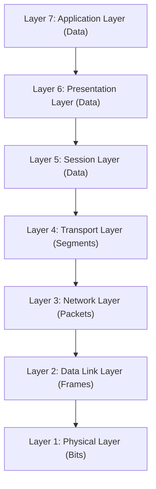

# OSI Model: Deep-Dive (ওএসআই মডেল বিস্তারিত)

**OSI (Open Systems Interconnection)** মডেল হলো নেটওয়ার্কিংয়ের সবচেয়ে গুরুত্বপূর্ণ এবং মৌলিক কনসেপ্ট। ১৯৭০-এর দশকের শেষদিকে **ISO (International Organization for Standardization)** এই মডেলটি তৈরি করে যাতে ভিন্ন ভিন্ন কোম্পানির হার্ডওয়্যার এবং সফটওয়্যার একে অপরের সাথে নির্বিঘ্নে যোগাযোগ করতে পারে।

---

## ১. ওএসআই মডেল কি এবং কেন গুরুত্বপূর্ণ?
ওএসআই মডেল কোনো ফিজিক্যাল হার্ডওয়্যার নয়, বরং এটি একটি **লজিক্যাল ফ্রেমওয়ার্ক** যা বর্ণনা করে কীভাবে ডাটা এক কম্পিউটার থেকে অন্য কম্পিউটারে নেটওয়ার্কের মাধ্যমে পৌঁছায়।

**কেন গুরুত্বপূর্ণ?**
- **Troubleshooting:** নেটওয়ার্কের সমস্যা ঠিক কোন লেয়ারে হচ্ছে তা দ্রুত শনাক্ত করা যায়।
- **Standardization:** বিভিন্ন ভেন্ডর (যেমন: Cisco, HP, Juniper) যেন একে অপরের সাথে কাজ করতে পারে।
- **Modularity:** এক লেয়ারের পরিবর্তন অন্য লেয়ারের ওপর প্রভাব ফেলে না।

---

## ২. ওএসআই মডেলের ৭টি লেয়ার (একনজরে)

ওএসআই মডেলে ৭টি লেয়ার থাকে। আমরা যখন ডাটা **পাঠাই**, তখন লেয়ার ৭ থেকে ১-এর দিকে যাই। আর যখন ডাটা **রিসিভ** করি, তখন লেয়ার ১ থেকে ৭-এর দিকে যাই।



---

## ৩. প্রতিটি লেয়ারের বিস্তারিত আলোচনা

### লেয়ার ৭: Application Layer (অ্যাপ্লিকেশন লেয়ার)
এটি ইউজার এবং নেটওয়ার্কের মধ্যে সরাসরি ইন্টারফেস হিসেবে কাজ করে। আমরা যে ব্রাউজার বা অ্যাপ ব্যবহার করি তা এই লেয়ারে থাকে।
- **কাজ:** ইমেইল পাঠানো, ফাইল ডাউনলোড, ওয়েব পেজ লোড।
- **Protocols:** HTTP, HTTPS, FTP, DNS, SMTP, Telnet.
- **PDU:** Data.

### লেয়ার ৬: Presentation Layer (প্রেজেন্টেশন লেয়ার)
এই লেয়ার ডাটাকে এমনভাবে সাজায় যেন অ্যাপ্লিকেশন লেয়ার তা বুঝতে পারে (Data Formatting)।
- **কাজ:** ডাটা কমপ্রেশন (Compression), এনক্রিপশন (Encryption), এবং ফরমেটিং (যেমন: JPEG, ASCII)।
- **Protocols:** SSL, TLS, JPEG, MPEG.
- **PDU:** Data.

### লেয়ার ৫: Session Layer (সেশন লেয়ার)
দুটি ডিভাইসের মধ্যে কানেকশন তৈরি করা, মেইনটেইন করা এবং শেষ করার কাজ করে এই লেয়ার।
- **কাজ:** সেশন ম্যানেজমেন্ট, চেকপয়েন্ট তৈরি করা (যেন কানেকশন কাটলে আবার সেখান থেকে শুরু হয়)।
- **Protocols:** NetBIOS, PPTP, RPC.
- **PDU:** Data.

### লেয়ার ৪: Transport Layer (ট্রান্সপোর্ট লেয়ার)
এই লেয়ার নিশ্চিত করে যে ডাটা এক ডিভাইস থেকে অন্য ডিভাইসে সঠিকভাবে এবং ক্রমানুসারে পৌঁছেছে।
- **কাজ:** ডাটাকে ছোট ছোট টুকরো (Segments) করা, এরর কন্ট্রোল (Error Control), এবং ফ্লো কন্ট্রোল।
- **Protocols:** **TCP** (Reliable), **UDP** (Fast).
- **PDU:** Segments.

### লেয়ার ৩: Network Layer (নেটওয়ার্ক লেয়ার)
ডাটা কোন পথে যাবে (Routing) তা নির্ধারণ করা এই লেয়ারের প্রধান কাজ। এটি আইপি অ্যাড্রেস নিয়ে কাজ করে।
- **কাজ:** রাউটিং, লজিক্যাল অ্যাড্রেসিং (IP Addressing)।
- **Devices:** Router, Layer 3 Switch.
- **Protocols:** IP (IPv4/IPv6), ICMP, OSPF, BGP.
- **PDU:** Packets.

### লেয়ার ২: Data Link Layer (ডাটা লিঙ্ক লেয়ার)
এই লেয়ার একই নেটওয়ার্কের মধ্যে থাকা ডিভাইসের মধ্যে ডাটা আদান-প্রদান নিশ্চিত করে। এটি ফিজিক্যাল অ্যাড্রেস বা **MAC Address** ব্যবহার করে।
- **কাজ:** ফ্রেম তৈরি করা, এরর ডিটেকশন (CRC), অ্যাড্রেসিং (MAC)।
- **Devices:** Switch, Bridge.
- **Protocols:** Ethernet, PPP, VLAN (802.1Q).
- **PDU:** Frames.

### লেয়ার ১: Physical Layer (ফিজিক্যাল লেয়ার)
এটি নেটওয়ার্কের সবচেয়ে নিচের লেয়ার যা ক্যাবল, কানেকশন এবং ইলেকট্রিক্যাল সিগন্যাল নিয়ে কাজ করে।
- **কাজ:** ডাটাকে জিরো (0) এবং ওয়ান (1) অর্থাৎ বিট হিসেবে তার বা বাতাসের মাধ্যমে পাঠানো।
- **Devices:** Hub, Repeater, Cables, Connectors.
- **Protocols:** RS-232, 10Base-T, DSL.
- **PDU:** Bits.

---

## ৪. ডাটা এনক্যাপসুলেশন (Encapsulation) ও ডি-ক্যাপসুলেশন
ইউজার যখন একটি মেসেজ পাঠায়, তখন প্রতিটি লেয়ার সেই ডাটার সাথে নিজের কিছু ইনফরমেশন (Header) যোগ করে। একে বলা হয় **Encapsulation**। 

```text
L7 Data -> L4 Segment (Data+TCP Header) -> L3 Packet (Segment+IP Header) -> L2 Frame (Packet+MAC Header) -> L1 Bits (Physical)
```

রিসিভারের কাছে পৌঁছানোর পর নিচের লেয়ার থেকে ওপরের লেয়ারে ওঠার সময় ওই হেডারগুলো খুলে ফেলা হয়, একে বলা হয় **Decapsulation**।

---

## ৫. রিয়েল-ওয়ার্ল্ড উদাহরণ: একটি ব্রাউজার রিকোয়েস্ট (cURL Flow)
আপনি যখন কমান্ড দেন `curl https://google.com`, তখন ওএসআই লেয়ারে ঠিক যা ঘটে:

1.  **Layer 7 (Application):** ব্রাউজার বা cURL একটি HTTP GET রিকোয়েস্ট তৈরি করে।
2.  **Layer 6 (Presentation):** কানেকশনটি সিকিউর করার জন্য SSL/TLS এনক্রিপশন যোগ করা হয় (HTTPS)।
3.  **Layer 5 (Session):** আপনার কম্পিউটার এবং গুগল সার্ভারের মধ্যে একটি সেশন বা লজিক্যাল কানেকশন তৈরি হয়।
4.  **Layer 4 (Transport):** ডাটা ছোট ছোট টুকরো (Segments) হয়। গুগলের পোর্ট ৪৪৩ (HTTPS)-এর সাথে আপনার একটি ডাইনামিক পোর্টের সংযোগ তৈরি হয় (TCP Handshake)।
5.  **Layer 3 (Network):** আপনার আইপি থেকে গুগলের আইপিতে প্যাকেট পৌঁছানোর জন্য আইপি হেডার যোগ হয়। রাউটার ঠিক করে সেরা পথ কোনটি।
6.  **Layer 2 (Data Link):** আপনার কম্পিউটারের MAC অ্যাড্রেস এবং আপনার লোকাল গেটওয়ের (Router) MAC অ্যাড্রেস ফ্রেমের সাথে যুক্ত হয়।
7.  **Layer 1 (Physical):** পুরো ডাটা ইলেকট্রিক্যাল সিগন্যাল বা ফাইবারের আলোর মাধ্যমে তার দিয়ে বেরিয়ে যায়।

---

## ৬. ডেভঅপস ইঞ্জিনিয়ারদের জন্য ট্রাবলশুটিং গাইড
একজন DevOps বা SRE হিসেবে নেটওয়ার্কিং ইস্যু সলভ করার সময় আমরা ওএসআই মডেল অনুসরণ করি:

| লেয়ার | ইস্যু (Issue) | টুলস যা ব্যবহার করবেন (Tools) |
| :--- | :--- | :--- |
| **Layer 7** | এপিআই রেসপন্স আসছে না বা ভুল ডাটা আসছে। | `curl`, `postman`, `insomnia` |
| **Layer 4** | পোর্ট খোলা আছে কিনা বা কানেকশন রিফিউজড। | `telnet`, `nc (netcat)`, `lsof` |
| **Layer 3** | সাইট পিং হচ্ছে না বা প্যাকেট লস হচ্ছে। | `ping`, `mtr`, `traceroute`, `ip addr` |
| **Layer 2/4** | কন্টেইনার বা সার্ভিস লেভেলে কনজেশন বা প্যাকেট ড্রপ। | `tcpdump`, `wireshark` |
| **Layer 1** | তার লুজ বা ইন্টারফেস ডাউন। | `ethtool`, `ip link show` |

---

::: tip মনে রাখার টেকনিক
ওপর থেকে নিচে: **A**ll **P**eople **S**eem **T**o **N**eed **D**ata **P**rocessing
- **A**pplication, **P**resentation, **S**ession, **T**ransport, **N**etwork, **D**ata Link, **P**hysical.
:::
