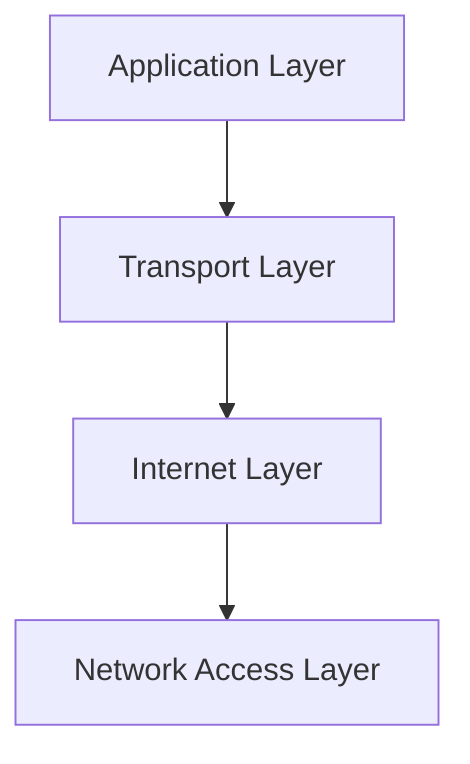

# TCP/IP Model: The Real-world Stack (টিসিপি/আইপি মডেল)

ওএসআই (OSI) মডেল যখন তাত্ত্বিকভাবে নেটওয়ার্কিং বোঝায়, তখন **TCP/IP (Transmission Control Protocol/Internet Protocol)** মডেল হলো সেই প্রোটোকল সুইট যা বাস্তবে ইন্টারনেট পরিচালনা করে। এটিকে **Internet Protocol Suite**-ও বলা হয়।

---

## ১. টিসিপি/আইপি মডেলের সংক্ষিপ্ত ইতিহাস ও গুরুত্ব
১৯৭০-এর দশকে মার্কিন প্রতিরক্ষা বিভাগ (DoD) এটি তৈরি করে। ওএসআই মডেলের ৭টি লেয়ার থাকলেও টিসিপি/আইপি মডেলে লেয়ার সংখ্যা মাত্র ৪টি। আজকের পৃথিবীর পুরো ইন্টারনেট এই ৪টি লেয়ারের ওপর ভিত্তি করেই চলছে।

**কেন এটি গুরুত্বপূর্ণ?**
- **Practicality:** এটি সরাসরি ইমপ্লিমেন্টেশন এবং ব্যবহারের জন্য তৈরি।
- **Flexibility:** এটি বিভিন্ন ধরনের হার্ডওয়্যার এবং ওএসের (OS) সাথে কাজ করতে সক্ষম।
- **Robustness:** এটি ডিস্ট্রিবিউটেড এবং অত্যন্ত নির্ভরযোগ্য।

---

## ২. টিসিপি/আইপি মডেলের ৪টি লেয়ার

টিসিপি/আইপি মডেলকে সাধারণত নিচের ৪টি লেয়ারে ভাগ করা হয়:

### লেয়ার ৪: Application Layer (অ্যাপ্লিকেশন লেয়ার)
ওএসআই মডেলের উপরের ৩টি লেয়ার (Application, Presentation, Session) এই একটি লেয়ারে একীভূত। এটি ইউজার এপ্লিকেশন এবং নেটওয়ার্কের মধ্যে সরাসরি যোগাযোগ ঘটায়।
- **কাজ:** ডাটা ফরমেটিং, কম্প্রেস করা এবং সেশন ম্যানেজমেন্ট।
- **Protocols:** HTTP, HTTPS (Web), FTP (File), SMTP (Email), DNS (Naming), SSH (Secure login).

### লেয়ার ৩: Transport Layer (ট্রান্সপোর্ট লেয়ার)
এটি ওএসআই মডেলের ট্রান্সপোর্ট লেয়ারের মতোই কাজ করে। এটি নিশ্চিত করে ডাটা এরর-মুক্তভাবে গন্তব্যে পৌঁছেছে কি না।
- **কাজ:** এন্ড-টু-এন্ড কানেক্টিভিটি, ডাটা সেগমেন্টেশন এবং এরর কন্ট্রোল।
- **Protocols:**
    - **TCP (Transmission Control Protocol):** কানেকশন-ওরিয়েন্টেড এবং নির্ভরযোগ্য (Reliable)।
    - **UDP (User Datagram Protocol):** কানেকশন-লেস এবং দ্রুত (Fast)।

### লেয়ার ২: Internet Layer (ইন্টারনেট লেয়ার)
এটি ওএসআই মডেলের 'Network Layer'-এর সমতুল্য। এর প্রধান দায়িত্ব হলো প্যাকেট হোস্ট থেকে গন্তব্যে পৌঁছানোর জন্য সেরা পথ (Routing) খুঁজে বের করা।
- **কাজ:** লজিক্যাল অ্যাড্রেসিং (IP Addressing) এবং রাউটিং।
- **Protocols:** IPv4, IPv6, ICMP (Ping-এর জন্য), IGMP, ARP.

### লেয়ার ১: Network Access Layer (নেটওয়ার্ক অ্যাক্সেস লেয়ার)
এটি ওএসআই মডেলের নিচের ২টি লেয়ারকে (Data Link এবং Physical) একত্রিত করে। এটি ডাটা ফিজিক্যালি কীভাবে যাবে (যেমন: তার বা ওয়াইফাই) তা নির্ধারণ করে।
- **কাজ:** ফ্রুয়ামিং (Framing), ফিজিক্যাল ও ম্যাক (MAC) অ্যাড্রেসিং।
- **Protocols:** Ethernet, Wi-Fi (802.11), PPP.

---

## ৩. OSI বনাম TCP/IP: প্রধান পার্থক্য

| বৈশিষ্ট্য | OSI Model (ওএসআই) | TCP/IP Model (টিসিপি/আইপি) |
| :--- | :--- | :--- |
| **লেয়ার সংখ্যা** | ৭টি লেয়ার। | ৪টি লেয়ার। |
| **উদ্দেশ্য** | তাত্ত্বিক (Conceptual/Academic)। | ব্যবহারিক (Implementation/Real-world)। |
| **গঠন** | সেশন ও প্রেজেন্টেশন লেয়ার আলাদা। | সেশন ও প্রেজেন্টেশন এপ্লিকেশন লেয়ারে অন্তর্ভুক্ত। |
| **ব্যবহার** | নেটওয়ার্কিং শেখার জন্য ব্যবহৃত হয়। | আজকের ইন্টারনেট প্রোটোকল হিসেবে ব্যবহৃত হয়। |

---

## ৪. এনক্যাপসুলেশন (Encapsulation) ও ডি-ক্যাপসুলেশন

টিসিপি/আইপি স্ট্যাকে ডাটা যখন এক লেয়ার থেকে অন্য লেয়ারে যায়, তখন ডাটার নাম বদলে যায়:

1.  **Application Layer:** ডাটা তখন শুধু **Data** হিসেবেই থাকে।
2.  **Transport Layer:** ডাটার সাথে টিসিপি বা ইউডিপি হেডার যোগ হয়ে এটি হয় **Segment**।
3.  **Internet Layer:** এর সাথে আইপি হেডার যোগ হয়ে এটি হয় **Packet**।
4.  **Network Access Layer:** এর সাথে ম্যাক হেডার এবং ট্রেইলার যোগ হয়ে এটি হয় **Frame**।
5.  **Physical Media:** এটি শেষ পর্যন্ত **Bits** (0, 1) হিসেবে প্রবাহিত হয়।

---

## ৫. ডেভঅপস ইঞ্জিনিয়ারদের জন্য বাস্তব উদাহরণ
যখন কেউ আপনাকে বলে "সার্ভারে কানেক্ট করা যাচ্ছে না", তখন আপনি যেভাবে চিন্তা করবেন:

- **Check App Layer:** `curl` করে দেখুন এপিআই রেসপন্স দিচ্ছে কি না (HTTP Errors 404, 500)।
- **Check Transport Layer:** `telnet` বা `nc` দিয়ে পোর্ট চেক করুন (TCP issues)।
- **Check Internet Layer:** `ping` দিয়ে দেখুন প্যাকেট পৌঁছাচ্ছে কি না (IP Routing issues)।
- **Check Access Layer:** ইন্টারফেস আপ আছে কি না তা দেখুন (`ip link`)।

---

::: tip মনে রাখবেন!
ওএসআই মডেল হলো নেটওয়ার্কিংয়ের **মানচিত্র (Map)**, আর টিসিপি/আইপি হলো সেই মানচিত্রের ওপর ভিত্তি করে তৈরি করা **রাস্তা (Road)**। বাস্তব কাজ করতে গেলে টিসিপি/আইপি মডেলই আপনার সবচেয়ে বেশি কাজে লাগবে।
:::
