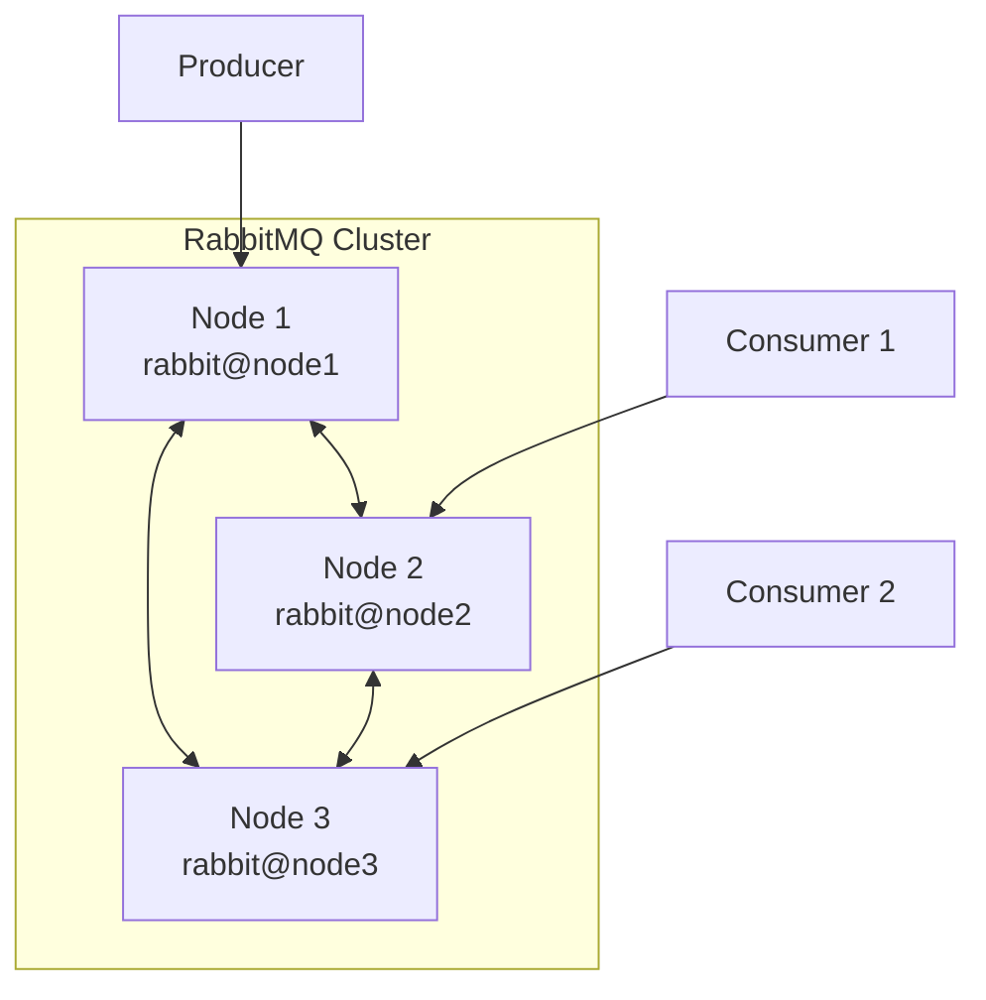

# মডিউল ৬: RabbitMQ ক্লাস্টারিং (Clustering)

প্রোডাকশন এনভায়রনমেন্টে হাই-অ্যাভেইল্যাবিলিটি এবং স্কেলেবিলিটির জন্য RabbitMQ ক্লাস্টার সেটআপ করা অত্যন্ত জরুরি।

## ক্লাস্টার আর্কিটেকচার (Cluster Architecture)

RabbitMQ ক্লাস্টার হলো একাধিক RabbitMQ নোড যারা একসাথে কাজ করে। প্রতিটি নোড একই Erlang cookie শেয়ার করে।



### ক্লাস্টারে কী শেয়ার হয়:

- ✅ Users, Virtual Hosts, Permissions
- ✅ Exchanges, Bindings
- ❌ Queue contents (ডিফল্টভাবে)

## ক্লাস্টার সেটআপ (Setting up a Cluster)

### ধাপ ১: Erlang Cookie সিঙ্ক করা

সব নোডে একই Erlang cookie থাকতে হবে।

```bash
# Node 1 এর cookie কপি করুন
sudo cat /var/lib/rabbitmq/.erlang.cookie

# Node 2 এবং Node 3 এ এই cookie সেট করুন
sudo echo "SAME_COOKIE_VALUE" > /var/lib/rabbitmq/.erlang.cookie
sudo chmod 400 /var/lib/rabbitmq/.erlang.cookie
sudo chown rabbitmq:rabbitmq /var/lib/rabbitmq/.erlang.cookie
```

### ধাপ ২: নোডগুলো জয়েন করা

```bash
# Node 2 এ
sudo rabbitmqctl stop_app
sudo rabbitmqctl join_cluster rabbit@node1
sudo rabbitmqctl start_app

# Node 3 এ
sudo rabbitmqctl stop_app
sudo rabbitmqctl join_cluster rabbit@node1
sudo rabbitmqctl start_app
```

### ধাপ ৩: ক্লাস্টার স্ট্যাটাস চেক করা

```bash
sudo rabbitmqctl cluster_status
```

## Mirrored Queues (HA Queues)

**Mirrored Queues** একাধিক নোডে queue এর কপি রাখে। যদি একটি নোড ডাউন হয়, অন্য নোড থেকে মেসেজ পাওয়া যায়।

### Policy দিয়ে Mirroring সেট করা:

```bash
# সব queue mirror করা (ha-mode: all)
rabbitmqctl set_policy ha-all "^" '{"ha-mode":"all"}' --apply-to queues

# নির্দিষ্ট সংখ্যক নোডে mirror করা
rabbitmqctl set_policy ha-two "^" '{"ha-mode":"exactly","ha-params":2}' --apply-to queues

# নির্দিষ্ট নোডে mirror করা
rabbitmqctl set_policy ha-nodes "^" '{"ha-mode":"nodes","ha-params":["rabbit@node1","rabbit@node2"]}' --apply-to queues
```

> [!WARNING]
> Mirrored Queues deprecated হয়ে গেছে RabbitMQ 3.8+ এ। এখন Quorum Queues ব্যবহার করা উচিত।

## Quorum Queues

**Quorum Queues** হলো আধুনিক, Raft consensus algorithm ভিত্তিক replicated queue।

### Quorum Queue তৈরি করা:

```python
# Python example
channel.queue_declare(
    queue='my_quorum_queue',
    durable=True,
    arguments={'x-queue-type': 'quorum'}
)
```

```bash
# CLI দিয়ে
rabbitmqadmin declare queue name=my_quorum_queue durable=true arguments='{"x-queue-type":"quorum"}'
```

### Quorum Queue এর সুবিধা:

- ✅ ডেটা লস হয় না (majority consensus)
- ✅ Automatic leader election
- ✅ Better performance than mirrored queues
- ✅ Poison message handling

## Federation

**Federation** বিভিন্ন ক্লাস্টার বা ডেটাসেন্টারের মধ্যে মেসেজ শেয়ার করতে ব্যবহৃত হয়।

```bash
# Federation plugin enable করা
rabbitmq-plugins enable rabbitmq_federation
rabbitmq-plugins enable rabbitmq_federation_management

# Upstream সেট করা
rabbitmqctl set_parameter federation-upstream my-upstream \
'{"uri":"amqp://server-name","expires":3600000}'

# Policy সেট করা
rabbitmqctl set_policy federate-me "^federated\." \
'{"federation-upstream-set":"all"}'
```

## Shovel

**Shovel** একটি ক্লাস্টার থেকে অন্য ক্লাস্টারে মেসেজ কপি করে।

```bash
# Shovel plugin enable করা
rabbitmq-plugins enable rabbitmq_shovel
rabbitmq-plugins enable rabbitmq_shovel_management

# Dynamic shovel তৈরি করা
rabbitmqctl set_parameter shovel my-shovel \
'{"src-uri":"amqp://","src-queue":"source_queue",
  "dest-uri":"amqp://remote-server","dest-queue":"dest_queue"}'
```

### Federation vs Shovel:

| বৈশিষ্ট্য     | Federation                 | Shovel                  |
| ------------- | -------------------------- | ----------------------- |
| **Direction** | Pull-based                 | Push or Pull            |
| **Use Case**  | Exchange/Queue replication | Point-to-point transfer |
| **Topology**  | Star, Ring                 | Any                     |

---

> [!IMPORTANT]
> প্রোডাকশনে কমপক্ষে ৩টি নোড ব্যবহার করুন Quorum Queues এর জন্য (majority voting এর জন্য)।
