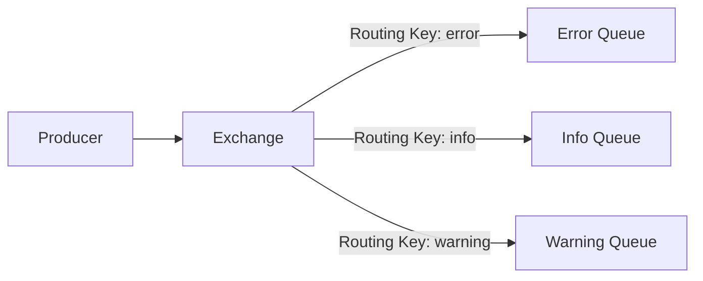

# মডিউল ৩: মূল ধারণাসমূহ (Core Concepts)

RabbitMQ বোঝার জন্য এর মূল কম্পোনেন্টগুলো সম্পর্কে জানা অত্যন্ত জরুরি।

## ১. Producer (প্রডিউসার)

যে অ্যাপ্লিকেশন মেসেজ পাঠায় তাকে **Producer** বলে।

```python
# Python example with pika
import pika

connection = pika.BlockingConnection(pika.ConnectionParameters('localhost'))
channel = connection.channel()

channel.queue_declare(queue='hello')
channel.basic_publish(exchange='', routing_key='hello', body='Hello World!')

print(" [x] Sent 'Hello World!'")
connection.close()
```

## ২. Consumer (কনজিউমার)

যে অ্যাপ্লিকেশন মেসেজ গ্রহণ করে তাকে **Consumer** বলে।

```python
# Python consumer example
import pika

connection = pika.BlockingConnection(pika.ConnectionParameters('localhost'))
channel = connection.channel()

channel.queue_declare(queue='hello')

def callback(ch, method, properties, body):
    print(f" [x] Received {body}")

channel.basic_consume(queue='hello', on_message_callback=callback, auto_ack=True)
print(' [*] Waiting for messages. To exit press CTRL+C')
channel.start_consuming()
```

## ৩. Queue (কিউ)

**Queue** হলো একটি বাফার যেখানে মেসেজগুলো স্টোর হয়। এটি FIFO (First In First Out) নীতি অনুসরণ করে।

### Queue এর বৈশিষ্ট্য:

- **Durable**: সার্ভার রিস্টার্ট হলেও Queue থাকবে
- **Exclusive**: শুধুমাত্র একটি কানেকশন ব্যবহার করতে পারবে
- **Auto-delete**: শেষ কনজিউমার ডিসকানেক্ট হলে Queue ডিলিট হবে

## ৪. Exchange (এক্সচেঞ্জ)

**Exchange** মেসেজ রিসিভ করে এবং সেগুলো সঠিক Queue-তে রাউট করে।

### Exchange এর প্রকারভেদ:

১. **Direct**: Routing key ম্যাচ করে
২. **Fanout**: সব Queue-তে পাঠায়
৩. **Topic**: Pattern ম্যাচিং করে
৪. **Headers**: Header attributes দিয়ে রাউট করে



## ৫. Binding (বাইন্ডিং)

**Binding** হলো Exchange এবং Queue এর মধ্যে সংযোগ। এটি বলে দেয় কোন মেসেজ কোন Queue-তে যাবে।

```python
# Binding example
channel.queue_bind(exchange='logs', queue='error_queue', routing_key='error')
```

## ৬. Virtual Host (ভার্চুয়াল হোস্ট)

**Virtual Host (vhost)** হলো একটি লজিক্যাল গ্রুপ যা Exchanges, Queues এবং Bindings কে আলাদা করে রাখে। এটি মাল্টি-টেন্যান্সির জন্য ব্যবহৃত হয়।

```bash
# Create a virtual host
rabbitmqctl add_vhost my_vhost

# Create user and set permissions
rabbitmqctl add_user myuser mypassword
rabbitmqctl set_permissions -p my_vhost myuser ".*" ".*" ".*"
```

## ৭. Connection এবং Channel

- **Connection**: TCP কানেকশন যা অ্যাপ্লিকেশন এবং RabbitMQ এর মধ্যে
- **Channel**: Connection এর ভেতরে একটি ভার্চুয়াল কানেকশন (লাইটওয়েট)

একটি Connection এর মধ্যে অনেকগুলো Channel থাকতে পারে।

```javascript
// Node.js example
const amqp = require("amqplib");

async function connect() {
  const connection = await amqp.connect("amqp://localhost");
  const channel = await connection.createChannel();

  await channel.assertQueue("hello");
  channel.sendToQueue("hello", Buffer.from("Hello from Node.js!"));

  console.log(" [x] Sent 'Hello from Node.js!'");
}

connect();
```

---

> [!NOTE]
> একটি Connection তৈরি করা ব্যয়বহুল, তাই একটি Connection এ অনেকগুলো Channel ব্যবহার করা ভালো।
