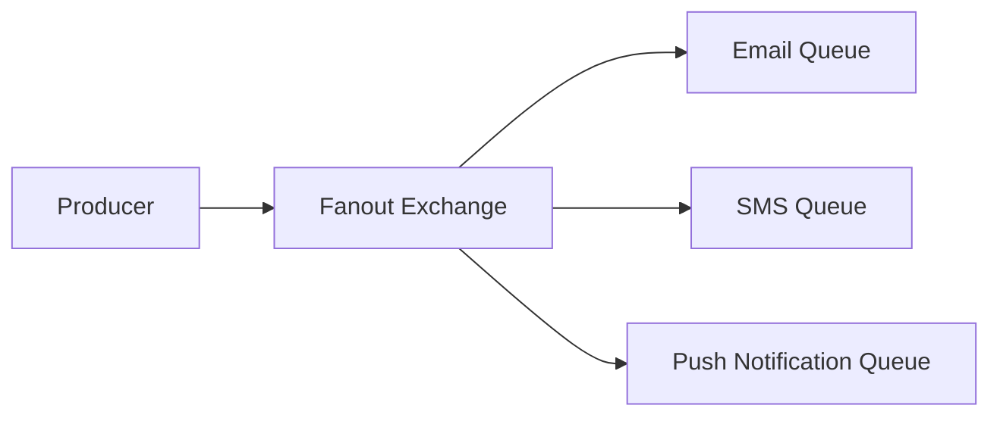

# মডিউল ৪: এক্সচেঞ্জ এবং রাউটিং (Exchanges and Routing)

RabbitMQ এর সবচেয়ে শক্তিশালী ফিচার হলো এর নমনীয় রাউটিং সিস্টেম। এই মডিউলে আমরা বিভিন্ন ধরনের Exchange নিয়ে আলোচনা করব।

## ১. Direct Exchange

**Direct Exchange** routing key এর সাথে exact match করে মেসেজ রাউট করে।

### ব্যবহার: Log Level ভিত্তিক রাউটিং

```python
# Producer
channel.exchange_declare(exchange='direct_logs', exchange_type='direct')

# Send error log
channel.basic_publish(exchange='direct_logs', routing_key='error', body='Error message')

# Send info log
channel.basic_publish(exchange='direct_logs', routing_key='info', body='Info message')
```

```python
# Consumer for errors only
channel.queue_bind(exchange='direct_logs', queue='error_queue', routing_key='error')
```

## ২. Fanout Exchange

**Fanout Exchange** সব connected queue-তে মেসেজ পাঠায়। Routing key ignore করে।

### ব্যবহার: Broadcasting

```python
# Declare fanout exchange
channel.exchange_declare(exchange='notifications', exchange_type='fanout')

# Publish to all subscribers
channel.basic_publish(exchange='notifications', routing_key='', body='New notification!')
```



## ৩. Topic Exchange

**Topic Exchange** pattern matching করে routing key এর সাথে।

### Wildcard:

- `*` (star): ঠিক একটি শব্দ ম্যাচ করে
- `#` (hash): শূন্য বা একাধিক শব্দ ম্যাচ করে

### উদাহরণ:

```python
# Declare topic exchange
channel.exchange_declare(exchange='topic_logs', exchange_type='topic')

# Routing keys: "system.error", "app.info", "db.warning"
channel.basic_publish(exchange='topic_logs', routing_key='system.error', body='System error!')
```

```python
# Consumer binding patterns
channel.queue_bind(exchange='topic_logs', queue='all_errors', routing_key='*.error')
# Matches: system.error, app.error, db.error

channel.queue_bind(exchange='topic_logs', queue='all_system', routing_key='system.#')
# Matches: system.error, system.info, system.warning.critical
```

## ৪. Headers Exchange

**Headers Exchange** message headers দিয়ে রাউট করে, routing key ব্যবহার করে না।

```python
# Declare headers exchange
channel.exchange_declare(exchange='headers_exchange', exchange_type='headers')

# Publish with headers
channel.basic_publish(
    exchange='headers_exchange',
    routing_key='',
    body='Message',
    properties=pika.BasicProperties(
        headers={'format': 'pdf', 'type': 'report'}
    )
)
```

```python
# Bind with header matching
channel.queue_bind(
    exchange='headers_exchange',
    queue='pdf_queue',
    arguments={'x-match': 'all', 'format': 'pdf', 'type': 'report'}
)
# x-match: 'all' = সব headers ম্যাচ করতে হবে
# x-match: 'any' = যেকোনো একটি ম্যাচ করলেই হবে
```

## ৫. Default Exchange

**Default Exchange** একটি বিশেষ direct exchange যার নাম খালি string ("")। প্রতিটি queue automatically এর সাথে bind হয় queue এর নাম দিয়ে।

```python
# Using default exchange (no exchange name)
channel.basic_publish(exchange='', routing_key='my_queue', body='Hello')
# এটি সরাসরি 'my_queue' নামের queue-তে যাবে
```

## Routing Key vs Binding Key

- **Routing Key**: Producer যে key দিয়ে মেসেজ পাঠায়
- **Binding Key**: Queue যে pattern দিয়ে bind করে

```python
# Producer sets routing key
channel.basic_publish(exchange='logs', routing_key='app.error', body='Error!')

# Consumer sets binding key
channel.queue_bind(exchange='logs', queue='error_queue', routing_key='*.error')
```

---

> [!TIP]
> প্রোডাকশনে সাধারণত Topic Exchange সবচেয়ে বেশি ব্যবহৃত হয় কারণ এটি সবচেয়ে নমনীয়।
