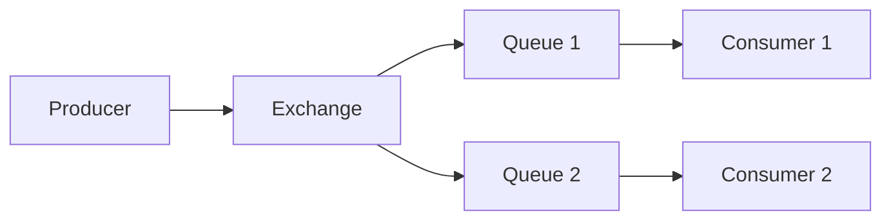

# মডিউল ১: RabbitMQ পরিচিতি (Introduction to RabbitMQ)

এই মডিউলে আমরা RabbitMQ এর বেসিক কনসেপ্ট, এর গুরুত্ব এবং এটি কিভাবে কাজ করে তা জানব।

## RabbitMQ কী? (What is RabbitMQ?)

**RabbitMQ** হলো একটি **Message Broker** যা অ্যাপ্লিকেশনগুলোর মধ্যে মেসেজ আদান-প্রদান করতে সাহায্য করে। এটি **AMQP (Advanced Message Queuing Protocol)** প্রোটোকল ব্যবহার করে।

সহজ ভাষায়, RabbitMQ হলো একটি পোস্ট অফিসের মতো যেখানে একটি অ্যাপ্লিকেশন মেসেজ পাঠায় এবং অন্য অ্যাপ্লিকেশন সেই মেসেজ গ্রহণ করে।

### রিয়েল-লাইফ উদাহরণ: ই-কমার্স অর্ডার প্রসেসিং

যখন আপনি একটি অনলাইন শপে অর্ডার দেন:

1. **Order Service** অর্ডার তৈরি করে এবং RabbitMQ-তে মেসেজ পাঠায়
2. **Payment Service** সেই মেসেজ পড়ে পেমেন্ট প্রসেস করে
3. **Inventory Service** স্টক আপডেট করে
4. **Notification Service** আপনাকে ইমেইল পাঠায়

সব সার্ভিস একসাথে কাজ করে কিন্তু একে অপরের ওপর সরাসরি নির্ভরশীল নয়।

## RabbitMQ এর বৈশিষ্ট্য (Features)

১. **Reliability (নির্ভরযোগ্যতা)**: মেসেজ হারিয়ে যায় না, ডিস্কে সেভ করা যায়।
২. **Flexible Routing (নমনীয় রাউটিং)**: বিভিন্ন ধরনের এক্সচেঞ্জ দিয়ে মেসেজ রাউট করা যায়।
৩. **Clustering (ক্লাস্টারিং)**: একাধিক সার্ভারে চালিয়ে হাই-অ্যাভেইল্যাবিলিটি পাওয়া যায়।
৪. **Multi-Protocol (মাল্টি-প্রোটোকল)**: AMQP, MQTT, STOMP সাপোর্ট করে।
৫. **Management UI**: ওয়েব-বেসড ম্যানেজমেন্ট ইন্টারফেস।

## RabbitMQ vs Kafka

| বৈশিষ্ট্য             | RabbitMQ                    | Kafka                             |
| --------------------- | --------------------------- | --------------------------------- |
| **Use Case**          | Task Queue, RPC             | Event Streaming, Logs             |
| **Message Retention** | মেসেজ কনজিউম হলে ডিলিট হয়  | মেসেজ নির্দিষ্ট সময় পর্যন্ত থাকে |
| **Throughput**        | মাঝারি (হাজার/সেকেন্ড)      | অনেক বেশি (লক্ষ/সেকেন্ড)          |
| **Routing**           | খুব নমনীয়                  | সীমিত                             |
| **Best For**          | Microservices Communication | Real-time Analytics               |

## AMQP প্রোটোকল বেসিক্স (AMQP Protocol Basics)

**AMQP (Advanced Message Queuing Protocol)** হলো একটি স্ট্যান্ডার্ড প্রোটোকল যা মেসেজিংয়ের জন্য ব্যবহৃত হয়।

### AMQP এর মূল কম্পোনেন্ট:

- **Producer**: যে মেসেজ পাঠায়
- **Exchange**: মেসেজ রিসিভ করে এবং রাউট করে
- **Queue**: মেসেজ স্টোর করে
- **Consumer**: মেসেজ গ্রহণ করে

## রিয়েল-লাইফ কেস স্টাডি (Real-life Case Studies)

### ১. T-Mobile

T-Mobile তাদের মোবাইল নেটওয়ার্কে বিভিন্ন সিস্টেমের মধ্যে যোগাযোগের জন্য RabbitMQ ব্যবহার করে। প্রতিদিন কোটি কোটি মেসেজ প্রসেস করা হয়।

### ২. 9GAG

9GAG তাদের ইমেজ প্রসেসিং এবং নোটিফিকেশন সিস্টেমে RabbitMQ ব্যবহার করে। যখন কেউ একটি পোস্ট আপলোড করে, RabbitMQ বিভিন্ন সাইজের থাম্বনেইল তৈরির কাজ ডিস্ট্রিবিউট করে।

### ৩. ব্যাংকিং সিস্টেম

ব্যাংকগুলো RabbitMQ ব্যবহার করে বিভিন্ন ব্রাঞ্চ এবং সার্ভিসের মধ্যে ট্রানজ্যাকশন মেসেজ পাঠাতে।

---

> [!NOTE]
> RabbitMQ হলো একটি "Smart Broker, Dumb Consumer" সিস্টেম যেখানে ব্রোকার মেসেজ রাউটিং এর দায়িত্ব নেয়। Kafka হলো "Dumb Broker, Smart Consumer" যেখানে কনজিউমার নিজেই মেসেজ ম্যানেজ করে।
