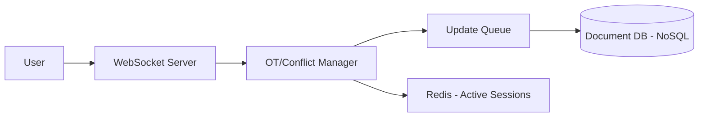

# Design Google Docs (গুগল ডকস - কোলাবোরেটিভ এডিটিং)

গুগল ডকস হলো একটি রিয়েল-টাইম কোলাবোরেটিভ টেক্সট এডিটর যেখানে একাধিক ইউজার একই সাথে একই ফাইলে কাজ করতে পারে।

---

## ১. রিকয়ারমেন্টস (Requirements)

- **Real-time Collaboration:** একাধিক ইউজার একসাথে এডিট করতে পারবে এবং একে অপরের চেইঞ্জ দেখতে পাবে।
- **Conflict Resolution:** একাধিক এডিটের মধ্যে কোনো কনফ্লিক্ট হলে তা বুদ্ধিমত্তার সাথে সমাধান করতে হবে।
- **Consistency:** সবার কাছে যেন ডকুমেন্টের একই ভার্সন থাকে।
- **Persistence:** ফাইলগুলো অটোমেটিক সেভ হতে হবে।

---

## ২. কোর টেকনিক্যাল চ্যালেঞ্জ: কনফ্লিক্ট রেজোলিউশন

একই সময়ে দুইজন ইউজার একই শব্দ এডিট করলে কে জিতেছে বা কোন চেইঞ্জটি আগে হবে, তা ঠিক করা সবচেয়ে কঠিন। এর ২টি সমাধান:

১. **Operational Transformation (OT):** এটি একটি পুরনো পদ্ধতি যা গুগল ডকস ব্যবহার করে। এটি এডিটগুলোকে 'Operations' (insert, delete) হিসেবে দেখে এবং সার্ভার সাইডে সেগুলো ট্রান্সফর্ম করে সঠিক পজিশনে বসায়।
২. **CRDT (Conflict-free Replicated Data Types):** এটি আধুনিক পদ্ধতি যা কোনো সেন্ট্রাল সার্ভার ছাড়াও কনফ্লিক্ট সমাধান করতে পারে। এখানে প্রতিটি ক্যারেক্টারের একটি ইউনিক আইডি এবং পজিশন থাকে।

---

## ৩. হাই-লেভেল ডিজাইন

### কেন WebSockets?

যেহেতু আমাদের রিয়েল-টাইম এবং উভমুখী (Two-way) কমিউনিকেশন প্রয়োজন, তাই সাধারণ HTTP-এর বদলে **WebSockets** ব্যবহার করা হয়।

---

## ৪. সার্ভার ডিজাইন

- **Document Server:** এটি একটি ইন-মেমরি ডকুমেন্ট বজায় রাখে এবং আগত এডিটগুলোকে প্রসেস করে।
- **Snapshot Service:** প্রতি কয়েক সেকেন্ড পরপর ডকুমেন্টের একটি স্ন্যাপশট ডাটাবেসে সেভ করে।
- **Notification Service:** অন্যান্য অনলাইন ইউজারদের জানানো যে ডকুমেন্টে চেইঞ্জ হয়েছে।

---

## ৫. স্কেলিং এবং পারফরম্যান্স

- **Sticky Sessions:** যেহেতু OT/CRDT লজিক ইন-মেমরিতে চলে, তাই একই ডকুমেন্টের সব ইউজারকে একই সার্ভারে রাখার চেষ্টা করা হয়।
- **Sharding:** ডকুমেন্ট আইডি অনুযায়ী ডাটাবেসকে শার্ডিং করা হয়।

---

> [!CAUTION]
> কোলাবোরেটিভ এডিটিং সিস্টেমে নেটওয়ার্ক ল্যাটেন্সি অনেক বড় সমস্যা। তাই ক্লায়েন্ট সাইডে "Optimistic UI Update" করা হয় যাতে ইউজারের কাছে কোনো ল্যাগ মনে না হয়।
