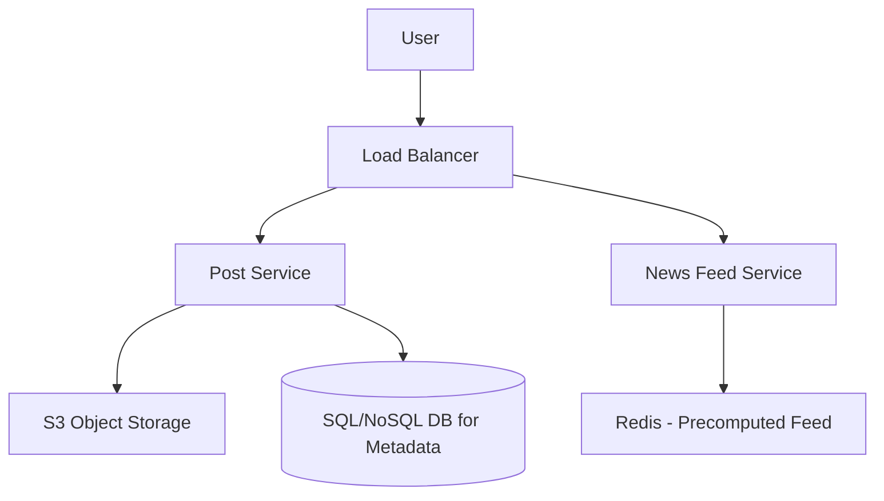

# Design Instagram (ইনস্টাগ্রাম ডিজাইন)

ইনস্টাগ্রাম হলো একটি সোশ্যাল মিডিয়া সিস্টেম যেখানে ইউজাররা ছবি/ভিডিও শেয়ার করে, অন্যদের ফলো করে এবং একটি নিউজ ফিড (News Feed) দেখে।

---

## ১. রিকয়ারমেন্টস (Requirements)

### ফাংশনাল (Functional)

- **Upload Photo/Video:** ইউজার ছবি বা ছোট ভিডিও আপলোড করতে পারবে।
- **Follow:** ইউজার অন্য ইউজারদের ফলো করতে পারবে।
- **News Feed:** ইউজারের ফিডে সে যাদের ফলো করে তাদের লেটেস্ট পোস্ট থাকবে।
- **Search/Discover:** ইউজার ছবি বা অন্যান্য ইউজার সার্চ করতে পারবে।

### নন-ফাংশনাল (Non-functional)

- **High Availability:** ছবি আপলোড বা ফিড দেখা সব সময় সচল থাকতে হবে।
- **High Consistency:** ছবি আপলোড হওয়ার সাথে সাথে নিজের প্রোাইলে দেখা যেতে হবে (তবে ফিডে কিছুটা দেরি হতে পারে)।
- **Read-Heavy System:** ফিড দেখা এবং ছবি দেখার হার পোস্ট করার চেয়ে অনেক বেশি।

---

## ২. হাই-লেভেল ডিজাইন (High-level Design)

### প্রধান ২রটি ভাগ:

১. **Write Path:** ছবি আপলোড করা এবং ডাটাবেসে মেটাডেটা (Metadata) সেভ করা।
২. **Read Path (Feed):** ইউজার যখন অ্যাপে ঢুকে সব পোস্ট দেখে।

---

## ৩. কোর ডিজাইন ডিপ-ডাইভ (Core Design Deep-dive)

### ক. নিউজ ফিড জেনারেশন (How to generate Feed?)

ফিড জেনারেশনের দুটি পদ্ধতি:
১. **Pull Method:** ইউজার রিফ্রেশ করলে তখন সব ফলোয়ারের পোস্ট খুঁজে আনা। (স্লো পারফরম্যান্স)।
২. **Push (Fan-out) Method:** যখন কেউ ছবি পোস্ট করে, তার ফলোয়ারদের নিউজ ফিড ক্যাশে (Redis) পোস্টটি পুশ করা হয়। এতে রিড অত্যন্ত ফাস্ট হয়।

- **চ্যালেঞ্জ:** যদি সেলিব্রেটিদের (অনেক ফলোয়ার) ক্ষেত্রে সবাইকেই পুশ করা হয়, তবে সিস্টেমে অনেক চাপ পড়ে (Hot Key Problem)। সমাধান হলো সেলিব্রেটিদের জন্য 'Pull' এবং সাধারণ ইউজারদের জন্য 'Push' মেথড।

### খ. স্টোরেজ ডিজাইন

ছবি এবং ভিডিওর সাইজ অনেক বড় হয়, তাই এগুলো ডাটাবেসে না রেখে **Object Storage (যেমন AWS S3)** এ রাখা হয়। ডাটাবেসে শুধু ছবির লিঙ্ক বা পাথ (URL) সেভ করা হয়।

---

## ৪. স্কেলিং এবং ক্যাশিং (Scaling & Caching)

- **Sharding:** ইউজার আইডি (UID) অনুযায়ী ডাটাবেসকে শার্ডিং করা যায় যাতে কোটি কোটি ইউজার হ্যান্ডেল করা সম্ভব হয়।
- **CDN:** গ্লোবাল ইউজারদের জন্য ছবিগুলো দ্রুত লোড করতে **Content Delivery Network (CDN)** ব্যবহার করা অত্যন্ত জরুরি।

---

> [!TIP]
> ইন্টারভিউতে নিউজ ফিড জেনারেশন (Push vs Pull) এবং সেলিব্রেটি হ্যান্ডেল করার বিষয়টি গুরুত্বের সাথে ব্যাখ্যা করুন।
