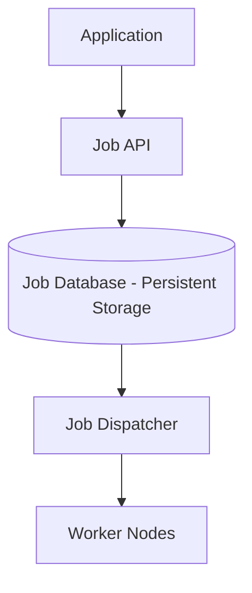

# Distributed Job Scheduler (ডিস্ট্রিবিউটেড জব শিডিউলার ডিজাইন)

জব শিডিউলার হলো এমন একটি সিস্টেম যা নির্দিষ্ট সময়ে বা নিয়মিত বিরতিতে কোনো টাস্ক (Task) রান করে। ডিস্ট্রিবিউটেড সিস্টেমে এটি কোটি কোটি জব হ্যান্ডেল করতে সক্ষম।

---

## ১. রিকয়ারমেন্টস (Requirements)

- **Durability:** একবার জব সাবমিট হলে সেটি অবশ্যই রান হতে হবে (No loss)।
- **Accuracy:** জবটি ঠিক যে সময়ে শিডিউল করা হয়েছে, তার আশেপাশেই রান হতে হবে।
- **High Throughput:** প্রতি সেকেন্ডে হাজার হাজার জব প্রসেস করতে হবে।
- **Fault Tolerance:** কোনো ওয়ার্কার ফেইল করলে অন্য কেউ যেন ওই জবটি শেষ করে।

---

## ২. হাই-লেভেল ডিজাইন

### প্রধান কম্পোনেন্টসমূহ:

১. **Job API:** নতুন জব রিসিভ করা এবং ডাটাবেসে সেভ করা।
২. **Persistent Storage:** জবের ডিটেইলস এবং স্ট্যাটাস (Pending, Running, Success, Failure) সেভ করা।
৩. **Job Dispatcher:** নির্ধারিত সময়ে ডাটাবেস থেকে জব তুলে নিয়ে ওয়ার্কারদের কাছে পাঠানো।
৪. **Workers:** আসল কাজ (যেমন ইমেইল পাঠানো বা রিপোর্ট জেনারেশন) সম্পন্ন করা।

---

## ৩. কোর ডিজাইন ডিপ-ডাইভ (Core Design Deep-dive)

### ক. পোলিং বনাম টাইম-হুইল (Polling vs Time Wheel)

- **Polling:** প্রতি সেকেন্ডে ডাটাবেস চেক করা। (বিলিয়ন জবের জন্য অত্যন্ত স্লো)।
- **Hierarchical Timing Wheels:** এটি একটি এফিশিয়েন্ট ডেটা স্ট্রাকচার যা ও(১) সময়ে জব খুঁজে বের করতে পারে।

### খ. জব এক্সিকিউশন গ্যারান্টি

কোনো জব দুইবার বা তিনবার রান হওয়া ঠেকাতে **Leader Election** এবং **Idempotency** ব্যবহার করা হয়। ডিসপ্যাচার যখন কোনো জব তুলে নেয়, সে ডাটাবেসে জবের স্ট্যাটাস `Running` করে দেয় যাতে অন্য কেউ সেটি না ধরে।

---

## ৪. স্কেলিং এবং ফেইলিওর হ্যান্ডলিং

- **Dead Letter Queue:** যে জবগুলো বারবার ফেইল করছে সেগুলোকে আলাদা কিউতে সরিয়ে রাখা।
- **Dynamic Scaling:** যদি কিউতে জবের সংখ্যা বেড়ে যায়, তবে অটোমেটিক নতুন ওয়ার্কার নোড যুক্ত করা।

---

> [!TIP]
> ইন্টারভিউতে জব শিডিউলারের ক্ষেত্রে "At-least-once" ডেলিভারি এবং জবের "Retry Policy" নিয়ে কথা বলা আপনার সিস্টেমের স্থায়িত্ব সম্পর্কে জ্ঞান প্রকাশ করে।
