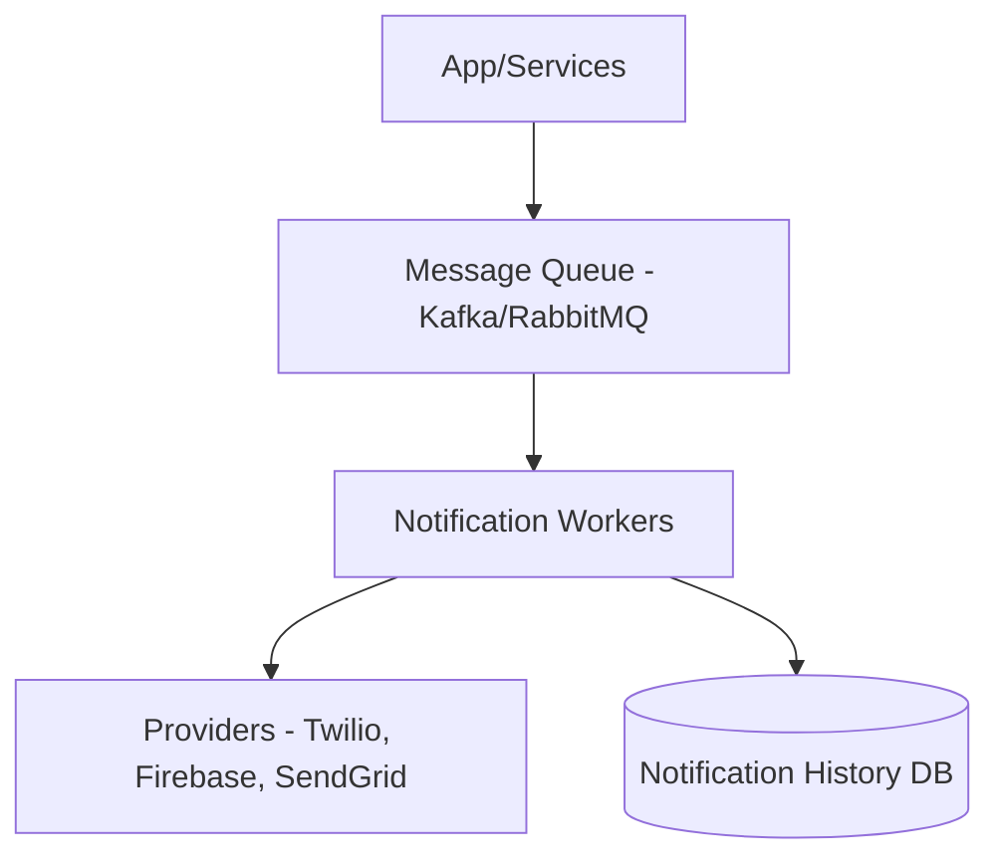

# Scalable Notification Service (নোটিফিকেশন সার্ভিস ডিজাইন)

একটি আধুনিক অ্যাপে ইমেইল, এসএমএস এবং অ্যাপ পুশ নোটিফিকেশন পাঠানোর জন্য একটি স্কেলেবল এবং রিলায়েবল সার্ভিস প্রয়োজন।

---

## ১. রিকয়ারমেন্টস (Requirements)

- **Reliability:** নোটিফিকেশন মিস হওয়া যাবে না (At least once delivery)।
- **High Throughput:** প্রতি সেকেন্ডে লাখ লাখ নোটিফিকেশন হ্যান্ডেল করতে হবে।
- **Scalability:** নতুন নতুন নোটিফিকেশন টাইপ (উদা: WhatsApp) সহজে যুক্ত করা যাবে।

---

## ২. হাই-লেভেল ডিজাইন

### প্রসেস স্ট্যাপস:

১. অন্য কোনো সার্ভিস থেকে নোটিফিকেশন পাঠানোর রিকোয়েস্ট আসে এবং তা **Message Queue**-তে জমা হয়।
২. **Notification Workers** কিউ থেকে মেসেজ নেয় এবং ইউজারের প্রেফারেন্স চেক করে।
৩. থার্ড-পার্টি **Providers** এর মাধ্যমে নোটিফিকেশন পাঠানো হয়।

---

## ৩. কোর ডিজাইন ডিপ-ডাইভ (Core Design Deep-dive)

### ক. ডি-ডুপ্লিকেশন (De-duplication)

একই নোটিফিকেশন যেন দুইবার না যায়, সেজন্য একটি 'Dedupe Key' বা আইডি দিয়ে ডাটাবেসে চেক করা হয়।

### খ. রেট লিমিটিং (Rate Limiting)

ইউজার যেন বিরক্তি না পায় এবং প্রোভাইডার খরচ যেন ঠিক থাকে, সেজন্য রেট লিমিটিং এবং **Notification Throttling** ব্যবহার করা হয়।

### গ. রিট্রাই মেকানিজম (Retry Mechanism)

যদি থার্ড-পার্টি প্রোভাইডার ডাউন থাকে, তবে এক্সপোনেনশিয়াল ব্যাকঅফ (Exponential Backoff) দিয়ে আবার পাঠানোর চেষ্টা করা হয়। যদি বারবার ফেইল করে, তবে তা **Dead Letter Queue (DLQ)**-তে পাঠানো হয়।

---

## ৪. স্কেলিং এবং ফল্ট টলারেন্স

- **Queuing:** কিউ ব্যবহারের ফলে সিস্টেমের লোড হুট করে বেড়ে গেলেও নোটিফিকেশন মিস হয় না, শুধু কিছুটা দেরি হয় (Backlog)।
- **Sharding:** ইউজারের নোটিফিকেশন হিস্টোরি ডেটাবেসকে ইউজার আইডি অনুযায়ী শার্ডিং করা হয়।

---

> [!TIP]
> ইন্টারভিউতে মেকানিজমটি যে "অ্যাসিঙ্ক্রোনাস" (Message Queue ব্যবহার করা), সেটি খুব পরিষ্কারভাবে উল্লেখ করুন।
