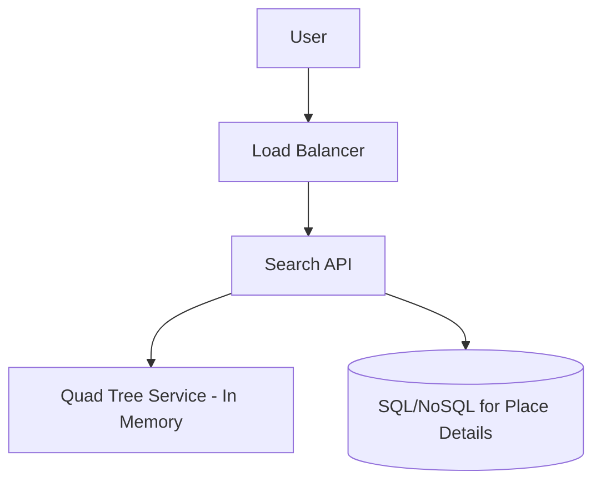

# Proximity Service - Yelp/Google Maps (প্রক্সিমিটি সার্ভিস ডিজাইন)

প্রক্সিমিটি সার্ভিস হলো এমন একটি সিস্টেম যা ইউজারের বর্তমান লোকেশনের ওপর ভিত্তি করে আশেপাশের দোকান, রেস্টুরেন্ট বা হাসপাতাল খুঁজে বের করে।

---

## ১. রিকয়ারমেন্টস (Requirements)

- **Search by Location:** ইউজার তার অবস্থান দিলে আশেপাশের (উদা: ৫ কিমি) রেস্টুরেন্ট খুঁজে পাবে।
- **Add/Update Places:** নতুন রেস্টুরেন্ট বা ব্যবসার তথ্য সিস্টেমে যুক্ত করা।
- **Fast Response:** কয়েক বিলিয়ন দোকানের মধ্যে থেকে দ্রুত রেজাল্ট বের করা।
- **Low Latency:** ম্যাপে সার্চ করা অত্যন্ত দ্রুত হতে হবে।

---

## ২. মূল সমস্যা: লোকেশন সার্চিং

সাধারণ ডাটাবেসে অক্ষাংশ (Latitude) এবং দ্রাঘিমাংশ (Longitude) দিয়ে কুয়েরি করা অত্যন্ত স্লো। কারণ এতে বিলিয়ন ডেটার ওপর রেঞ্জ কোয়েরি করতে হয়। সমাধান:

১. **Geo-hashing:** পুরো পৃথিবীকে গ্রিডে ভাগ করে প্রতিটি গ্রিডকে একটি ইউনিক স্ট্রিং দেওয়া হয়। কাছাকাছি লোকেশনের স্ট্রিংয়ের মিল থাকে।
২. **Quad Trees (সেরা সমাধান):** এটি এমন একটি ট্রি স্ট্রাকচার যেখানে প্রতিটি নোডকে ৪টি চাইল্ডে ভাগ করা হয়। যদি কোনো নির্দিষ্ট গ্রিডে দোকানের সংখ্যা লিমিট (উদা: ১০০) পার করে, তবে ওই গ্রিডকে আবার ৪ ভাগে ভাগ করা হয়।

---

## ৩. হাই-লেভেল ডিজাইন

### প্রধান কম্পোনেন্ট:

১. **Search Service:** ইউজারের কুয়েরি প্রসেস করে এবং Quad Tree থেকে দোকান খুঁজে নেয়।
২. **Business Service:** দোকানের নাম, রেটিং এবং রিভিউ ম্যানেজ করে।
৩. **Quad Tree Service:** এটি ইন-মেমরিতে থাকে দ্রুত লোকেশন ম্যাপিংয়ের জন্য।

---

## ৪. স্কেলিং এবং আপডেট

- **Read vs Write:** রেস্টুরেন্টের তথ্য খুব কম আপডেট হয় কিন্তু মানুষ সারাদিন সার্চ করে। তাই রিড রেপ্লিকা (Read Replicas) ব্যবহার করা এখানে অত্যন্ত জরুরি।
- **Sharding:** লোকেশন বা গ্রিড অনুযায়ী ডাটাবেস শার্ডিং করলে সার্চ পারফরম্যান্স বাড়ে।

---

> [!TIP]
> ইন্টারভিউতে লোকেশন ইনডেক্সিংয়ের জন্য **Quad Tree** বা **Google S2 Library** সম্পর্কে কথা বলা আপনার অ্যাডভান্সড নলেজ প্রমাণ করে।
