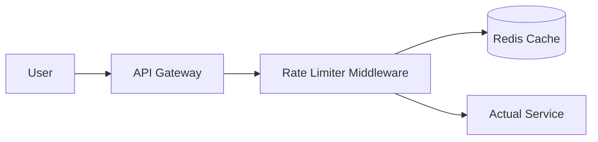

# Design a Distributed Rate Limiter (রেট লিমিটার ডিজাইন)

রেট লিমিটার হলো একটি সিকিউরিটি মেকানিজম যা নির্দিষ্ট সময়ের মধ্যে একজন ইউজার বা এপিআই কতবার রিকোয়েস্ট করতে পারবে তা সীমাবদ্ধ করে। এটি মূলত স্প্যাম এবং DDoS অ্যাটাক প্রতিরোধ করার জন্য ব্যবহৃত হয়।

---

## ১. রিকয়ারমেন্টস (Requirements)

- **Accuracy:** রেট লিমিটারকে একদম নিখুঁতভাবে রিকোয়েস্ট ব্লক করতে হবে।
- **Low Latency:** মেইন এপিআই কল করার আগে এটি দ্রুত সিদ্ধান্ত নিতে হবে (Allow or Block)।
- **Distributed:** এটি একাধিক সার্ভারে স্কেল হতে হবে।

---

## ২. রেট লিমিটিং অ্যালগরিদম (Algorithms)

১. **Token Bucket:** একটি বাকেটে নির্দিষ্ট রেটে টোকেন জমা হয়। প্রতিটি রিকোয়েস্টের জন্য একটি টোকেন লাগে। বাকেট খালি হলে রিকোয়েস্ট রিজেক্ট হয়। (সবচেয়ে জনপ্রিয়)।
২. **Leaky Bucket:** রিকোয়েস্টগুলো একটি নির্দিষ্ট স্পিডে প্রসেস হয়। যদি ইনপুট স্পিড আউটপুটের চেয়ে বেশি হয়, তবে বাকেট উপচে পড়ে (Request Drop)।
৩. **Fixed Window Counter:** এটি নির্দিষ্ট সময়ের (উদা: ১ মিনিট) উইন্ডোতে রিকোয়েস্ট গোনে। (উইন্ডোর শেষে স্পাইক হওয়ার রিস্ক থাকে)।
৪. **Sliding Window Log/Counter:** এটি উইন্ডোর সমস্যা দূর করে একদম নিখুঁতভাবে টাইম গ্যাপ চেক করে।

---

## ৩. হাই-লেভেল ডিজাইন (Distributed Design)

একটি ডিস্ট্রিবিউটেড সিস্টেমে ডেটা শেয়ার করার জন্য ইন-মেমরি ক্যাশ (Redis) ব্যবহার করা সেরা বুদ্ধি।

### কেন Redis?

কাউন্টার ম্যানেজ করার জন্য Redis অত্যন্ত ফাস্ট। এটি `INCR` এবং `EXPIRE` এর মতো এটমিক অপারেশন সাপোর্ট করে যা কনকারেন্সি হ্যান্ডেল করতে সাহায্য করে।

---

## ৪. ডিস্ট্রিবিউটেড এনভায়রনমেন্টের চ্যালেঞ্জ

১. **Race Condition:** যদি দুইজন ইউজার একই সাথে রিকোয়েস্ট করে, তবে Redis কাউন্টার আপডেট করার সময় ভুল হতে পারে।

- **সমাধান:** Redis-এর Lua Scripting বা Lock ব্যবহার করা।
  ২. **Synchronization:** বিভিন্ন রিজিয়নে রেট লিমিটার সিঙ্ক্রোনাইজ করা কঠিন।
- **সমাধান:** 'Sticky Sessions' অথবা সেন্ট্রাল Redis ক্লাস্টার ব্যবহার করা।

---

## ৫. এপিআই রেসপন্স (Handling 429 Status)

যখন কোনো রিকোয়েস্ট ব্লক করা হয়, তখন সিস্টেমকে অবশ্যই HTTP Status Code **429 (Too Many Requests)** ফেরত দিতে হবে। এছাড়া ব্রাউজারকে জানানোর জন্য নিচের হেডারগুলো যোগ করা যেতে পারে:

- `X-Ratelimit-Remaining`: আর কতগুলো রিকোয়েস্ট করা যাবে।
- `X-Ratelimit-Reset`: কতক্ষণ পর আবার লিমিট রিসেট হবে।

---

> [!IMPORTANT]
> বড় সিস্টেমে রেট লিমিটার সাধারণত **API Gateway** বা **Middleware** লেভেলে ইমপ্লিমেন্ট করা হয় যাতে ব্যাকেন্ড সার্ভারগুলোতে অপ্রয়োজনীয় চাপ না পড়ে।
