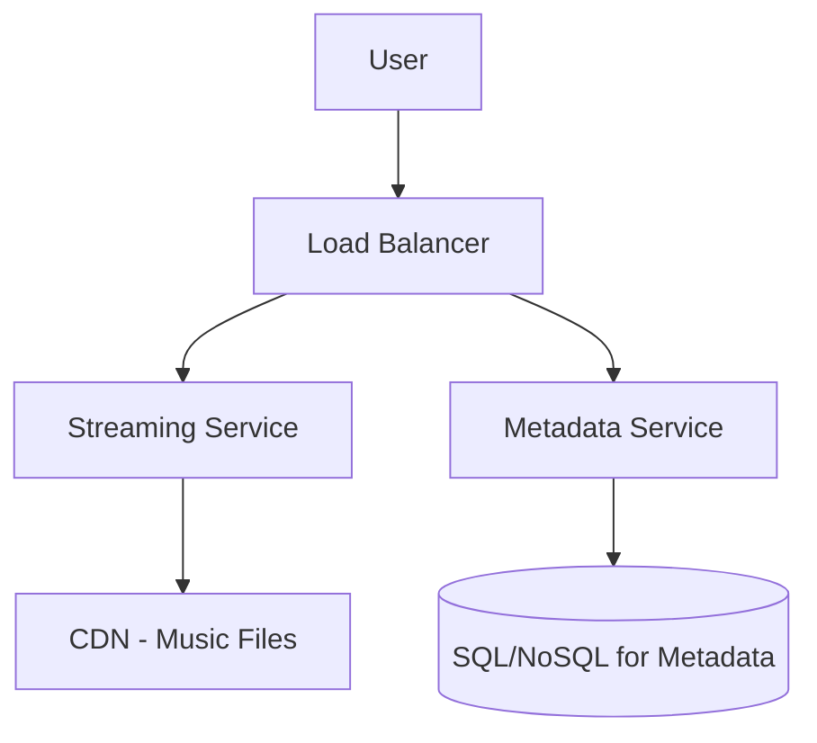

# Design Spotify (স্পটিফাই/মিউজিক স্ট্রিমিং ডিজাইন)

স্পটিফাই বা ইউটিউব মিউজিকের মতো অ্যাপে ইউজাররা গান সার্চ করে এবং অনলাইনে মিউজিক শোনে (Streaming)।

---

## ১. রিকয়ারমেন্টস (Requirements)

### ফাংশনাল (Functional)

- **Play Music:** ইউজার গান সিলেক্ট করে তা রিয়েল-টাইম শুনতে পারবে।
- **Search:** গান, আর্টিস্ট বা অ্যালবাম সার্চ করা যাবে।
- **Playlist:** ইউজার নিজের প্লেলিস্ট তৈরি করতে পারবে।
- **Library:** ফেভারিট গান এবং আর্টিস্ট সেভ করে রাখা।

### নন-ফাংশনাল (Non-functional)

- **No Buffering:** গান শোনার সময় যেন কোনো ল্যাগ বা বাফারিং না হয়।
- **Offline Access (Optional):** গান ডাউনলোড করার সুবিধা।
- **High Scalability:** কয়েক কোটি ইউজারকে একসাথে সার্ভিস দেওয়া।

---

## ২. হাই-লেভেল ডিজাইন (Architecture)

### প্রধান কম্পোনেন্টসমূহ:

১. **Streaming Service:** গানের অডিও চাঙ্কগুলো (Chunks) ইউজারের কাছে পাঠায়।
২. **Metadata Service:** গানের নাম, আর্টিস্ট এবং প্লেলিস্টের তথ্য ম্যানেজ করে।
৩. **CDN:** গানের ফাইলগুলো ইউজারের ভৌগলিক অবস্থানের কাছে ক্যাশ করে রাখে।

---

## ৩. কোর ডিজাইন ডিপ-ডাইভ (Core Design Deep-dive)

### ক. অডিও স্ট্রিমিং (How streaming works?)

পুরো গানের ফাইল (উদা: ৮ এমবি) একসাথে না পাঠিয়ে ছোট ছোট চাঙ্ক (Chunk) হিসেবে পাঠানো হয়। ক্লায়েন্ট সাইডে প্লেয়ারটি কিছু সেকেন্ডের ডেটা আগে থেকেই বাফার করে রাখে যাতে নেটওয়ার্ক দুর্বল হলেও গান না থামে।

### খ. স্টোরেজ এবং ফরম্যাট

আসল অডিও ফাইলগুলো হাই-কোয়ালিটিতে স্টোর করা হয়, কিন্তু ইউজারের নেটওয়ার্ক স্পিড অনুযায়ী বিভিন্ন বিটরেটে (উদা: 96kbps, 160kbps, 320kbps) গান সার্ভ করা হয়।

---

## ৪. সার্চ এবং রিকমেন্ডেশন (Search & Recommendation)

- **Search:** গানের টাইটেল বা আর্টিস্টের ওপর ভিত্তি করে **Elasticsearch** ব্যবহার করে দ্রুত সার্চ রেজাল্ট দেখানো হয়।
- **Recommendation:** ইউজারের পছন্দ অনুযায়ী নতুন গান সাজেস্ট করার জন্য **Machine Learning (Collaborative Filtering)** ব্যবহার করা হয়। এটি ব্যাকগ্রাউন্ডে ব্যাচ প্রসেসিং (উদা: Apache Spark) এর মাধ্যমে করা হয়।

---

## ৫. স্কেলিং টিপস

- গানের ফাইলগুলো স্ট্যাটিক এবং কখনও খুব একটা চেঞ্জ হয় না, তাই **CDN** এখানে সবচেয়ে গুরুত্বপূর্ণ ভূমিকা পালন করে।
- প্লেলিস্ট বা ফেভারিটের মতো রাইট-হেভি ডেটার জন্য **Cassandra** বা **DynamoDB** ব্যবহার করা ভালো।

---

> [!IMPORTANT]
> স্পটিফাই বা ইউটিউবের মতো সিস্টেমে "অডিও কোয়ালিটি অ্যাডাপ্টেশন" (Adaptive Bitrate) নিয়ে কথা বলা ইন্টারভিউতে ভালো ইমপ্রেশন তৈরি করে।
