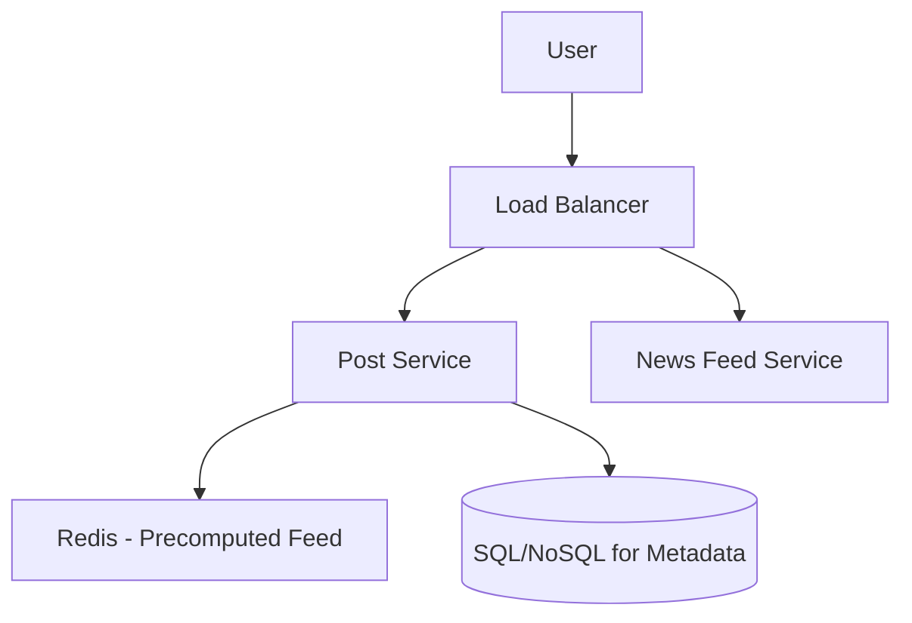

# Designing Twitter (নিউজ ফিড সিস্টেম ডিজাইন)

টুইটার হলো একটি সোশ্যাল মিডিয়া প্লাটফর্ম যেখানে ইউজাররা ছোট টেক্সট (টুইট) পোস্ট করে এবং অন্যদের ফলো করে। এখানে মূল চ্যালেঞ্জ হলো রিয়েল-টাইমে লক্ষ লক্ষ ফলোয়ারের কাছে টুইট পৌঁছে দেওয়া।

---

## ১. রিকয়ারমেন্টস (Requirements)

- **Post Tweet:** ইউজার দ্রুত ছোট টেক্সট পোস্ট করতে পারবে।
- **News Feed:** ইউজার তার ফলোয়ারদের টুইট দেখতে পাবে।
- **Follow/Unfollow:** ইউজার অন্যদের ফলো করতে পারবে।
- **Retweet/Like:** টুইটে লাইক বা রিটুইট করা যাবে।

---

## ২. হাই-লেভেল ডিজাইন

### কেন আলাদা ফিড সার্ভিস?

টুইটারের রিড রিকোয়েস্ট (ফিড দেখা) এর হার রাইট রিকোয়েস্টের (টুইট করা) চেয়ে কয়েক হাজার গুণ বেশি। তাই ফিড জেনারেশনকে আলাদা সার্ভিস হিসেবে রাখা হয়।

---

## ৩. কোর চ্যালেঞ্জ: ফ্যান-আউট (Fan-out Strategy)

যখন কোনো ইউজার টুইট করে, সেটি তার লাখ লাখ ফলোয়ারের কাছে কীভাবে পৌঁছাবে?

১. **Push (Fan-out on load):** যখন কেউ টুইট করে, তার সব ফলোয়ারের ইনবক্সে (Redis) সেটি পুশ করা হয়। (রিড অত্যন্ত ফাস্ট)।
২. **Pull (Fan-out on read):** ইউজার ফিড রিফ্রেশ করলে ডাটাবেস থেকে সব ফলোয়ারের লেটেস্ট টুইট খুঁজে আনা হয়। (রাইট ফাস্ট কিন্তু রিড স্লো)।

---

## ৪. সেলিব্রেটি হ্যান্ডলিং (Hybrid Approach)

যদি এলন মাস্ক (Elon Musk) টুইট করেন এবং তার ১০০ মিলিয়ন ফলোয়ার থাকে, তবে সবার ক্যাশে পুশ করতে সিস্টেম ক্র্যাশ করতে পারে।

- **সমাধান:** আমারা হাইব্রিড পদ্ধতি ব্যবহার করি। সাধারণ ইউজারদের জন্য **Push** এবং সেলিব্রেটিদের জন্য **Pull** মেথড।

---

> [!TIP]
> ইন্টারভিউতে "Fan-out on write" বনাম "Fan-out on read" এর ট্রেড-অফগুলো নিয়ে বিস্তারিত কথা বলুন।
