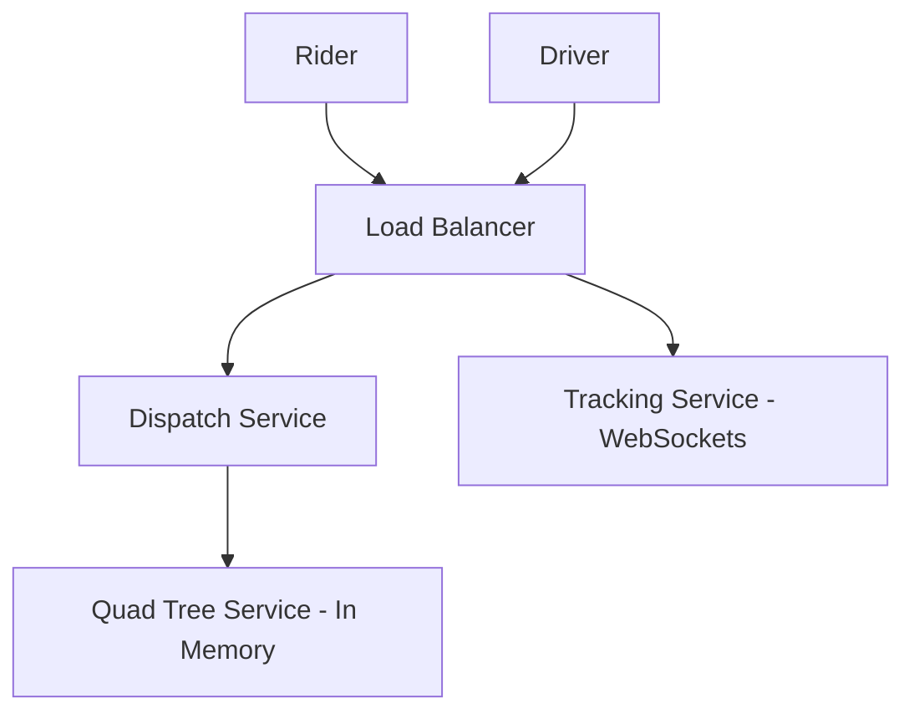

# Designing Uber (রাইড শেয়ারিং সিস্টেম ডিজাইন)

উবার বা পাঠাওয়ের মতো অ্যাপে মূল চ্যালেঞ্জ হলো ইউজারের বর্তমান লোকেশনের কাছাকাছি থাকা ড্রাইভারদের সাথে দ্রুত ম্যাচ করা এবং রিয়েল-টাইমে ট্র্যাকিং করা।

---

## ১. রিকয়ারমেন্টস (Requirements)

- **Match Driver:** কাছাকাছি থাকা ৩-৫ জন ড্রাইভারকে রাইড রিকোয়েস্ট পাঠানো।
- **Real-time Tracking:** ম্যাপে ড্রাইভারের মুভমেন্ট দেখা।
- **Pricing:** দূরত্ব এবং ডিমান্ড অনুযায়ী ভাড়া নির্ধারণ করা (Surge Pricing)।
- **Review/Rating:** রাইড শেষে রিভিউ দেওয়া।

---

## ২. জিওস্পেশিয়াল কুয়েরি (Geospatial Query)

লোকেশন সার্চ করার জন্য সাধারণ SQL কুয়েরি অত্যন্ত ধীর। সমাধান হিসেবে **Geo-hashing** বা **Quad Trees** ব্যবহার করা হয়। এটি পৃথিবীকে অনেকগুলো ছোট ছোট গ্রিডে ভাগ করে ফেলে, যাতে খুব দ্রুত পাশের গ্রিড থেকে ড্রাইভার খুঁজে পাওয়া যায়।

---

## ৩. হাই-লেভেল ডিজাইন

### কেন ইন-মেমরি Quad Tree?

ড্রাইভারের লোকেশন প্রতি ২-৩ সেকেন্ডে আপডেট হয়। এই বিশাল পরিমাণ আপডেট সরাসরি ডাটাবেসে না লিখে ইন-মেমরি ট্রি-তে স্টোর করা হয় যাতে ম্যাচিং দ্রুত হয়।

---

## ৪. পেমেন্ট ও ফেয়ার ক্যালকুলেশন

- **Surge Pricing:** যখন কোনো এলাকায় অনেক রাইডার থাকে কিন্তু ড্রাইভার কম, তখন প্রাইস বাড়ানো হয়। এটি একটি **Dynamic Pricing Algorithm** যা রিয়েল-টাইম ডিমান্ড এবং ট্রাফিক ডেটা চেক করে।

---

> [!IMPORTANT]
> উবারের রাইড ম্যাচিংয়ে **Strong Consistency** প্রয়োজন যাতে একজন ড্রাইভারকে একই সাথে দুইজন রাইডারের কাছে না পাঠানো হয়।
