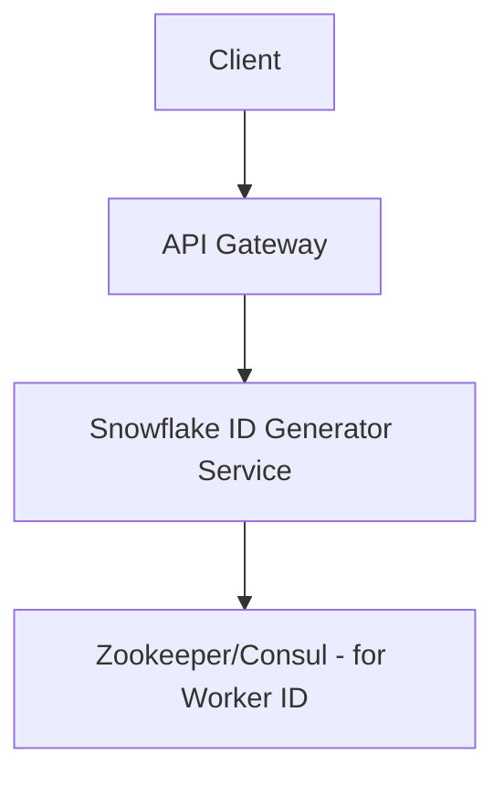

# Design a Unique ID Generator (ইউনিক আইডি জেনারেটর)

ডিস্ট্রিবিউটেড সিস্টেমে কোটি কোটি ডেটার মধ্যে প্রতিটি ডেটাকে আলাদাভাবে চেনার জন্য একটি ইউনিক আইডি (Unique ID) প্রয়োজন। সাধারণ ডাটাবেসের `auto_increment` আইডি ডিস্ট্রিবিউটেড সিস্টেমে স্কেল করে না।

---

## ১. রিকয়ারমেন্টস (Requirements)

- **Uniqueness:** প্রতিটি আইডি অবশ্যই ইউনিক হতে হবে।
- **Scalability:** সিস্টেমকে প্রতি সেকেন্ডে হাজার হাজার আইডি জেনারেট করতে হবে।
- **Sorted by Time:** আইডিগুলো যেন সময়ের ক্রমানুসারে (Sortable by time) থাকে।
- **High Availability:** আইডি জেনারেটর সার্ভিস ডাউন হওয়া যাবে না।

---

## ২. আইডি জেনারেট করার বিভিন্ন পদ্ধতি

### ক. Multi-master Replication

ডাটাবেসের অটো-ইনক্রিমেন্ট ব্যবহার করা কিন্তু ইনক্রিমেন্ট ভ্যালু হবে সার্ভার সংখ্যা (k) অনুযায়ী।

- **Pros:** সহজ।
- **Cons:** নতুন সার্ভার যুক্ত করা বা কমানো অনেক কঠিন।

### খ. UUID (Universally Unique Identifier)

এটি একটি ১২৮-বিট আইডি। উদা: `550e8400-e29b-41d4-a716-446655440000`।

- **Pros:** কোনো কোঅর্ডিনেশন লাগে না।
- **Cons:** অনেক বড় (১২৮ বিট) এবং সময়ের ক্রমানুসারে থাকে না।

### গ. Twitter Snowflake (সেরা সমাধান)

এটি একটি ৬৪-বিট আইডি যা সময়ের ক্রমানুসারে (Sortable) থাকে।

**Snowflake ID স্ট্রাকচার:**

- **১ বিট:** সাইন বিট (সর্বদা ০)।
- **৪১ বিট:** টাইমস্ট্যাম্প (মিলি-সেকেন্ডে)।
- **১০ বিট:** মেশিন/ওয়ার্কার আইডি।
- **১২ বিট:** সিকোয়েন্স নাম্বার (একই মিলি-সেকেন্ডে একাধিক আইডি জেনারেট করার জন্য)।

---

## ৩. হাই-লেভেল ডিজাইন

### কেন Zookeeper প্রয়োজন?

ডিস্ট্রিবিউটেড সিস্টেমে প্রতিটি আইডি জেনারেটর সার্ভিসকে একটি ইউনিক 'Worker ID' দেওয়ার জন্য একটি কোঅর্ডিনেশন সার্ভিস (উদা: Zookeeper) ব্যবহার করা হয়।

---

## ৪. চ্যালেঞ্জ এবং সমাধান

- **Clock Skew:** যদি একটি সার্ভারের সময় অন্য সার্ভারের চেয়ে আলাদা হয়, তবে আইডি জেনারেশনে সমস্যা হতে পারে। সমাধান হিসেবে এনটিপি (Network Time Protocol) ব্যবহার করা হয়।
- **High Throughput:** ১২ বিট সিকোয়েন্স নাম্বার মানে প্রতি মিলি-সেকেন্ডে ৪০৯৬টি আইডি জেনারেট করা সম্ভব, যা একটি বড় সিস্টেমের জন্য যথেষ্ঠ।

---

> [!TIP]
> ইন্টারভিউতে আপনি কেন Snowflake আইডি বেছে নিচ্ছেন, তা এর স্ট্রাকচার (টাইমস্ট্যাম্প এবং মেশিন আইডি) দিয়ে সুন্দর করে বুঝিয়ে বলুন।
