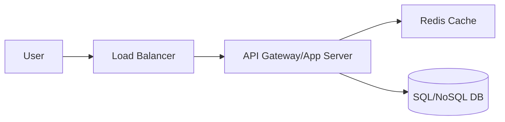

# Design a URL Shortener (URL শর্টেনার ডিজাইন)

একটি URL শর্টেনার (যেমন tinyurl.com বা bitly) বড় বড় লিঙ্কগুলোকে ছোট লিঙ্কে রূপান্তর করে যা দেখতে সুন্দর এবং শেয়ার করা সহজ।

---

## ১. রিকয়ারমেন্টস (Requirements)

### ফাংশনাল (Functional)

- **URL Shortening:** একটি বড় URL দিলে সিস্টেম একটি ইউনিক শর্ট লিঙ্ক তৈরি করবে।
- **Redirection:** ওই শর্ট লিঙ্কটি ব্যবহার করলে ইউজার মূল লিঙ্কে পৌঁছে যাবে।
- **Custom Alias (Optional):** ইউজার চাইলে নিজের পছন্দমতো নাম দিতে পারবে (উদা: tinyurl.com/ripans-portfolio)।
- **Expiration (Optional):** লিঙ্কটি কতদিন পর ইনভ্যালিড হবে তা সেট করা যাবে।

### নন-ফাংশনাল (Non-functional)

- **High Availability:** সিস্টেম কখনোই ডাউন হওয়া যাবে না।
- **Low Latency:** রিডাইরেকশন অত্যন্ত দ্রুত হতে হবে।
- **Uniqueness:** শর্ট লিঙ্কগুলো অবশই ইউনিক হতে হবে।

---

## ২. হাই-লেভেল ডিজাইন (High-level Design)

### প্রধান ৩টি কম্পোনেন্ট:

১. **API Layer:** রিকোয়েস্ট গ্রহণ করা এবং শর্টেনিং লজিক চালানো।
২. **Database:** অরিজিনাল URL এবং শর্ট কি (Key) ম্যাপিং স্টোর করা।
৩. **Cache:** রিড পারফরম্যান্স বাড়াতে জনপ্রিয় লিঙ্কগুলো ক্যাশ করে রাখা।

---

## ৩. কোর ডিজাইন ডিপ-ডাইভ (Core Design Deep-dive)

### ক. শর্ট লিঙ্ক জেনারেশন (How to generate the Key?)

সবচেয়ে বড় চ্যালেঞ্জ হলো ইউনিক কি (Key) তৈরি করা। দুটি মূল পদ্ধতি:
১. **Base62 Encoding:** 0-9, a-z, A-Z (মোট ৬২টি ক্যারেকটার) ব্যবহার করা। ৭ ক্যারেকটারের কি হলে প্রায় ৩.৫ ট্রিলিয়ন ইউনিক লিঙ্ক তৈরি সম্ভব।
২. **Key Generation Service (KGS):** একটি আলাদা সার্ভিস যা আগে থেকেই ইউনিক কি তৈরি করে ডাটাবেসে রাখবে। যখন কোনো নতুন রিকোয়েস্ট আসবে, সাথে সাথে একটি কি দিয়ে দেওয়া হবে। এতে রানটাইম কলিশন হওয়ার সম্ভাবনা থাকে না।

### খ. ডাটাবেস সিলেকশন

যেহেতু আমাদের ডেটার মধ্যে রিলেশন তেমন নেই এবং বিলিয়ন বিলিয়ন রো হবে, তাই **NoSQL (যেমন Cassandra বা MongoDB)** ভালো চয়েস। কারণ এটি রাইট-হেভি লোড ভালো হ্যান্ডেল করে।

---

## ৪. এপিআই ডিজাইন (API Design)

১. **POST /api/v1/shorten**

- Body: `{ "long_url": "...", "custom_alias": "..." }`
- Return: `{ "short_url": "..." }`

২. **GET /{short_url_key}**

- Return: `302 Redirect to long_url`

---

## ৫. ট্রেড-অফ এবং স্কেলিং (Tradeoffs & Scaling)

- **301 vs 302 Redirect:** 301 মানে 'Permanent' (ব্রাউজার ক্যাশ করবে), 302 মানে 'Temporary' (সব রিকোয়েস্ট সার্ভারে আসবে যাতে অ্যানালিটিক্স করা যায়)। ইন্টারভিউতে দ্বিতীয়টি বলা ভালো যদি আপনি ক্লিক ট্র্যাক করতে চান।
- **Caching Strategy:** রিসেন্টলি অ্যাক্সেস হওয়া ২০% লিঙ্ক ৮০% ট্রাফিক জেনারেট করে (Pareto Principle)। তাই LRU (Least Recently Used) ইভিকশন পলিসি ব্যবহার করে ক্যাশিং ফাস্ট রাখা যায়।

---

> [!IMPORTANT]
> একটি ভালো সিস্টেমে অবশ্যই **Rate Limiting** থাকতে হবে যাতে কেউ স্প্যাম করে ডাটাবেস ফুল না করে দিতে পারে।
