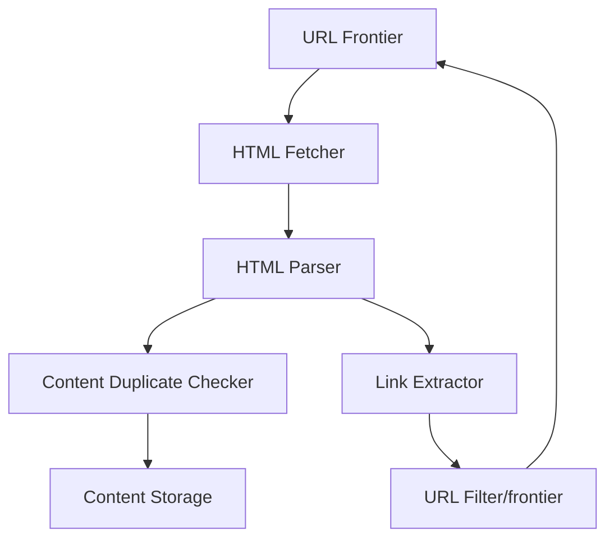

# Design a Web Crawler (ওয়েব ক্রলার ডিজাইন)

ওয়েব ক্রলার (যেমন Googlebot) হলো একটি স্বয়ংক্রিয় প্রোগ্রাম যা ইন্টারনেটের লিংকগুলো ঘুরে ঘুরে নতুন নতুন পেজ খুঁজে বের করে এবং সেগুলোর তথ্য সংগ্রহ করে ইনডেক্স করে।

---

## ১. রিকয়ারমেন্টস (Requirements)

- **Scalability:** কোটি কোটি পেজ ক্রল করতে হবে।
- **Politeness:** একই সাইটে বারবার রিকোয়েস্ট পাঠিয়ে যেন সেটি ডাউন না করে দেয় (Robots.txt মেনে চলা)।
- **Freshness:** কোনো সাইট আপডেট হলে যেন ক্রলার তা বুঝতে পারে।
- **Robustness:** ট্র্যাপ বা ডেড-লুপ এড়ানো।

---

## ২. হাই-লেভেল ডিজাইন (Architecture)

### প্রধান ৩টি ধাপ:

১. **URL Frontier:** কোন কোন লিঙ্কগুলোতে ভবিষ্যতে যাওয়া হবে তার একটি কিউ মেনটেইন করা।
২. **HTML Fetcher:** সার্ভার থেকে ওয়েবপেজ ডাউনলোড করা।
３. **Content Storage:** পেজের ডেটা এবং লিঙ্কের ম্যাপিং স্টোর করা।

---

## ৩. কোর ডিজাইন ডিপ-ডাইভ (Core Design Deep-dive)

### ক. ইউআরএল ফ্রন্টিয়ার (URL Frontier)

লিঙ্কগুলো প্রায়োরিটি অনুযায়ী সাজানো হয়। যেমন: নামকরা সাইটের লিঙ্ক আগে ক্রল করা হবে। এখানে **BFS (Breadth First Search)** ব্যবহার করা হয়।

### খ. ডুপ্লিকেট কন্টেন্ট ডিটেকশন

ইন্টারনেটে একই কন্টেন্ট অনেক লিঙ্ক এ থাকতে পারে। ডুপ্লিকেট এড়াতে পেজের কন্টেন্টের একটি **Heash (উদা: Simhash)** জেনারেট করে ডাটাবেসে চেক করা হয়।

### গ. রোবট সেফটি (Politeness)

প্রতিটি সাইটে রিকোয়েস্ট পাঠানোর মাঝে কিছুটা গ্যাপ বা টাইমআউট দেওয়া হয় যাতে সার্ভারের ওপর বেশি চাপ না পড়ে।

---

## ৪. চ্যালেঞ্জ এবং সমাধান

- **Crawler Traps:** কিছু সাইট এমনভাবে লিঙ্ক তৈরি করে যা কখনও শেষ হয় না। এটি এড়াতে সর্বোচ্চ পাথ গভীরতা (Max Path Depth) লিমিট করে দেওয়া হয়।
- **JavaScript Rendering:** অনেক সাইট এখন ডাইনামিক। তাই সাধারণ ফ্রেচারের বদলে **Headless Browser** (উদা: Puppeteer) ব্যবহার করতে হতে পারে।

---

> [!IMPORTANT]
> একটি সফল ক্রলারের মূল চাবিকাঠি হলো **Distributed Architecture**। অর্থাৎ অনেকগুলো ক্রলার মেশিন একসাথে কাজ করবে কিন্তু একই সাইটে যেন সবাই না যায় তা কোঅর্ডিনেট করতে হবে।
