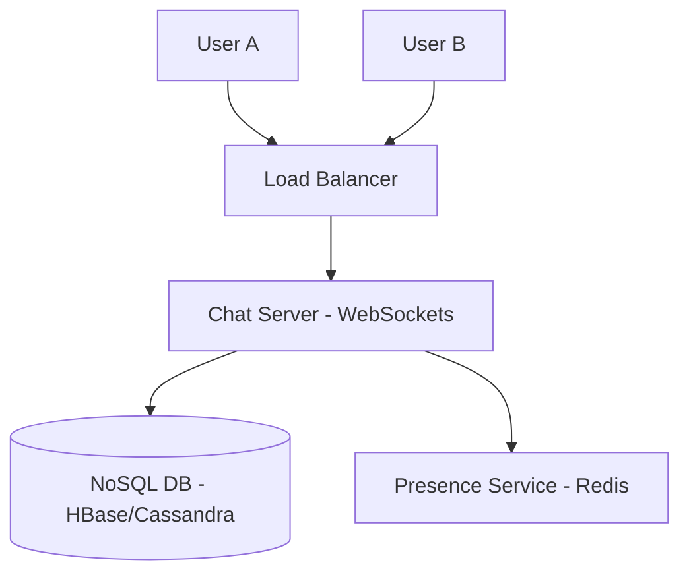

# Designing WhatsApp (রিয়েল-টাইম চ্যাট সিস্টেম)

ওয়াটসঅ্যাপ বা ফেসবুক মেসেঞ্জারের মতো অ্যাপে মূল চ্যালেঞ্জ হলো বিলিয়ন ইউজারের মধ্যে একদম জিরো-ল্যাটেন্সিতে মেসেজ আদান-প্রদান করা এবং ইউজারের অনলাইন স্ট্যাটাস দেখানো।

---

## ১. রিকয়ারমেন্টস (Requirements)

- **1-on-1 Chat:** দুইজন ইউজার রিয়েল-টাইমে মেসেজ পাঠাতে পারবে।
- **Group Chat:** একাধিক ইউজার একসাথে চ্যাট করতে পারবে।
- **Acknowledment:** মেসেজ ডেলিভারি এবং রিড স্ট্যাটাস (Single/Double Tick)।
- **Last Seen:** ইউজারের অনলাইন বা অফলাইন স্ট্যাটাস।
- **Media Sharing:** ইমেজ বা ভিডিও শেয়ার করা।

---

## ২. প্রোটোকল: WebSockets vs HTTP

সাধারণ HTTP রিকোয়েস্টে সার্ভার নিজে থেকে ক্লায়েন্টকে ডেটা পাঠাতে পারে না। তাই চ্যাট অ্যাপের জন্য **WebSockets** ব্যবহার করা হয়। এটি একটি কন্টিনিউয়াস কানেকশন যা উভমুখী ডেটা আদান-প্রদান নিশ্চিত করে।

---

## ৩. হাই-লেভেল ডিজাইন

### কেন NoSQL (HBase/Cassandra)?

চ্যাট অ্যাপ্লিকেশন প্রচুর পরিমাণে রাইট (Write) অপারেশন করে এবং ডেটার পরিমাণ বিশাল। HBase বা Cassandra খুব দ্রুত রাইট হ্যান্ডেল করতে পারে এবং এগুলো স্কেলেবল।

---

## ৪. মেসেজ ফ্লো (Message Delivery Flow)

১. **ইউজার এ** মেসেজ পাঠায় সার্ভারে।
২. সার্ভার দেখে **ইউজার বি** অনলাইনে আছে কি না (Redis থেকে চেক করে)।
৩. অনলাইনে থাকলে সাথে সাথে **WebSocket** দিয়ে মেসেজ পাঠিয়ে দেয়।
৪. অফলাইনে থাকলে মেসেজটি ডাটাবেসে সেভ করে রাখে এবং ইউজার অনলাইন হলে ডেলিভার করে।

---

## ৫. অনলাইন স্ট্যাটাস (Presence Service)

ইউজার অ্যাপ ওপেন করলেই একটি হার্টবিট (Heartbeat) পাঠায়। যদি ৩০ সেকেন্ড কোনো হার্টবিট না আসে, তবে সিস্টেম ধরে নেয় ইউজার অফলাইন। এই তথ্য **Redis**-এ রাখা হয় দ্রুত এক্সেস করার জন্য।

---

> [!IMPORTANT]
> ওয়াটসঅ্যাপের অন্যতম বড় কনসেপ্ট হলো **End-to-End Encryption (E2EE)**। এতে মাঝপথে এমনকি সার্ভারও মেসেজ পড়তে পারে না।
