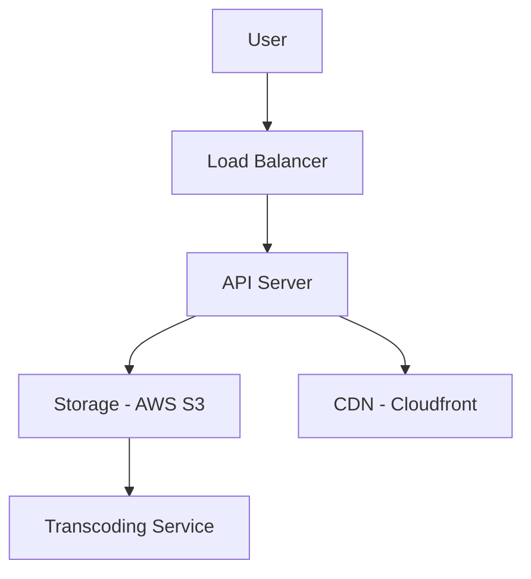

# Designing YouTube (ভিডিও স্ট্রিমিং সার্ভিস ডিজাইন)

ইউটিউব বা নেটফ্লিক্সের মতো সিস্টেমে মূল চ্যালেঞ্জ হলো বিশাল সাইজের ভিডিও ফাইল ম্যানেজ করা এবং ইউজারের ইন্টারনেটের স্পিড অনুযায়ী বাফারিং ছাড়া ভিডিও প্লে করা।

---

## ১. রিকয়ারমেন্টস (Requirements)

- **Upload Video:** ইউজার ভিডিও আপলোড করতে পারবে।
- **Stream Video:** ইউজার বাফারিং ছাড়া ভিডিও দেখতে পারবে।
- **Search:** নাম বা কি-ওয়ার্ড দিয়ে ভিডিও সার্চ করা যাবে।
- **Analytics:** ভিউ সংখ্যা, লাইক এবং কমেন্ট।

---

## ২. ভিডিও আপলোড ও এনকোডিং (Encoding Flow)

ভিডিও আপলোড হওয়ার পর সেটিকে সরাসরি প্লে করা হয় না। কারণ একেক ইউজারের ডিভাইসের রেজোলিউশন (360p, 720p, 4K) এবং ফরম্যাট আলাদা হয়।
১. **Transcoding:** ভিডিওটিকে বিভিন্ন ফরম্যাটে এবং সাইজে ভাগ করা হয়।
২. **Adaptive Bitrate Streaming:** ইউজারের নেটওয়ার্ক স্লো হলে ভিডিওর কোয়ালিটি অটোমেটিক কমে যায় (যেমন 1080p থেকে 480p চলে আসে)। এটি **HLS** বা **DASH** প্রোটোকল দিয়ে করা হয়।

---

## ৩. হাই-লেভেল ডিজাইন (Architecture)

### কেন CDN (Content Delivery Network)?

ভিডিও ফাইল অনেক বড় হয়। যদি সব ইউজার একই সার্ভার থেকে ভিডিও দেখে, তবে সার্ভার ক্রাশ করবে। CDN ভিডিওগুলোকে ইউজারের কাছে থাকা ব্যাকবোন সার্ভারে সেভ করে রাখে, ফলে লু ল্যাটেন্সিতে ভিডিও দেখা যায়।

---

## ৪. ডাটাবেস ডিজাইন

- **Video Metadata:** টাইটেল, ডেসক্রিপশন এবং ইউজারের তথ্যের জন্য **SQL** ডাটাবেস।
- **Storage:** আসল ভিডিও ফাইলের জন্য **Object Storage (S3)**।
- **Search:** দ্রুত সার্চ করার জন্য **Elasticsearch**।

---

> [!TIP]
> ইন্টারভিউতে ভিডিও চাঙ্কিং (Chunking) এবং অ্যাডাপ্টিভ স্ট্রিমিং নিয়ে বিস্তারিত উত্তর দিন।
