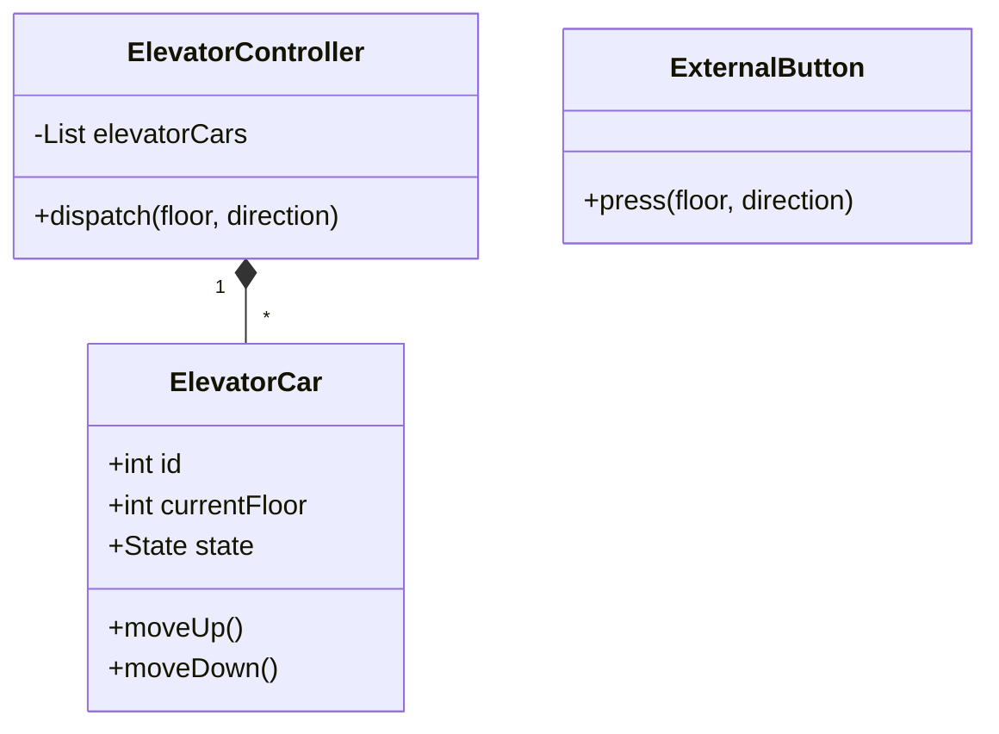

# Elevator System Design (LLD Deep-Dive)

একটি মাল্টি-লিফট এলিভেটর সিস্টেম ডিজাইন করা কনকারেন্সি এবং অ্যালগরিদমিক চিন্তার বড় একটি উদাহরণ।

---

## ১. রিকোয়ারমেন্টস (Requirements)

- একাধিক এলিভেটর/লিফট থাকবে।
- অনেকগুলো ফ্লোর থাকবে।
- প্রতিটি ফ্লোরে উপরে বা নিচে যাওয়ার বাটন থাকবে।
- লিফটের ভিতরে ফ্লোর সিলেক্ট করার প্যানেল থাকবে।
- লিফটটি এমনভাবে কাজ করবে যাতে ওয়েটিং টাইম এবং এনার্জি খরচ কমে।

---

## ২. মেইন ক্লাস এবং এনটিটি

- **ElevatorController:** এটি পুরো সিস্টেমের মাথা। কোন রিকোয়েস্টে কোন লিফট আসবে তা এটি ঠিক করে।
- **ElevatorCar:** লিফটের বর্তমান স্টেট (Moving up, down, idle), ডিরেকশন এবং বর্তমান ফ্লোর ট্র্যাক করে।
- **InternalButton / ExternalButton:** ইউজার ইনপুট হ্যান্ডেল করে।
- **Floor:** ফ্লোর নম্বর এবং এক্সটার্নাল বাটন প্যানেল।

---

## ৩. অলগরিদম এবং ডিজাইন প্যাটার্ন

- **Dispatch Strategy:** কোন লিফটকে পাঠানো হবে তার জন্য **Strategy Pattern** ব্যবহার করা হয় (যেমন: Nearest elevator first)।
- **Observer Pattern:** যখন লিফট একটি ফ্লোরে পৌঁছাবে, তখন ওয়েটিং ইউজার বা ডিসপ্লে বোর্ডকে নোটিফাই করা।
- **State Pattern:** লিফটের স্টেট (Idle, Moving, Stopped) ম্যানেজ করার জন্য।
- **SCAN Algorithm:** হার্ড ড্রাইভের মতো লিফটও সাধারণত SCAN বা LOOK অ্যালগরিদম ব্যবহার করে মুভ করে।

---

## ৪. ক্লাস ডায়াগ্রাম (Mermaid)

---

## ৫. ডিপ ডাইভ (Advanced Concepts)

- **Concurrency:** যখন ১০টি ফ্লোর থেকে একসাথে বাটন প্রেস করা হয়, তখন **Request Queue** কে থ্রেড-সেফ রাখতে হবে।
- **Optimization:** লিফট যখন নিচে নামছে, সে তখন মাঝখানের কোনো ফ্লোর থেকে নিচে যাওয়ার রিকোয়েস্ট পিক করে নেবে (Optimization)।
