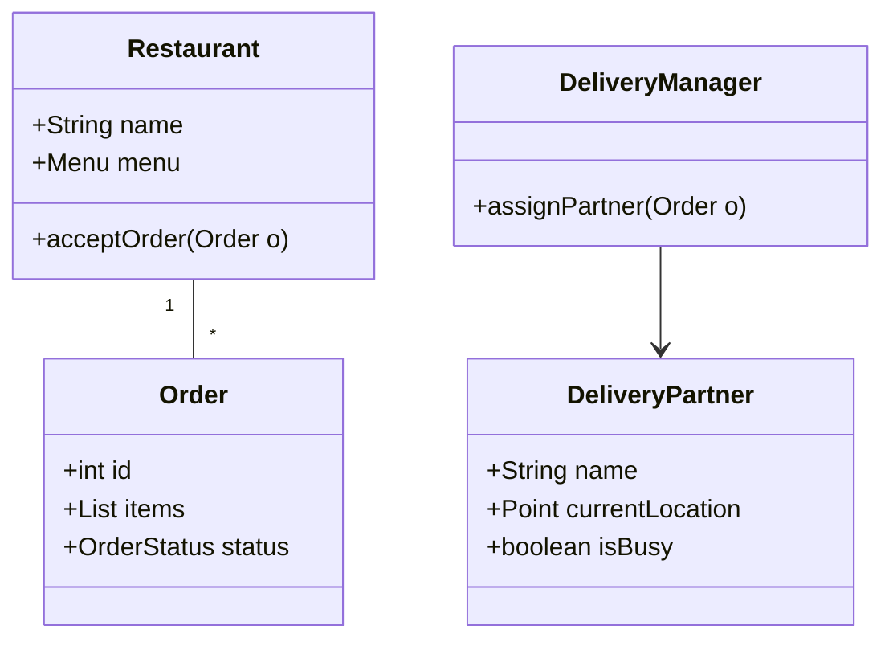

# Food Delivery App Design (LLD Deep-Dive)

Zomato বা Swiggy-এর মতো ফুড ডেলিভারি অ্যাপের LLD ডিজাইনে সবথেকে বড় চ্যালেঞ্জ হলো রিয়েল-টাইম ট্র্যাকিং এবং ডেলিভারি পার্টনার অ্যাসাইনমেন্ট।

---

## ১. রিকোয়ারমেন্টস (Requirements)

- ইউজার রেস্টুরেন্ট সার্চ করতে পারবে এবং খাবার অর্ডার করতে পারবে।
- রেস্টুরেন্ট অর্ডার একসেপ্ট বা রিজেক্ট করতে পারবে।
- ডেলিভারি পার্টনারকে (Rider) অর্ডার অ্যাসাইন করা হবে।
- অর্ডার স্ট্যাটাস রিয়েল-টাইম ট্র্যাক করা যাবে।

---

## ২. মেইন ক্লাস এবং এনটিটি

- **User / Customer:** প্রোফাইল এবং অ্যাড্রেস।
- **Restaurant:** মেনু, ডিশ এবং অর্ডার ম্যানেজমেন্ট।
- **DeliveryPartner:** কারেন্ট লোকেশন এবং অ্যাভেইল্যাবিলিটি।
- **Order:** আইটেম লিস্ট, টোটাল প্রাউস, স্ট্যাটাস।
- **Food:** নাম, ডেসক্রিপশন, প্রাইস।
- **DeliveryManager:** এটি মূলত ডেলিভারি পার্টনারদের ট্র্যাক করে এবং অর্ডার অ্যাসাইন করে।

---

## ৩. ডেলিভারি পার্টনার অ্যাসাইনমেন্ট লজিক

**অ্যালগরিদম:**
যখন কোনো অর্ডার তৈরি হয়, সিস্টেম তখন রেস্টুরেন্টের কাছাকাছি থাকা (ধরুন ৫ কিমি) ফ্রি ডেলিভারি পার্টনারদের লিস্ট পায় এবং তাদের নোটিফিকেশন পাঠায়। যে আগে একসেপ্ট করবে তাকে অর্ডার দেওয়া হবে।

---

## ৪. ডিজাইন প্যাটার্ন ব্যবহার

- **Observer Pattern:** অর্ডারের স্ট্যাটাস চেঞ্জ হলে ইউজারকে নোটিফাই করার জন্য।
- **Strategy Pattern:** বিভিন্ন ডেলিভারি চার্জ ক্যালকুলেশন বা সার্ভিস ফি এর জন্য।
- **Singleton Pattern:** ডেলিভারি ম্যানেজার বা ইনভেন্টরি ম্যানেজারের জন্য।

---

## ৫. ক্লাস ডায়াগ্রাম (Mermaid)

---

> [!NOTE]
> রিয়েল-টাইম লোকেশন ট্র্যাকিংয়ের জন্য **WebSockets** এবং জিও-লোকেশন ইনডেক্সিংয়ের জন্য **Redis Geo-spatial** ডেটা ব্যবহার করা হয়।
