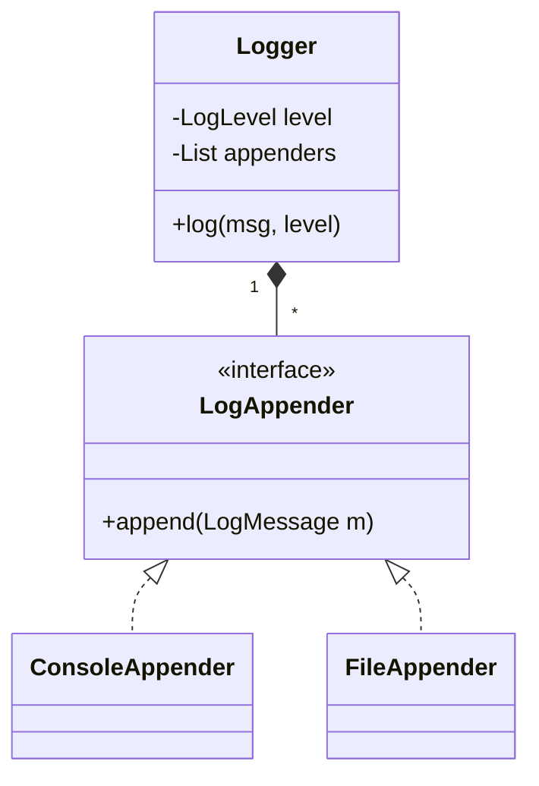

# Logging Framework Design (LLD Deep-Dive)

একটি কাস্টম লগিং ফ্রেমওয়ার্ক (যেমন: Log4j বা Python's logging) ডিজাইন করা যা বিভিন্ন লেভেলে (INFO, DEBUG, ERROR) এবং বিভিন্ন গন্তব্যে (Console, File, DB) লগ পাঠাতে পারে।

---

## ১. রিকোয়ারমেন্টস (Requirements)

- মাল্টিপল লগ লেভেল সাপোর্ট করবে।
- মাল্টিপল ডেস্টিনেশন/অ্যাপেন্ডার (Console, File) সাপোর্ট করবে।
- কনফিগারযোগ্য ফরম্যাট হতে হবে।
- থ্রেড-সেফ হতে হবে।

---

## ২. মেইন ক্লাস এবং এনটিটি

- **Logger:** মেইন ক্লাস যা ইউজার ব্যবহার করবে।
- **LogMessage:** টাইমস্ট্যাম্প, লেভেল এবং মেসেজ থাকবে।
- **LogAppender (Interface):** ConsoleAppender, FileAppender এটি ইমপ্লিমেন্ট করবে।
- **LogFilter:** কোন লেভেলের লগ পাস হবে তা ঠিক করবে।

---

## ৩. ডিজাইন প্যাটার্ন

- **Singleton Pattern:** পুরো অ্যাপ্লিকেশনে একটি মাত্র লগ ম্যানেজার থাকবে।
- **Chain of Responsibility:** লগ মেসেজটি একের পর এক অ্যাপেন্ডারের কাছে পাঠানো।
- **Strategy Pattern:** বিভিন্ন ফরম্যাটিং স্টাইলের জন্য।
- **Observer Pattern:** লগ তৈরি হলে অ্যাপেন্ডারদের জানানো।

---

## ৪. ক্লাস ডায়াগ্রাম (Mermaid)

---

## ৫. ডিপ ডাইভ (Performance)

লগিং যেন মেইন থ্রেডকে ব্লক না করে সেজন্য **Asynchronous Logging** ব্যবহার করা হয়। একটি ইন-মেমরি কিউতে লগগুলো রাখা হয় এবং একটি ব্যাকগ্রাউন্ড থ্রেড সেগুলো ডিস্কে রাইট করে।
