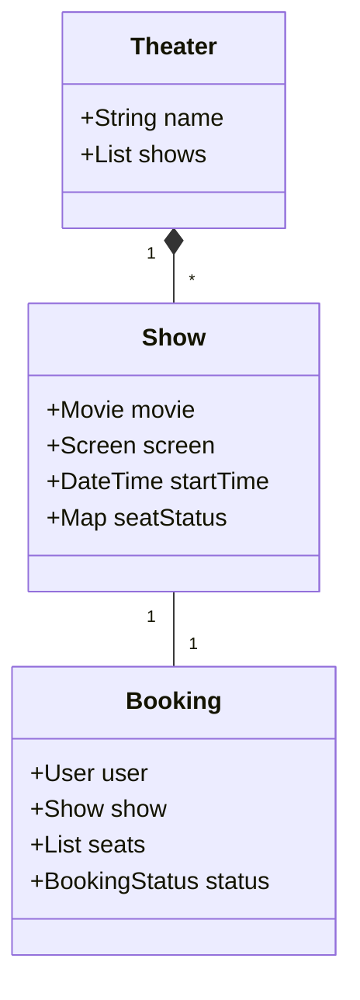

# Movie Ticket Booking System (LLD Deep-Dive)

BookMyShow বা মুভি টিকিট বুকিং সিস্টেমের ক্ষেত্রে প্রধান চ্যালেঞ্জ হলো একই সিট যেন দুইজন বুক করতে না পারে (Concurrency)।

---

## ১. রিকোয়ারমেন্টস (Requirements)

- বিভিন্ন শহরে একাধিক থিয়েটার থাকবে।
- থিয়েটারে একাধিক হল/স্ক্রিন থাকবে।
- প্রতিটি স্ক্রিনে আলাদা আলাদা মুভি শো চলবে।
- সিট ক্যাটাগরি (Gold, Silver, Platinum) এবং সিট ম্যাপ থাকবে।
- একটি নির্দিষ্ট সময় পর্যন্ত সিট লক করে রাখা যাবে।

---

## ২. মেইন ক্লাস এবং এনটিটি

- **Movie:** নাম, ল্যাঙ্গুয়েজ, ডিউরেশন।
- **Theater:** নাম, লোকেশন, স্ক্রিন লিস্ট।
- **Screen:** সিট ম্যাপ।
- **Show:** নির্দিষ্ট মুভি, নির্দিষ্ট সময়ে কোনো একটি স্ক্রিনে।
- **Booking:** ইউজার, শো, সিট লিস্ট এবং পেমেন্ট স্ট্যাটাস।
- **Seat:** সিট নম্বর এবং টাইপ।

---

## ৩. কনকারেন্সি এবং লকিং মেকানিজম

টিকিট বুকিংয়ের সময় সবচেয়ে গুরুত্বপূর্ণ বিষয় হলো সিট ইনভেন্টরি ম্যানেজমেন্ট।

- **Pessimistic Locking:** যখন ইউজার সিট সিলেক্ট করে পেমেন্ট পেজে যাবে, তখন কিছু সময়ের (ধরা যাক ৫ মিনিট) জন্য ওই সিটগুলো লক করে দেওয়া হয় যাতে অন্য কেউ ওই সময় বুক করতে না পারে।
- **Redis Locks:** ডিস্ট্রিবিউটেড লকিংয়ের জন্য Redis ব্যবহার করা যেতে পারে।

---

## ৪. ডিজাইন প্যাটার্ন

- **Singleton:** টিকিট বুকিং ইঞ্জিন বা পেমেন্ট গেটওয়ের জন্য।
- **Strategy:** বিভিন্ন ডিসকাউন্ট বা অফার অ্যাপ্লাই করার জন্য।
- **Observer:** বুকিং কনফার্ম হলে এসএমএস বা ইমেইল পাঠানোর জন্য।

---

## ৫. ক্লাস ডায়াগ্রাম (Mermaid)

