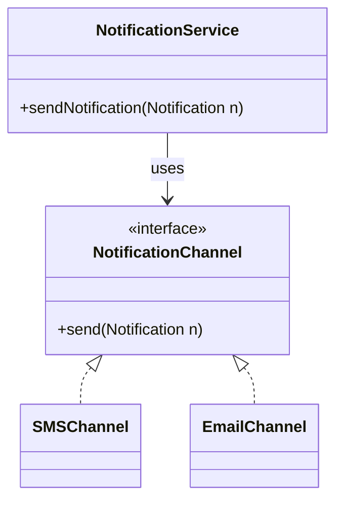

# Notification System Design (LLD Deep-Dive)

একটি স্কেলেবল নোটিফিকেশন সিস্টেম ডিজাইন করা যা ইমেইল, এসএমএস এবং পুশ নোটিফিকেশন পাঠাতে পারে।

---

## ১. রিকোয়ারমেন্টস (Requirements)

- ভিন্ন ভিন্ন চ্যানেল (SMS, Email, Push) সাপোর্ট করতে হবে।
- প্রিয়োরিটি কিউ (Critical notifications like OTP vs Marketing SMS) থাকতে হবে।
- রেট লিমিটিং (একই ইউজারকে যেন খুব বেশি নোটিফিকেশন না যায়) থাকতে হবে।
- স্ট্যাটাস ট্র্যাকিং (Sent, Delivered, Failed)।

---

## ২. মেইন ক্লাস এবং এনটিটি

- **Notification:** মেসেজ বডি, টাইপ, রিসিভার।
- **NotificationChannel (Interface):** EmailChannel, SMSChannel, PushChannel এটা ইমপ্লিমেন্ট করবে।
- **NotificationService:** পুরো প্রসেস এবং কিউইং হ্যান্ডেল করবে।
- **UserPreferences:** ইউজার কোন মাধ্যমে নোটিফিকেশন পেতে চায়।

---

## ৩. ডিজাইন প্যাটার্ন ব্যবহার

- **Strategy Pattern:** রান-টাইমে চ্যানেল সিলেক্ট করার জন্য।
- **Observer Pattern:** সিস্টেমের কোনো ইভেন্ট (যেমন: Order Placed) ঘটলে সাবস্ক্রাইবারদের নোটিফাই করা।
- **Factory Pattern:** নোটিফিকেশন অবজেক্ট তৈরির জন্য।
- **Decorator Pattern:** নোটিফিকেশনে অতিরিক্ত ফিচার (যেমন: লোগো যোগ করা বা এনক্রিপশন) যুক্ত করার জন্য।

---

## ৪. আর্কিটেকচার এবং কিউইং

স্কেলেবিলিটির জন্য মেসেজ কিউ (Kafka বা RabbitMQ) ব্যবহার করা হয়।
**প্রসেস:**
১. ইউজার রিকোয়েস্ট পাঠায়।
২. সিস্টেম রিকোয়েস্টটি ভ্যালিডেট করে কিউতে রাখে।
৩. ওয়ার্কাররা কিউ থেকে ডেটা নিয়ে থার্ড পার্টি এপিআই (যেমন: Twilio, SendGrid) এর মাধ্যমে পাঠায়।

---

## ৫. ক্লাস ডায়াগ্রাম (Mermaid)

