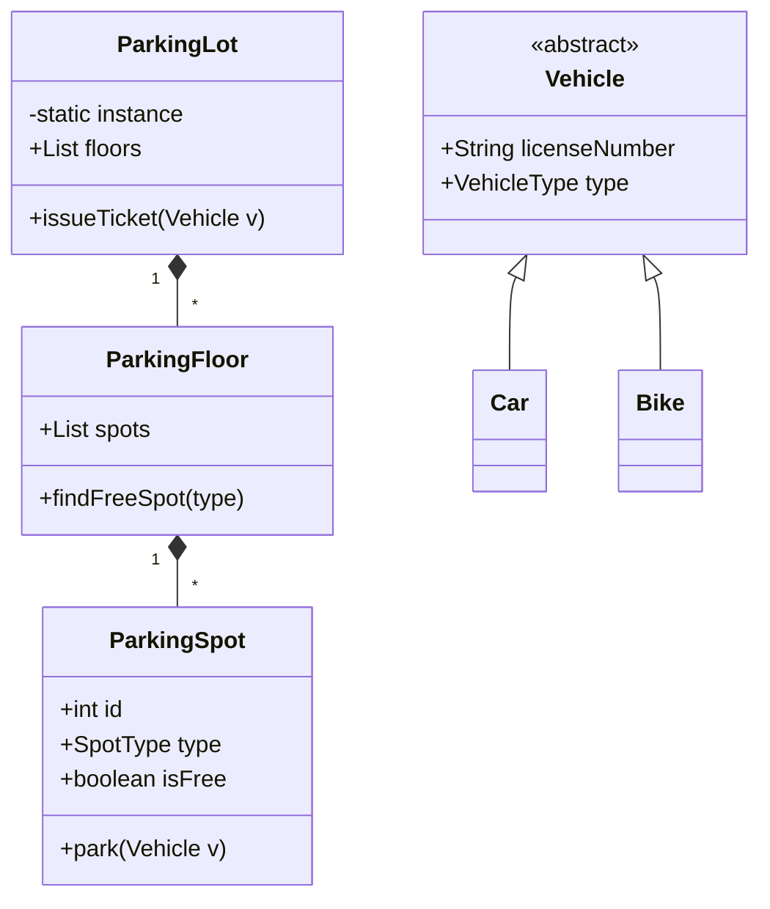

# Parking Lot System Design (LLD Deep-Dive)

পার্কিং লট ডিজাইন করা LLD ইন্টারভিউয়ের অন্যতম কমন প্রবলেম। এটি মূলত অবজেক্টের মধ্যকার রিলেশনশিপ বোঝার জন্য সেরা প্রবলেম।

---

## ১. রিকোয়ারমেন্টস (Requirements)

- একাধিক লেভেল (Floors) থাকবে।
- বিভিন্ন ধরনের পার্কিং স্পট থাকবে (Small for Bike, Compact for Car, Large for Truck)।
- এন্ট্রি এবং এক্সিট পয়েন্ট থাকবে।
- পার্কিং টিকিট জেনারেট করা হবে।
- সময়ের ওপর ভিত্তি করে পেমেন্ট ক্যালকুলেশন হবে।

---

## ২. মেইন ক্লাস এবং এনটিটি

- **Vehicle (Abstract):** Car, Bike, Truck এগুলো একে ইনহেরিট করবে।
- **ParkingSpot:** স্পটের ধরণ এবং স্ট্যাটাস (Free/Occupied) থাকবে।
- **ParkingFloor:** অনেকগুলো পার্কিং স্পট থাকবে।
- **Ticket:** এন্ট্রি টাইম, ভেহিকেল ইনফো ইত্যাদি থাকবে।
- **ParkingLot:** একাধিক ফ্লোর, পেমেন্ট গেটওয়ে এবং এন্ট্রি/একজিট ম্যানেজমেন্ট।

---

## ৩. ডিজাইন প্যাটার্ন ব্যবহার

- **Singleton Pattern:** নিশ্চিত করতে হবে যেন পুরো অ্যাপ্লিকেশনে পার্কিং লটের মাত্র একটি অবজেক্ট থাকে।
- **Factory Pattern:** ভেহিকেলের টাইপ অনুযায়ী অবজেক্ট তৈরির জন্য।
- **Strategy Pattern:** বিভিন্ন ধরনের পেমেন্ট লজিক বা পার্কিং অ্যাাইনমেন্ট লজিকের জন্য।

---

## ৪. ক্লাস ডায়াগ্রাম (Mermaid)

---

## ৫. ডিপ ডাইভ (Advanced Tips)

- **Concurrency:** যখন অনেকগুলো গাড়ি একসাথে এন্ট্রি করার চেষ্টা করে, তখন রেস কন্ডিশন এড়াতে **Mutex/Locks** ব্যবহার করতে হবে যাতে একই স্পট ডবল বুক না হয়।
- **Scalability:** নতুন ধরনের চার্জিং স্পট (EV Charging) সহজে যুক্ত করার জন্য ইন্টারফেস ব্যবহার করুন।
