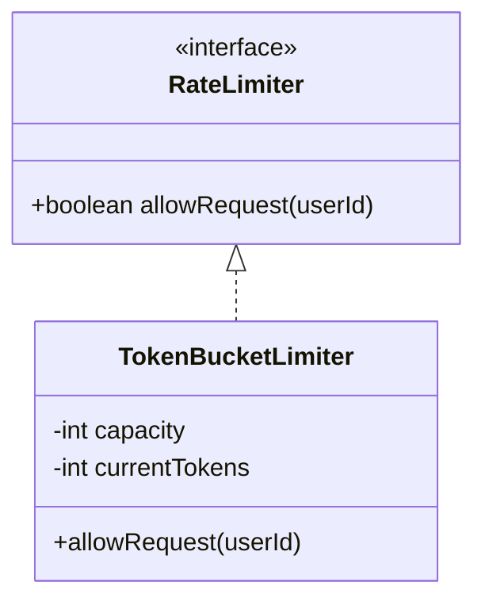

# Rate Limiter Design (LLD Deep-Dive)

রেট লিমিটর একটি সিস্টেমকে অতিরিক্ত রিকোয়েস্ট (Spam/DDoS) থেকে রক্ষা করে। এটি নিশ্চিত করে যে একজন ইউজার একটি নির্দিষ্ট সময়ে মাত্র নির্দিষ্ট সংখ্যাক রিকোয়েস্ট পাঠাতে পারবে।

---

## ১. রিকোয়ারমেন্টস (Requirements)

- ইউজার বা আইপি ভিত্তিক লিমিট।
- লো-ল্যাটেন্সি হতে হবে।
- ডিস্ট্রিবিউটেড এনভায়রনমেন্ট সাপোর্ট করবে।

---

## ২. অ্যালগরিদমসমূহ

- **Token Bucket:** একটি বাকেটে টোকেন জমা হয়, রিকোয়েস্ট আসলে একটি টোকেন নেওয়া হয়। বাকেট খালি থাকলে রিকোয়েস্ট রিজেক্ট হয়। (সবচেয়ে জনপ্রিয়)।
- **Leaky Bucket:** রিকোয়েস্ট একটি নির্দিষ্ট রেটে প্রসেস হয়।
- **Fixed Window Counter:** নির্দিষ্ট টাইমে (উদা: ১ মিনিট) কাউন্টার বাড়ানো হয়।

---

## ৩. মেইন ক্লাস এবং এনটিটি

- **RateLimiter:** মেইন ইন্টারফেস।
- **UserBucket:** প্রতিটি ইউজারের জন্য টোকেন ট্র্যাকার।
- **Refiller:** একটি নির্দিষ্ট সময় পর পর টোকেন রিফিল করার লজিক।

---

## ৪. ডিজাইন প্যাটার্ন

- **Strategy Pattern:** রান-টাইমে অ্যালগরিদম (Token Bucket vs Leaky Bucket) চেঞ্জ করার জন্য।
- **Singleton:** রেট লিমিটর কনফিগারেশন ম্যানেজারের জন্য।

---

## ৫. ক্লাস ডায়াগ্রাম (Mermaid)

---

## ৬. ডিপ ডাইভ (Distributed Rate Limiting)

যদি আপনার একাধিক সার্ভার থাকে, তবে লোকাল কাউন্টার কাজ করবে না। সেক্ষেত্রে **Redis** ব্যবহার করা হয়। Redis-এর `INCR` এবং `EXPIRE` কমান্ড ব্যবহার করে খুব সহজে গ্লোবাল রেট লিমিট হ্যান্ডেল করা যায়।
