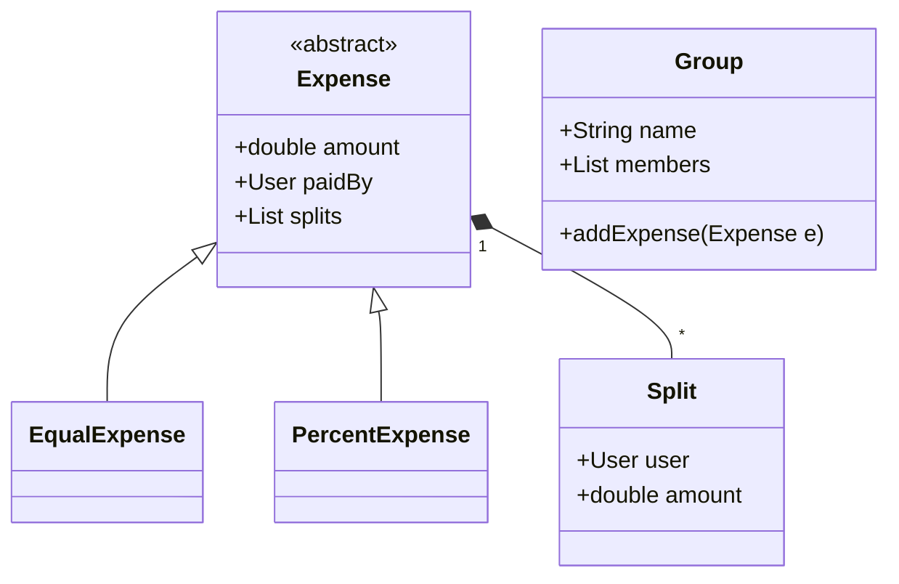

# Splitwise App Design (LLD Deep-Dive)

Splitwise হলো বন্ধুদের মধ্যে খরচ ভাগাভাগি করার জনপ্রিয় অ্যাপ। এর ডিজাইনে ডেটাবেস এবং ব্যালেন্স সেটেলমেন্ট লজিক গুরুত্বপূর্ণ।

---

## ১. রিকোয়ারমেন্টস (Requirements)

- ইউজাররা গ্রুপ তৈরি করতে পারবে।
- যেকোনো ইউজার খরচ (Expense) যোগ করতে পারবে।
- খরচ সমানভাগে (Equal), নির্দিষ্ট পারসেন্টেজ (%) বা অ্যামাউন্ট অনুযায়ী ভাগ করা যাবে।
- কে কার কাছে কত পায় তার হিসাব দেখা যাবে।
- ট্রানজেশন সংখ্যা কমানোর জন্য **Simplify Debt** ফিচার থাকবে।

---

## ২. মেইন ক্লাস এবং এনটিটি

- **User:** আইডি, নাম, ইমেইল।
- **Group:** মেম্বার লিস্ট এবং এক্সপেন্স লিস্ট।
- **Expense (Abstract):** EqualExpense, PercentExpense, ExactExpense একে ইনহেরিট করবে।
- **Split (Abstract):** প্রতিটি ইউজারের ভাগের হিসাব।
- **BalanceSheet:** কে কার কাছে কত পায় তার নেট ব্যালেন্স।

---

## ৩. ডিজাইন প্যাটার্ন ব্যবহার

- **Strategy Pattern:** খরচ ভাগ করার বিভিন্ন পদ্ধতি (Equal, Percent, Exact) ম্যানেজ করার জন্য।
- **Observer Pattern:** যখন গ্রুপে নতুন খরচ যোগ করা হয়, তখন সব মেম্বারকে নোটিফাই করা।
- **Factory Pattern:** এক্সপেন্স টাইপ অনুযায়ী সঠিক অবজেক্ট তৈরির জন্য।

---

## ৪. ক্লাস ডায়াগ্রাম (Mermaid)

---

## ৫. ডিপ ডাইভ (Simplified Debt Algorithm)

সবচেয়ে ইন্টারেস্টিং পার্ট হলো ট্রানজিশন কমানো।
**লজিক:**
১. সবার নেট ব্যালেন্স বের করুন (Credit - Debit)।
২. যাদের ব্যালেন্স নেগেটিভ (পাওনাদার) এবং পজিটিভ (ঋণী) তাদের আলাদা করুন।
৩. Greedy পদ্ধতিতে সবচেয়ে বড় ঋণী এবং সবচেয়ে বড় পাওনাদারের মধ্যে সেটেলমেন্ট করুন। এটি মিনিমাম ট্রানজিশন নিশ্চিত করবে।
