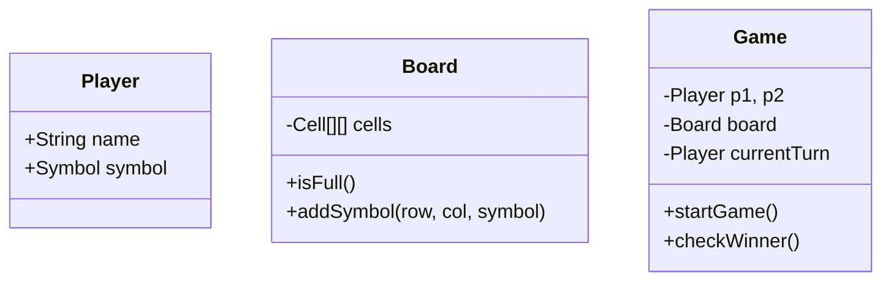

# Tic-Tac-Toe Game Design (LLD Deep-Dive)

Tic-Tac-Toe একটি চমৎকার প্রবলেম যা দিয়ে OOP এবং ডিজাইন প্যাটার্ন প্র্যাকটিস করা যায়।

---

## ১. রিকোয়ারমেন্টস (Requirements)

- ২ জন প্লেয়ার থাকবে।
- ৩x৩ বোর্ড থাকবে।
- প্লেয়াররা 'X' অথবা 'O' ব্যবহার করবে।
- যেকোনো একজন ৩টি ঘর এক সারিতে (Horizontal, Vertical, Diagonal) পূর্ণ করলে জিতে যাবে।
- বোর্ড ফুল হলে এবং কেউ না জিতলে ড্র হবে।

---

## ২. মেইন এনটিটি এবং ক্লাস (Classes)

- **Board:** ৩x৩ গ্রিড ম্যানেজ করবে।
- **Player:** প্লেয়ারের নাম এবং সিম্বল (X/O) থাকবে।
- **Cell:** বোর্ডের প্রতিটি ঘরের অবস্থা (Empty, X, O) ট্র্যাক করবে।
- **Game:** পুরো গেমের লজিক, টার্ন ম্যানেজমেন্ট এবং উইনার চেক করবে।

---

## ৩. ক্লাস ডায়াগ্রাম (Mermaid)



---

## ৪. পাইথন কোড উদাহরণ

```python
class Board:
    def __init__(self, size=3):
        self.size = size
        self.grid = [[' ' for _ in range(size)] for _ in range(size)]

    def print_board(self):
        for row in self.grid:
            print('|'.join(row))

    def make_move(self, r, c, symbol):
        if self.grid[r][c] == ' ':
            self.grid[r][c] = symbol
            return True
        return False

class Game:
    def __init__(self, p1_name, p2_name):
        self.board = Board()
        self.p1 = {'name': p1_name, 'symbol': 'X'}
        self.p2 = {'name': p2_name, 'symbol': 'O'}
        self.current_player = self.p1

    def play(self, r, c):
        if self.board.make_move(r, c, self.current_player['symbol']):
            self.board.print_board()
            # উইনার চেকিং লজিক এখানে হবে
            self.current_player = self.p2 if self.current_player == self.p1 else self.p1
        else:
            print("Invalid Move!")
```

---

## ৫. ডিপ ডাইভ (Deep Dive Concepts)

- **Extensibility:** যদি ৪x৪ বা NxN বোর্ড করতে বলা হয়, তবে `Board` ক্লাসে সাইজ ভ্যারিয়েবল ব্যবহার করুন।
- **Design Pattern:** প্লেয়ারের টার্ন ম্যানেজমেন্টের জন্য আপনি **State Pattern** অথবা **Strategy Pattern** ব্যবহার করতে পারেন যদি গেমের লজিক আরও জটিল হয়।
