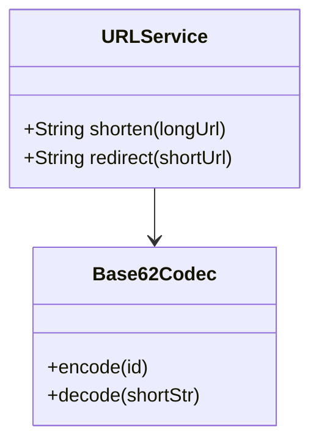

# URL Shortener Design (LLD Deep-Dive)

TinyURL বা Bitly-এর মতো URL শর্টেনার ডিজাইন করা ডাটাবেস এবং এনকোডিং বোঝার জন্য চমৎকার উদাহরণ।

---

## ১. রিকোয়ারমেন্টস (Requirements)

- লং URL ইনপুট দিলে একটি ইউনিক শর্ট URL জেনারেট করে দিবে।
- শর্ট URL-এ ভিজিট করলে অরিজিনাল URL-এ রিডাইরেক্ট করবে।
- শর্ট URL যেন ছোট হয় (উদা: tiny.com/abc1234)।

---

## ২. অ্যালগরিদম (Base62 Encoding)

৬২টি ক্যারেক্টার (a-z, A-Z, 0-9) ব্যবহার করে শর্ট আইডি জেনারেট করা হয়।
**প্রসেস:**
১. ডাটাবেসে একটি ইউনিক অটো-ইনক্রিমেন্ট আইডি (ID) লিবে।
২. সেই আইডি-কে Base62-তে কনভার্ট করবে। (ID 12345 -> 'sfR')

---

## ৩. মেইন ক্লাস এবং এনটিটি

- **URLService:** শর্ট করা এবং রিডাইরেক্ট করার মেইন লজিক।
- **URLMapping:** লং URL, শর্ট URL এবং এক্সপায়ার ডেট স্টোর করবে।
- **Statistics:** হিট কাউন্ট এবং ট্রাফিক ডাটা।

---

## ৪. ডিজাইন প্যাটার্ন

- **Singleton:** ইউআরএল জেনারেটরের জন্য।
- **Strategy:** ভিন্ন ভিন্ন এনকোডিং অ্যালগরিদম ব্যবহারের জন্য।

---

## ৫. ক্লাস ডায়াগ্রাম (Mermaid)

---

## ৬. ডিপ ডাইভ (Optimization)

- **Caching:** যেহেতু রিডাইরেকশন রিকোয়েস্ট অনেক বেশি হয়, তাই পপুলার ইউআরএলগুলো **Redis**-এ ক্যাশ করে রাখা হয়।
- **Collision:** রেন্ডম স্ট্রিং জেনারেট করলে কোলিশন হতে পারে, তাই ডাটাবেস সিকোয়েন্স ব্যবহার করা আইডি সবচেয়ে সেফ।
