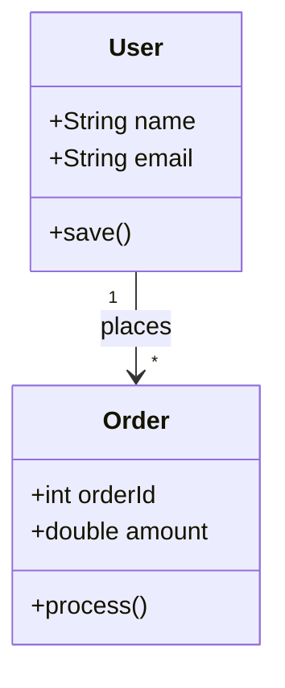
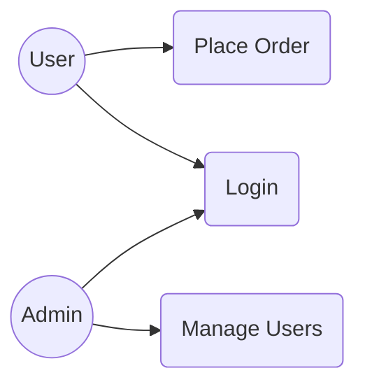
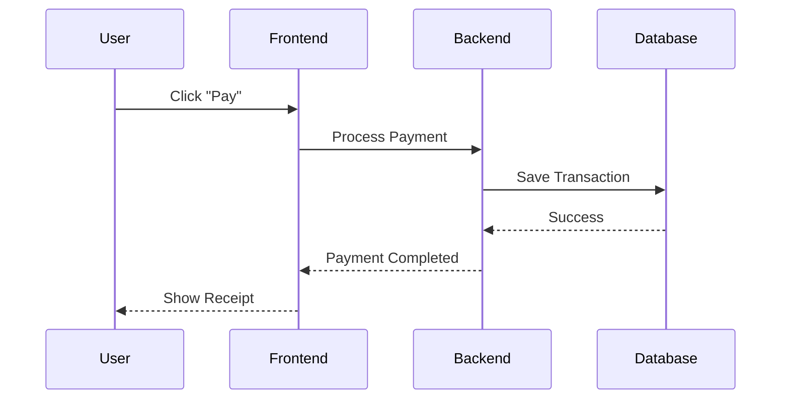
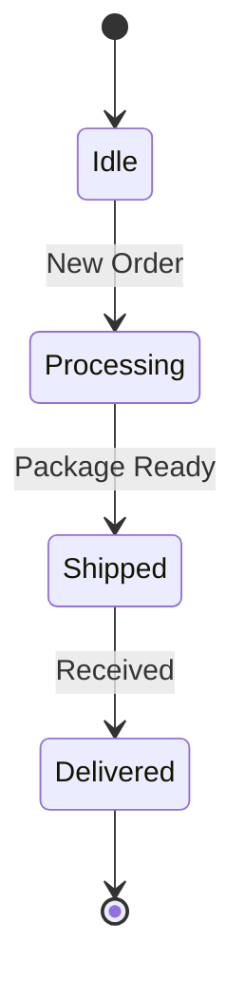

# UML (Unified Modeling Language) - বাংলায়

UML হলো একটি স্ট্যান্ডার্ড ল্যাঙ্গুয়েজ যা সফটওয়্যার সিস্টেমের আর্কিটেকচার, ডিজাইন এবং ইমপ্লিমেন্টেশনকে ভিজুয়ালি রিপ্রেজেন্ট করার জন্য ব্যবহৃত হয়। এটি মূলত সিস্টেমের ব্লুপ্রিন্ট।

সিস্টেম ডিজাইনের ক্ষেত্রে ৪টি ডায়াগ্রাম সবচেয়ে বেশি জনপ্রিয়:

---

## ১. ক্লাস ডায়াগ্রাম (Class Diagram)

ক্লাস ডায়াগ্রাম হলো একটি স্ট্যাটিক স্ট্রাকচার ডায়াগ্রাম যা সিস্টেমের ক্লাসসমূহ, তাদের অ্যাট্রিবিউট, মেথড এবং ক্লাসগুলোর মধ্যে সম্পর্ক তুলে ধরে।

**উদাহরণ (Mermaid):**

---

## ২. ইউজ কেস ডায়াগ্রাম (Use Case Diagram)

ইউজ কেস ডায়াগ্রাম দেখায় যে ইউজার (Actor) কীভাবে একটি সিস্টেমের সাথে ইন্টারঅ্যাক্ট করে। এটি সিস্টেমের ফাংশনাল রিকোয়ারমেন্ট প্রকাশ করে।

**উদাহরণ (Mermaid):**

---

## ৩. সিকোয়েন্স ডায়াগ্রাম (Sequence Diagram)

সিকোয়েন্স ডায়াগ্রাম হলো একটি ইন্টারঅ্যাকশন ডায়াগ্রাম যা দেখায় কীভাবে অবজেক্টগুলো একটি নির্দিষ্ট ক্রমে একে অপরের সাথে যোগাযোগ করে। এটি মূলত টাইম-অর্ডার অনুযায়ী কাজ করে।

**উদাহরণ (Mermaid):**

---

## ৪. স্টেট ডায়াগ্রাম (State Diagram)

স্টেট ডায়াগ্রাম একটি অবজেক্টের লাইফসাইকেল বা তার বিভিন্ন অবস্থার পরিবর্তন (State transition) দেখায়।

**উদাহরণ (Mermaid):**

---

## কেন UML শিখবেন?

- **ক্লিয়ার কমিউনিকেশন:** ডেভেলপার, ম্যানেজার এবং ক্লায়েন্টদের মধ্যে সিস্টেমের ডিজাইন নিয়ে পরিষ্কার ধারণা তৈরি হয়।
- **ডকুমেন্টেশন:** ভবিষ্যতে সিস্টেমটি মেইনটেইন করা সহজ হয়।
- **কোডিং এর আগে পরিকল্পনা:** বড় প্রজেক্টের কোড শুরু করার আগে লজিক্যাল ভুলগুলো UML-এর মাধ্যমে সহজেই ধরা যায়।

---

> [!TIP]
> সবসময় সব ডায়াগ্রাম আঁকার প্রয়োজন নেই। যে সিস্টেমটি ডিজাইন করছেন সেখানে যেটা সবচেয়ে বেশি প্রয়োজনীয় (যেমন জটিল লজিকের জন্য Sequence Diagram) সেটি আগে আঁকুন।
