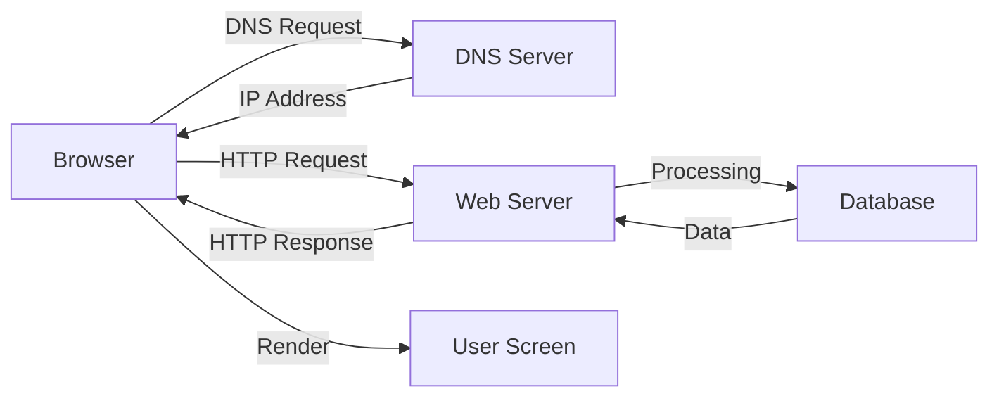

# How does the Work? (ইন্টারনেট কিভাবে কাজ করে?)

আমরা যখন ব্রাউজারে `www.google.com` লিখে এন্টার চাপি, তখন পর্দার আড়ালে অনেকগুলো ডিজিটাল ধাপ পার হতে হয়। চলুন দেখে নেই এই মজার প্রক্রিয়াটি।

## ধাপ ১: DNS Lookup (অ্যাড্রেস খোঁজা)
ব্রাউজার সরাসরি কোনো নাম বোঝে না, সে বোঝে আইপি (IP) অ্যাড্রেস। তাই ব্রাউজার প্রথমে **DNS (Domain Name System)** সার্ভারের কাছে গিয়ে জিজ্ঞাসা করে, "google.com এর আইপি অ্যাড্রেস কি?"

## ধাপ ২: TCP Connection & Handshake
আইপি অ্যাড্রেস পাওয়ার পর, ব্রাউজার সেই সার্ভারের সাথে সংযোগ স্থাপন করে। এখানে একটি **Three-way Handshake** প্রক্রিয়া ঘটে (SYN, SYN-ACK, ACK), যার মাধ্যমে নিশ্চিত হওয়া যায় যে সার্ভারটি রিকোয়েস্ট গ্রহণের জন্য প্রস্তুত।

## ধাপ ৩: HTTP/HTTPS Request
সার্ভারের সাথে কানেক্ট হওয়ার পর ব্রাউজার একটি **HTTP GET** রিকোয়েস্ট পাঠায়। যেমন: "আমাকে তোমার হোমপেজের HTML ফাইলটি দাও।" যদি এটি HTTPS হয়, তবে এখানে ডেটা এনক্রিপশনের কাজও সম্পন্ন হয়।

## ধাপ ৪: Server Processing
সার্ভার রিকোয়েস্টটি পাওয়ার পর চেক করে যে ডাটাটি কোথায় আছে। সে ডেটাবেস থেকে তথ্য নিয়ে একটি রেসপন্স (Response) তৈরি করে।

## ধাপ ৫: HTTP Response & Rendering
সার্ভার ব্রাউজারকে একটি স্ট্যাটাস কোড (যেমন- 200 OK) এবং কাঙ্ক্ষিত ফাইলগুলো (HTML, CSS, JS) পাঠিয়ে দেয়। ব্রাউজার এগুলো পাওয়ার পর নিচের ধাপগুলো কাজ করে:
*   **Parsing:** ফাইলগুলো পড়ে স্ট্রাকচার বোঝে।
*   **Rendering:** স্ক্রিনে পেজটি ফুটিয়ে তোলে।

## সারসংক্ষেপ (Diagram flow)

---

> [!NOTE]
> এই পুরো প্রক্রিয়াটি সম্পন্ন হতে মাত্র কয়েক মিলিসেকেন্ড সময় লাগে। লোড ব্যালেন্সার, সিডিএন (CDN) এবং ক্যাশিং এই প্রসেসকে আরও দ্রুত করতে সাহায্য করে।
