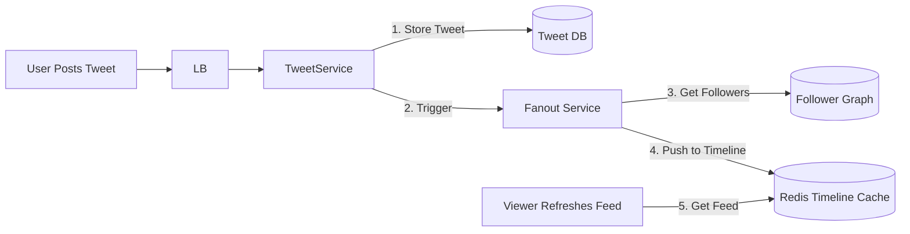
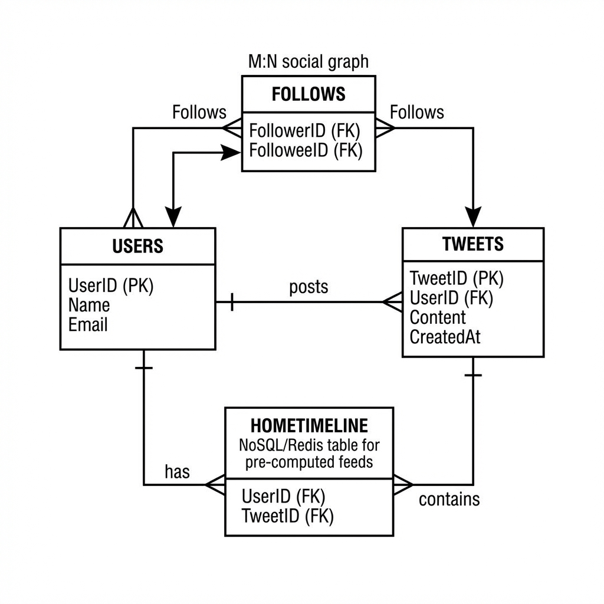

# Designing Twitter / X (Newsfeed System)

"Twitter" বা "Facebook Newsfeed" ডিজাইন করা একটি অত্যন্ত জনপ্রিয় ইন্টারভিউ প্রশ্ন। এটি একটি **Read-Heavy** সিস্টেম, যেখানে ডেটা কনসিস্টেন্সির চেয়ে **Availability** এবং **Low Latency** বেশি গুরুত্বপূর্ণ।

এই গাইডে আমরা দেখব কিভাবে মিলিয়ন ইউজারের জন্য একটি রিয়েল-টাইম নিউজফিড সিস্টেম ডিজাইন করা যায়।

## 1. Requirements (রিকয়রমেন্টস)

### Functional Requirements (ফিচারস)

1.  **Post Tweet:** ইউজাররা টুইট (টেক্সট, ইমেজ, ভিডিও) পোস্ট করতে পারবে।
2.  **Timeline (Newsfeed):** ইউজার তার ফলো করা মানুষদের টুইটগুলো ক্রমানুসারে (Reverse Chronological Order) দেখতে পাবে।
3.  **Follow/Unfollow:** ইউজাররা একে অপরকে ফলো করতে পারবে।
4.  **Search:** কি-ওয়ার্ড দিয়ে টুইট সার্চ করা যাবে।

### Non-Functional Requirements (কোয়ালিটি)

1.  **High Availability:** সিস্টেম সবসময় চালু থাকতে হবে (CAP থিওরামের AP)।
2.  **Low Latency (200ms):** নিউজফিড লোড হতে ২০মিলিসেকেন্ডের বেশি নেয়া যাবে না।
3.  **Eventual Consistency:** আমি টুইট করার সাথে সাথেই আমার সব ফলোয়ারের কাছে সেটি না পৌঁছালেও সমস্যা নেই, কয়েক সেকেন্ড দেরি হতে পারে।

---

## 2. Capacity Estimation (ক্যাপাসিটি এস্টিমেশন)

Twitter একটি **Read-Heavy** সিস্টেম। অর্থাৎ, টুইট পোস্ট করার চেয়ে টুইট পড়ার সংখ্যা অনেক বেশি।

- **Total Users:** 1 Billion.
- **Daily Active Users (DAU):** 200 Million.
- **Writes (Post Tweet):** 100 Million tweets / day.
- **Reads (View Timeline):** 20 Billion views / day.
- **Read:Write Ratio:** 200:1 (প্রচুর রিড হয়)।

### Storage Estimation

- মনে করি প্রতিটি টুইট ১৪০ ক্যারেক্টার এবং কিছু মেটাডেটা সহ **500 bytes**।
- Daily Storage = 100M \* 500 bytes = **50 GB / day**।
- 5 Years Storage = 50 GB _ 365 _ 5 ≈ **90 TB** (মিডিয়া ফাইল ছাড়া)।

---

## 3. High-Level Design (HLD)

নিচে টুইটারের একটি হাই-লেভেল আর্কিটেকচার দেওয়া হলো:


```mermaid
flowchart TD
    User[Clients (Mobile/Web)]
    LB[Load Balancer]
    API[API Gateway]

    subgraph Services
        UserService[User Service (Profile/Graph)]
        TweetService[Tweet Service (Post/Store)]
        FanoutService[Fanout Service (Newsfeed)]
        SearchService[Search Service]
    end

    subgraph Storage
        UserDB[(User DB - MySQL)]
        TweetDB[(Tweet DB - Cassandra/MySQL)]
        FollowDB[(Graph DB - Neo4j)]
        Cache[(Redis Cluster)]
    end

    User -->|HTTPS| LB
    LB --> API
    API --> UserService
    API --> TweetService
    API --> SearchService
    API --> FanoutService

    UserService --> UserDB
    UserService --> FollowDB
    TweetService --> TweetDB
    FanoutService --> Cache
    SearchService --> TweetDB
```

---

## 4. Deep Dive: Timeline Generation (Fanout Service)

টুইটারের ডিজাইনের সবচেয়ে চ্যালেঞ্জিং পার্ট হলো **নিউজফিড জেনারেশন**। যখন একজন ইউজার টুইট করে, তখন তার সব ফলোয়ারের ফিডে সেই টুইটটি পৌঁছে দিতে হয়। একে বলা হয় **Fanout**।

### Approach 1: Pull Model (Fanout on Load)

যখন ইউজার অ্যাপ ওপেন করে (Timeline রিফ্রেশ করে), তখন সিস্টেম:

1.  ইউজার যাদের ফলো করে তাদের তালিকা বের করে।
2.  সেই ফলোয়িং-লিস্টের সবার লেটেস্ট টুইটগুলো কুয়েরি করে নিয়ে আসে।
3.  মেমোরিতে মার্জ (Merge) করে টাইমলাইন দেখায়।

**সমস্যা:** যখন ফলোয়িং সংখ্যা অনেক বেশি হয়, তখন এই কুয়েরি খুব স্লো হয়ে যায়।

### Approach 2: Push Model (Fanout on Write) - **Preferred**

যখন কেউ টুইট **পোস্ট** করে, তখনই সিস্টেম তার সব ফলোয়ারের প্রি-কম্পিউটেড টাইমলাইন লিস্টে (Redis List) টুইটটি ইনসার্ট করে দেয়।

1.  Alice টুইট করল।
2.  Fanout Service এলিসের সব ফলোয়ারকে খুঁজে বের করে।
3.  সবার `HomeTimeline` (Redis) এ টুইট আইডিটি পুশ করে দেয়।
4.  Bob যখন লগইন করে, সে সরাসরি Redis থেকে তার টাইমলাইন পেয়ে যায় (0 latency)।

**সমস্যা (The Justin Bieber Problem):** জাস্টিন বিবারের মতো সেলেব্রিটির ফলোয়ার মিলিয়ন মিলিয়ন। একবার টুইট করলেই কোটি কোটি মানুষের ক্যাশ আপডেট করতে গেলে সিস্টেম বসে যাবে।

### Approach 3: Hybrid Model (Twitter's Solution)

- **সাধারণ ইউজারদের জন্য:** **Push Model** ব্যবহার করা হয়।
- **সেলেব্রিটিদের জন্য:** **Pull Model** ব্যবহার করা হয়। তাদের টুইট ফলোয়ারদের টাইমলাইনে পুশ করা হয় না। যখন ইউজার ফিড লোড করে, তখন সাধারণ টুইটগুলোর সাথে সেলেব্রিটিদের টুইট মার্জ করে দেখানো হয়।



---

## 5. Deep Dive: Search Service (Earlybird)

টুইটারের সার্চ সিস্টেম রিয়েল-টাইমে কাজ করে। টুইট করার কয়েক সেকেন্ডের মধ্যেই সেটি সার্চেবল হতে হয়। টুইটার এর জন্য **Earlybird** নামক একটি মডিফাইড **Lucene** বেসড ইঞ্জিন ব্যবহার করে।

### ইনডেক্সিং ফ্লো:

1.  **Ingestion:** টুইট পোস্ট হওয়ার সাথে সাথে এটি Kafka-তে চলে যায়।
2.  **Processing:** একটি ইনজেস্টর সার্ভিস টুইটটিকে টোকেনাইজ করে এবং হ্যাশট্যাগ এক্সট্র্যাক্ট করে।
3.  **Indexing:** প্রসেস করা টুইটটি **Earlybird** শার্ডে স্টোর হয়। প্রতিটি শার্ড একটি নির্দিষ্ট সময়ের (যেমন ১ ঘন্টা বা ১ দিন) টুইট ধারণ করে।

### সার্চ ফ্লো (Scatter-Gather):

1.  ইউজার 'Cristiano' লিখে সার্চ দিল।
2.  **Blender (Aggregator)** সার্ভিস এই রিকোয়েস্টটি রিসিভ করে।
3.  এটি প্যারালালি সব Earlybird শার্ডে সার্চ রিকোয়েস্ট পাঠায় (**Scatter**)।
4.  প্রতিটি শার্ড রেজাল্ট রিটার্ন করে।
5.  Blender সব রেজাল্ট মার্জ করে, সর্ট করে এবং ইউজারের কাছে পাঠায় (**Gather**)।

---

## 6. Database Schema Design

### SQL vs NoSQL?

- **User Profile:** রিলেশনাল ডেটা, তাই **MySQL**।
- **Tweets:** প্রচুর রাইট এবং রিড, রিলেশন কম। **Cassandra** (Wide-column store) এর জন্য সেরা। টুইটারের নিজস্ব ভার্সন হলো **Manhattan**।
- **Social Graph (Followers):** কে কাকে ফলো করছে, এটি গ্রাফ ডেটা। **Neo4j** বা **MySQ** (Adjacency List) দিয়ে ম্যানেজ করা যায়।

### Visual Schema Design

নিচে এন্টিটি রিলেশনশিপ ডায়াগ্রামের একটি উদাহরণ দেওয়া হলো:



---

## 7. Scalability & Optimization

1.  **Sharding:**
    - **Sharding by UserID:** একজন ইউজারের সব টুইট একই শার্ডে থাকবে। কিন্তু হট ইউজার (সেলিব্রিটি) সমস্যা করতে পারে।
    - **Sharding by TweetID (Snowflake ID):** টুইটার **Snowflake** অ্যালগরিদম ব্যবহার করে ইউনিক আইডি জেনারেট করে যা সময়ের সাথে সর্ট করা যায় (Time-sortable)। এটি বেস্ট অ্যাপ্রোচ।

2.  **Caching:**
    - **Redis** ব্যবহার করা হয় প্রতিটি ইউজারের `HomeTimeline` স্টোর করার জন্য। একটি `List` ডাটা স্ট্রাকচারে শুধু `TweetID` গুলো রাখা হয়।
    - মেমোরি বাঁচাতে শুধু লাস্ট ৮০০ টুইট ক্যাশে রাখা হয়।

---

## 8. Summary

- **Write Path:** User -> LB -> Tweet Service -> DB + Fanout Service -> Redis.
- **Read Path:** User -> LB -> Timeline Service -> Redis (Hybrid Merge) -> Return Feed.
- **Optimization:** Hybrid Fanout (Push for normal, Pull for celebrities).
