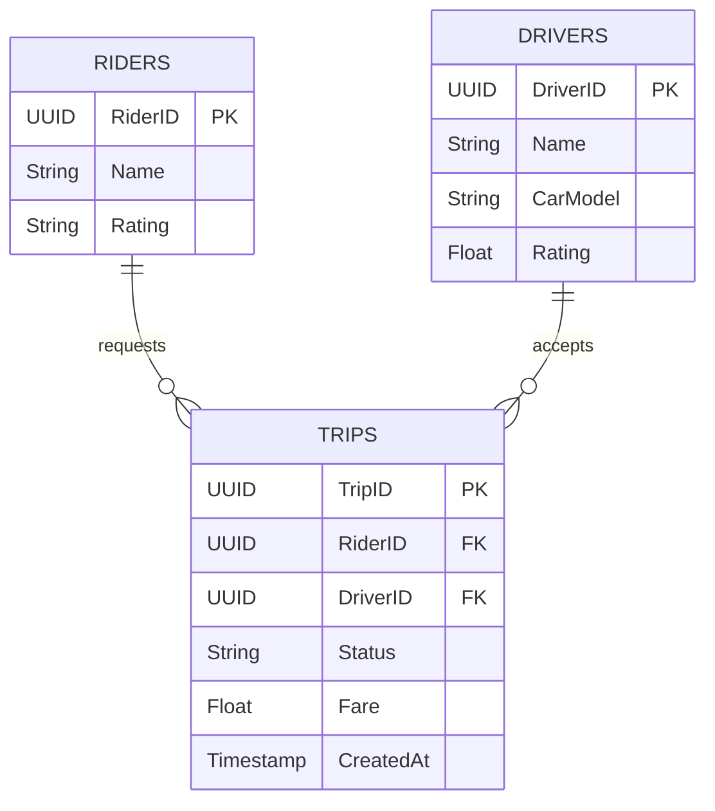

# Designing Uber / Pathao (Ride Sharing)

**Uber** বা **Pathao** এর মতো রাইড শেয়ারিং অ্যাপ ডিজাইন করা ইন্টারভিউতে খুব কমন একটি প্রশ্ন। এখানে মূল চ্যালেঞ্জ হলো রিয়েল-টাইমে যাত্রীর লোকেশন অনুযায়ী কাছের ড্রাইভারদের খুঁজে বের করা (**Geospatial Query**) এবং তাদের ম্যাচ করা।

## 1. Requirements (রিকয়রমেন্টস)

### Functional Requirements

1.  **Driver Matching:** ইউজার রাইড রিকোয়েস্ট করলে কাছের ড্রাইভারদের সাথে ম্যাচ করতে হবে।
2.  **Tracking:** রাইড চলাকালীন ড্রাইভারের রিয়েল-টাইম লোকেশন দেখা যাবে।
3.  **ETA Calculation:** ড্রাইভার কতক্ষণে পৌঁছাবে এবং গন্তব্যে যেতে কতক্ষণ লাগবে তা দেখাতে হবে।
4.  **Pricing:** দূরত্ব এবং ট্রাফিকের ওপর ভিত্তি করে ভাড়া নির্ধারণ (Surge Pricing)।

### Non-Functional Requirements

1.  **Low Latency:** ম্যাচিং খুব দ্রুত হতে হবে (1 মিনিটের কম)।
2.  **High Availability:** সিস্টেম সবসময় চালু থাকতে হবে।
3.  **Consistency:** একই ড্রাইভারকে যেন একই সময়ে দুইজন যাত্রীর সাথে ম্যাচ না করা হয় (Strong Consistency during matching)।

---

## 2. Capacity Estimation

- **Active Users:** 100 Million Riders, 1 Million Drivers.
- **QPS (Writes):** ড্রাইভাররা প্রতি ৩ সেকেন্ডে লোকেশন আপডেট করে।
  - 1M Drivers / 3s = **~333k requests/sec**। এটি একটি বিশাল রাইট লোড।

---

## 3. High-Level Design (HLD)

Uber এর আর্কিটেকচার মাইক্রোসার্ভিস ভিত্তিক। মূল কম্পোনেন্টগুলো হলো:

1.  **WebSockets:** ড্রাইভার এবং রাইডারের সাথে রিয়েল-টাইম লোকেশন আপডেটের জন্য।
2.  **Location Service:** ড্রাইভারদের লোকেশন ট্র্যাক করে।
3.  **Dispatch Service:** রাইড রিকোয়েস্ট পাওয়ার পর ড্রাইভার ম্যাচ করে।
4.  **Map Service (Google Maps API):** রুট এবং ETA ক্যালকুলেশনের জন্য।

### Architecture Diagram

নিচে একটি হাই-লেভেল আর্কিটেকচার ডায়াগ্রাম দেওয়া হলো (Mermaid):

```mermaid
flowchart TD
    %% Nodes
    Driver[📱 Driver App]
    Rider[📱 Rider App]
    LB[⚖️ Load Balancer]

    subgraph Services [Back-end Services]
        direction TB
        Dispatch[🚀 Dispatch Service]
        LocService[📍 Location Service]
        MapService[🗺️ Map Service]
        TripService[📝 Trip Service]
    end

    subgraph Storage [Data Layer]
        direction TB
        GeoIndex[(🔹 Redis Geo Index)]
        TripDB[(💾 Trip DB - SQL)]
    end

    %% Connections
    Driver -->|📍 Update Loc (3s)| LB
    Rider -->|🚗 Request Ride| LB

    LB --> LocService
    LB --> Dispatch

    LocService -->|Write| GeoIndex
    Dispatch -->|🔍 Find Nearby| GeoIndex
    Dispatch -->|⏳ Calc ETA| MapService
    Dispatch -->|🆕 Create Trip| TripService
    TripService --> TripDB

    %% Styling
    classDef mobile fill:#e1f5fe,stroke:#01579b,stroke-width:2px;
    classDef infra fill:#fff3e0,stroke:#e65100,stroke-width:2px;
    classDef service fill:#e8f5e9,stroke:#1b5e20,stroke-width:2px;
    classDef storage fill:#f3e5f5,stroke:#4a148c,stroke-width:2px;

    class Driver,Rider mobile;
    class LB infra;
    class Dispatch,LocService,MapService,TripService service;
    class GeoIndex,TripDB storage;
```

---

## 4. Deep Dive: Geospatial Indexing (Find Nearby Drivers)

সবচেয়ে বড় চ্যালেঞ্জ হলো: "আমার লোকেশন (x, y) এর ১ কি.মি. ব্যাসার্ধের মধ্যে কোন ড্রাইভাররা আছে?"

সাধারণ SQL কুয়েরি `SELECT * FROM Drivers WHERE lat < x+r AND lat > x-r...` স্কেলেবল নয় কারণ লক্ষ লক্ষ ড্রাইভারের জন্য এটি খুব স্লো। এর জন্য আমাদের বিশেষ ইনডেক্সিং দরকার।

### Approach 1: Geohash (Redis Geo)

পৃথিবীকে ছোট ছোট আয়তাকার গ্রিডে ভাগ করা হয়। প্রতিটি গ্রিডের একটি ইউনিক স্ট্রিং আইডি থাকে (যেমন: `wx4g0e`)।

- ড্রাইভার এবং রাইডার যদি একই Geohash বা তার প্রতিবেশী Geohash এ থাকে, তবে তারা কাছাকাছি আছে।
- **সুবিধা:** Redis এর `GEOADD` এবং `GEORADIUS` কমান্ড দিয়ে এটি খুব দ্রুত ইমপ্লিমেন্ট করা যায়।

### Approach 2: QuadTree (Uber's Choice)

পৃথিবীকে ৪টি ভাগে ভাগ করা হয়, এরপর প্রতিটি ভাগকে আবার ৪ ভাগে... এভাবে যতক্ষণ না একটি ছোট এলাকায় নির্দিষ্ট সংখ্যক ড্রাইভার থাকে।

- এটি একটি ট্রি ডাটা স্ট্রাকচার।
- সার্চ করার সময় মেমোরিতে খুব দ্রুত ট্রাভার্স করা যায়।
- Uber তাদের নিজস্ব **H3** (Hexagonal Hierarchical Spatial Index) লাইব্রেরি ব্যবহার করে, যা ষড়ভুজাকার গ্রিড তৈরি করে। ষড়ভুজের সব প্রতিবেশী সমান দূরত্বে থাকে, যা বর্গের ক্ষেত্রে হয় না।

---

## 5. Deep Dive: Location Updates & Dispatching

### Location Updates (High Write Throughput)

ড্রাইভাররা ৩ সেকেন্ড পর পর মুভ করছে। আমরা যদি প্রতিবার ডাটাবেসে আপডেট করি, ডাটাবেস ক্র্যাশ করবে।
**Solution:**

- ড্রাইভারের লোকেশন ডাটাবেসে পারসিস্টেন্টলি সেভ করার দরকার নেই (শুধু ট্রিপের সময় ছাড়া)।
- আমরা **Redis** (In-memory) ব্যবহার করি লেটেস্ট লোকেশন রাখার জন্য।
- পুরানো লোকেশন ডিসকার্ড করে দিই অথবা ব্যাচে আর্কাইভ করি।

### Matching Algorithm (Dispatch)

1.  রাইডার রিকোয়েস্ট পাঠায়।
2.  Geospatial Index (Redis) থেকে কাছের ১০ জন ড্রাইভারকে খুঁজে বের করা হয়।
3.  যাদের কাছে ইনভাইট পাঠানো হয়, তাদের সাময়িকভাবে 'Locked' করা হয়।
4.  প্রথম যে অ্যাকসেপ্ট করে, তার সাথে রাইড অ্যাসাইন হয়।

---

## 6. Database Schema Design

### Trip Database (PostgreSQL)

যেকোনো ট্রানজ্যাকশনাল ডাটা (পেমেন্ট, ট্রিপ স্ট্যাটাস) এর জন্য **SQL** জরুরি।

- `Trips` টেবিল: TripID, RiderID, DriverID, Status (Requested, Ongoing, Completed), Fare.

### Location Database (Redis + Cassandra)

- **Redis:** রিয়েল-টাইম লোকেশন (Ephemeral)।
- **Cassandra:** লোকেশন হিস্ট্রি (History) - পরবর্তীতে অ্যানালিটিক্স বা ক্রাইম ইনভেস্টিগেশনের জন্য।

### Visual Schema Design

নিচে এন্টিটি রিলেশনশিপ ডায়াগ্রামের একটি উদাহরণ দেওয়া হলো:



---

## 7. Summary

- **Geospatial Index:** QuadTree or Geohash (Redis/H3) to find nearby drivers.
- **Communication:** WebSockets for real-time tracking.
- **Database:** SQL for payments/trips, NoSQL for high-speed location updates.
