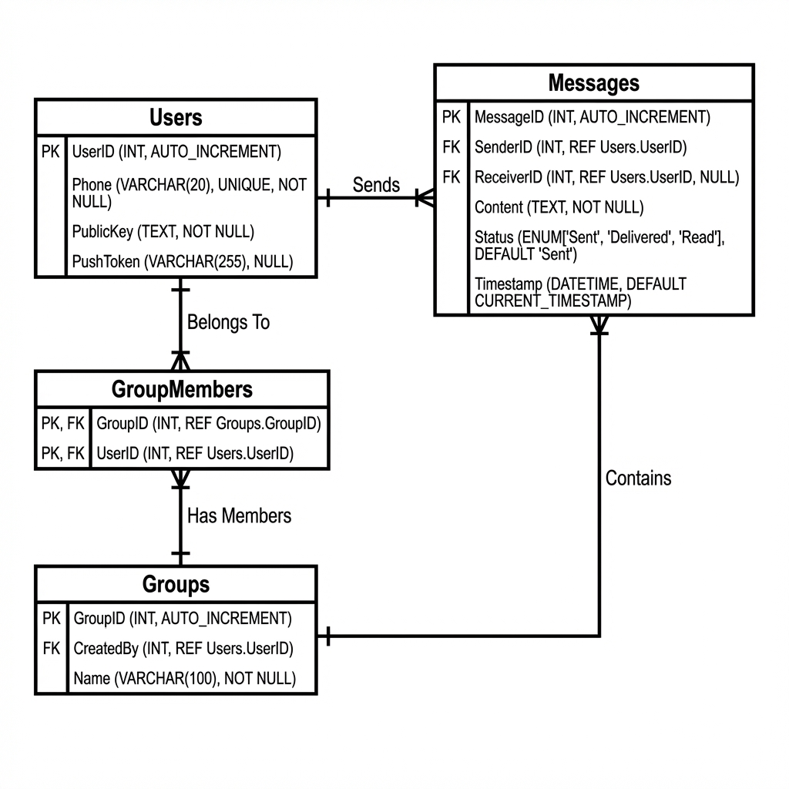

# Designing WhatsApp (Real-time Chat)

**WhatsApp** বা **Facebook Messenger** এর মতো সিস্টেম ডিজাইন করা হলো **Real-time Communication** সিস্টেম ডিজাইনের সেরা উদাহরণ। এখানে চ্যালেঞ্জ হলো বিলিয়ন ইউজারের মধ্যে খুব কম ল্যাটেন্সিতে ম্যাসেজ আদান-প্রদান করা।

## 1. Requirements (রিকয়রমেন্টস)

### Functional Requirements

1.  **1-on-1 Chat:** দুইজন ইউজার রিয়েল-টাইমে ম্যাসেজ পাঠাতে পারবে।
2.  **Group Chat:** একাধিক ইউজার (২৫৬ বা ৫১২ জন) একসাথে চ্যাট করতে পারবে।
3.  **Receipts:** Sent (✔), Delivered (✔✔), Read (Blue ✔✔) একনলেজমেন্ট থাকতে হবে।
4.  **Online/Last Seen Status:** ইউজার অনলাইনে আছে কিনা তা দেখা যাবে।
5.  **Media Sharing:** ইমেজ, ভিডিও এবং ফাইল আদান-প্রদান।

### Non-Functional Requirements

1.  **Low Latency:** ম্যাসেজ পাঠানোর সাথে সাথেই ডেলিভার হতে হবে।
2.  **High Availability:** সিস্টেম ডাউন হওয়া চলবে না।
3.  **Scale:** ২ বিলিয়ন+ ইউজার হ্যান্ডেল করতে হবে।

---

## 2. Capacity Estimation

- **Daily Active Users (DAU):** 2 Billion.
- **Messages per day:** 100 Billion.
- **Media Sharing:** 10% messages contain media.

### Bandwidth Estimation

- টেক্সট ম্যাসেজ খুব ছোট (100 Bytes)।
- 100 Billion \* 100 Bytes = 10 TB / day text data.
- মিডিয়া ফাইল অনেক বেশি ব্যান্ডউইথ নিবে।

---

## 3. High-Level Design (HLD)

টুইটার বা ইউটিউবের মতো HTTP Request/Response মডেল এখানে কাজ করবে না, কারণ HTTP তে সার্ভার ক্লায়েন্টকে নিজে থেকে পুশ করতে পারে না (Polling ছাড়া)। তাই আমরা **WebSocket** ব্যবহার করব।

### Architecture Overview

নিচে একটি হাই-লেভেল আর্কিটেকচার ডায়াগ্রাম দেওয়া হলো:


```mermaid
flowchart TD
    UserA[User A]
    UserB[User B]
    LB[Load Balancer]
    WebSocket[WebSocket Gateway / Chat Server]

    subgraph Services
        AuthService[Auth Service]
        GroupService[Group Mgmt Service]
        PresenceService[Presence Service (Online Status)]
        MediaService[Asset Service]
    end

    subgraph Storage
        Redis[(Redis - Presence & Cache)]
        HBase[(HBase/Cassandra - Chat History)]
        S3[(Object Storage - Media)]
    end

    UserA <-->|WebSocket Connection| LB
    UserB <-->|WebSocket Connection| LB
    LB <--> WebSocket

    WebSocket --> AuthService
    WebSocket --> Redis
    WebSocket --> HBase
    WebSocket --> PresenceService
```

### Protocol: WebSocket vs HTTP polling

- **HTTP Polling:** ক্লায়েন্ট বারবার সার্ভারকে জিজ্ঞেস করে "নতুন ম্যাসেজ আছে?" (অদক্ষ)।
- **Long Polling:** সার্ভার রিকোয়েস্ট হোল্ড করে রাখে যতক্ষণ না নতুন ডেটা আসে।
- **WebSocket (Best):** সার্ভার এবং ক্লায়েন্টের মধ্যে একটি **Persistent Connection** তৈরি হয়। সার্ভার যেকোনো সময় ক্লায়েন্টকে ম্যাসেজ পুশ করতে পারে। WhatsApp ঠিক এটাই ব্যবহার করে।

---

## 4. Deep Dive: Message Delivery Flow

### Scenario A: User B is Online

1.  **User A** চ্যাট সার্ভারে ম্যাসেজ পাঠায় (via WebSocket)।
2.  **Chat Server** দেখে User B কোন গেটওয়ে মেশিনে কানেক্টেড আছে (Redis এ ম্যাপিং থাকে)।
3.  সার্ভার সরাসরি সেই কানেকশন দিয়ে User B কে ম্যাসেজ পুশ করে দেয়।

### Scenario B: User B is Offline

1.  **User A** ম্যাসেজ পাঠায়।
2.  **Chat Server** দেখে User B অফলাইন।
3.  সার্ভার ম্যাসেজটি **Database (HBase/Cassandra)**-তে স্টোর করে রাখে।
4.  User B যখন অনলাইন হয়, তখন সার্ভার পেন্ডিং সব ম্যাসেজ তাকে ডেলিভার করে দেয় (Store and Forward)।

---

## 5. deep Dive: End-to-End Encryption (E2EE)

WhatsApp এর অন্যতম ফিচার হলো E2EE। সার্ভার নিজেও ম্যাসেজ পড়তে পারে না।
এটি **Signal Protocol** ব্যবহার করে কাজ করে।

1.  লগইন করার সময় প্রতিটি ইউজার `Public Key` এবং `Private Key` জেনারেট করে।
2.  `Public Key` সার্ভারে আপলোড করা থাকে।
3.  User A যখন User B কে ম্যাসেজ পাঠায়, সে User B এর `Public Key` দিয়ে ম্যাসেজ এনক্রিপ্ট করে।
4.  এই এনক্রিপ্ট করা ম্যাসেজ শুধু User B তার নিজের `Private Key` দিয়ে ডিক্রিপ্ট করতে পারে।

---

## 6. Database Schema Design

চ্যাট হিস্ট্রির জন্য আমাদের এমন ডেটাবেস দরকার যা প্রচুর রাইট (Write) হ্যান্ডেল করতে পারে।

- **MySQL?** না, স্কেল করা কঠিন হবে ১০০ বিলিয়ন ম্যাসেজের জন্য।
- **HBase / Cassandra:** সেরা অপশন। এগুলো **Wide-column** স্টোর এবং Write-heavy অপারেশনের জন্য অপ্টিমাইজড। Facebook Messenger মূলত **HBase** ব্যবহার করে।

### Visual Schema Design

নিচে এন্টিটি রিলেশনশিপ ডায়াগ্রামের একটি উদাহরণ দেওয়া হলো:



---

## 7. Summary

- **Protocol:** WebSocket for low latency.
- **Database:** HBase/Cassandra for infinite chat history.
- **Offline Handling:** Store and Forward mechanism.
- **Security:** End-to-End Encryption using Signal Protocol.
