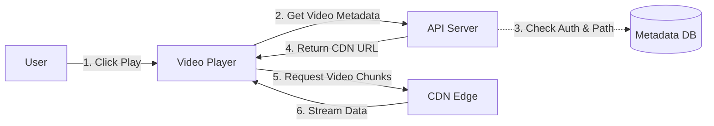
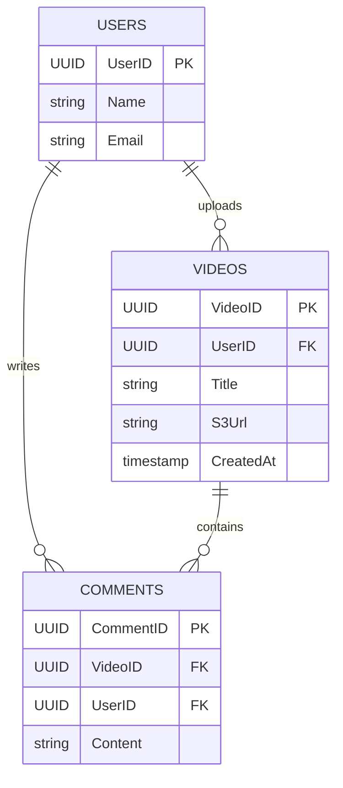

# Designing YouTube (Netflix/Twitch Similar)

সিস্টেম ডিজাইন ইন্টারভিউতে "YouTube" বা "Netflix" ডিজাইন করতে বলা একটি ক্লাসিক প্রশ্ন। এটি একটি **Heavy Read & Heavy Write** সিস্টেম, যেখানে প্রচুর স্টোরেজ এবং ব্যান্ডউইথ প্রয়োজন।

এই গাইডে আমরা একদম শুরু থেকে শেষ পর্যন্ত একটি স্কেলেবল ভিডিও স্ট্রিমিং প্লাটফর্ম ডিজাইন করব।

## 1. Requirements (রিকয়রমেন্টস)

সিস্টেম ডিজাইনের শুরুতে আমাদের রিকয়রমেন্টস ক্লিয়ার করে নিতে হবে।

### Functional Requirements (ফিচারস)

1.  **Upload Video:** ইউজাররা ভিডিও আপলোড করতে পারবে।
2.  **View Video:** ইউজাররা যেকোনো ডিভাইসে ভিডিও দেখতে পারবে।
3.  **Search:** ভিডিও টাইটেল দিয়ে সার্চ করা যাবে।
4.  **Like/Comment:** ভিডিওতে লাইক ও কমেন্ট করা যাবে।
5.  **Analytics:** ভিউ কাউন্ট দেখা যাবে।

### Non-Functional Requirements (কোয়ালিটি)

1.  **High Availability:** সিস্টেম সবসময় চালু থাকতে হবে।
2.  **High Reliability:** আপলোড করা ভিডিও কখনো হারানো যাবে না।
3.  **Low Latency:** ভিডিও প্লে বাফার ছাড়া চলতে হবে (Real-time)।
4.  **Scalability:** মিলিয়ন ইউজার হ্যান্ডেল করতে হবে।

---

## 2. Capacity Estimation (ক্যাপাসিটি এস্টিমেশন)

ডিজাইন করার আগে আমাদের সিস্টেমের স্কেল বোঝা জরুরি।

- **Total Users:** 1 Billion (100 কোটি)
- **Daily Active Users (DAU):** 100 Million (10 কোটি)
- ধরি, একজন ইউজার দিনে গড়ে ৫টি ভিডিও দেখে।

### Storage Estimation (স্টোরেজ)

- ধরি, প্রতিদিন **500,000** নতুন ভিডিও আপলোড হয়।
- গড় ভিডিও সাইজ: **300 MB**।
- Daily Storage Needed = 500,000 \* 300 MB = **150 TB / day**
- **5 Years Storage:** 150 TB _ 365 _ 5 ≈ **275 PB (Petabytes)**

> [!NOTE]
> বিশাল এই স্টোরেজ ম্যানেজ করার জন্য আমাদের **Blob Storage (Amazon S3 / Azure Blob)** ব্যবহার করতে হবে এবং পুরোনো ভিডিওগুলো **Cold Storage (AWS Glacier)**-এ মুভ করতে হবে খরচ কমানোর জন্য।

### Bandwidth Estimation (ব্যান্ডউইথ)

- ধরি, প্রতি সেকেন্ডে ১ মিলিয়ন ভিউ হচ্ছে।
- প্রতি সেকেন্ডে কত ডেটা ট্রান্সফার হচ্ছে? যদি ১ এমবিপিএস স্পিড ধরি, তবে **1 TB/sec** ব্যান্ডউইথ লাগতে পারে। এর জন্য **CDN (Content Delivery Network)** মাস্ট।

---

## 3. High-Level Design (HLD)

পুরো সিস্টেমটিকে আমরা কয়েকটি বড় ভাগে ভাগ করতে পারি। নিচে একটি বেসিক আর্কিটেকচার ডায়াগ্রাম দেওয়া হলো:


```mermaid
flowchart TD
    User[Clients (Mobile/Web)]
    LB[Load Balancer]
    WebServer[API Servers]

    subgraph Services
        Auth[Auth Service]
        Upload[Upload Service]
        Stream[Streaming Service]
        Search[Search Service]
    end

    subgraph StorageLayer
        DB[(Metadata DB - MySQL)]
        Blob[(Video Storage - S3)]
        Cache[(Redis Cache)]
    end

    CDN[CDN (Cloudflare/Akamai)]

    User -->|1. HTTPS Request| LB
    LB -->|2. Forward| WebServer
    WebServer -->|3. Validate| Auth
    WebServer -->|4. Upload Process| Upload
    WebServer -->|5. Stream Request| Stream
    WebServer -->|6. Search Query| Search

    Upload -->|7. Store Raw Video| Blob
    Upload -->|8. Save Metadata| DB
    Stream -->|9. Get Stream URL| CDN
    CDN -->|10. Fetch if miss| Blob
    Search -->|11. Query Index| DB

    WebServer -.->|Cache Hit/Miss| Cache
```

## 4. Detailed Component Design

এখন আমরা প্রতিটি কম্পোনেন্টকে বিস্তারিতভাবে ভাঙব।

### A. Video Upload Flow (ভিডিও আপলোড ফ্লো)

ভিডিও আপলোড একটি ভারী প্রসেস। এটি সরাসরি সার্ভারে আপলোড না করে আমারা ক্লাউড স্টোরেজে পাঠাব।

1.  ক্লায়েন্ট সার্ভারের কাছে রিকোয়েস্ট করে: "আমি একটি ভিডিও আপলোড করতে চাই"।
2.  সার্ভার অথেন্টিকেশন চেক করে এবং **Amazon S3 Pre-signed URL** রিটার্ন করে।
3.  ক্লায়েন্ট সরাসরি সেই URL-এ ভিডিও আপলোড করে (সার্ভারের ওপর লোড পড়ে না)।
4.  আপলোড শেষ হলে S3 একটি ইভেন্ট ট্রিগার করে এবং **Message Queue (Kafka)** তে মেসেজ পাঠায়—"Transcoding Needed"।

**Transcoding/Encoding কেন দরকার?**
একটি ভিডিওর অরিজিনাল ফাইল (ধরুন .mov বা .avi) অনেক বড় সাইজের হয়। সব ডিভাইসে (Mobile, TV, Laptop) এটি প্লে নাও হতে পারে। তাই ভিডিওটিকে প্রসেস করে `.mp4` বা `.hls` ফরম্যাটে কনভার্ট করতে হয় এবং বিভিন্ন রেজোলিউশনে (360p, 720p, 1080p, 4K) ভেঙে ফেলতে হয়।

```mermaid
flowchart LR
    User -->|1. Request Upload URL| APIServer
    APIServer -->|2. Returns Pre-signed URL| User
    User -->|3. Upload Video| S3[Original Storage (S3)]
    S3 -->|4. Trigger Event| Kafka[Message Queue]
    Kafka -->|5. Consume Task| Encoder[Transcoding Service]
    Encoder -->|6. Process Video| S3Final[Processed Storage]
    S3Final -->|7. Update Status| DB[(Metadata DB)]
```

### B. Video Streaming Flow (ভিডিও স্ট্রিমিং)

আমরা কখনোই সরাসরি হার্ড ড্রাইভ বা S3 থেকে ভিডিও স্ট্রিম করব না। এতে ল্যাটেন্সি বাড়বে। আমরা **CDN (Content Delivery Network)** ব্যবহার করব।

- **Adaptive Bitrate Streaming (HLS/DASH):**
  ইউজারের ইন্টারনেটের স্পিড অনুযায়ী ভিডিওর কোয়ালিটি অটোমেটিক চেঞ্জ হবে। নেট স্লো হলে 360p, ফাস্ট হলে 1080p চলবে। এর জন্য ভিডিওকে ছোট ছোট **Chunk** (৫-১০ সেকেন্ডের ক্লিপ) এ ভাগ করে রাখা হয়।

- **Flow:**
  1.  ইউজার ভিডিওতে ক্লিক করল।
  2.  সার্ভার ভিডিওর মেটাডেটা এবং স্ট্রিমিং URL (M3U8 ফাইল) দিল।
  3.  ভিডিও প্লেয়ার সেই URL থেকে সবচেয়ে কাছের **CDN Edge Server** থেকে ভিডিওর চাংক ডাউনলোড শুরু করল।



### C. Database Design (ডেটাবেস ডিজাইন)

আমাদের দুই ধরনের ডেটা আছে:

1.  **Video Metadata:** Title, Description, Uploader ID, Size.
2.  **User Data:** Name, Email, Password.
3.  **Videos:** এটি ডেটাবেসে নয়, **Object Storage (S3)** এ থাকবে।

**SQL নাকি NoSQL?**

- **Metadata (Users, Video Info):** রিলেশনাল ডেটা ও স্ট্রাকচার্ড, তাই **MySQL** বা **PostgreSQL** ভালো। আমরা **Sharding** ব্যবহার করতে পারি (User ID বা Video ID দিয়ে) স্কেল করার জন্য।
- **Comments/Likes:** বিশাল পরিমাণের ডেটা এবং রিলেশনশিপ কম, তাই **NoSQL (Cassandra বা MongoDB)** ভালো হবে।

**Entity Relationship (ER) Diagram:**



**Schema Example (MySQL):**

**Videos Table:**
| Column | Type | Description |
| :--- | :--- | :--- |
| VideoID | UUID | Primary Key (Sharding Key) |
| UserID | UUID | Owner |
| Title | VARCHAR | |
| S3Url | VARCHAR | Path to file |
| Thumbnail | VARCHAR | Path to image |
| CreatedAt | Timestamp | |

## 5. Scalability & Optimization

সিস্টেমটি স্কেল করার জন্য আমরা কী কী টেকনিক ব্যবহার করব?

1.  **Database Sharding:**
    হাজার কোটি ভিডিওর মেটাডেটা একটি সার্ভারে রাখা অসম্ভব। আমরা `VideoID` এর ওপর ভিত্তি করে ডেটাবেস শার্ডিং করতে পারি।

2.  **Caching (Redis/Memcached):**
    কিছু ভিডিও খুব পপুলার হয় (Viral Videos)। এগুলোর মেটাডেটা বারবার ডেটাবেস থেকে না এনে **Cache**-এ রাখব। এতে রেসপন্স টাইম মিলি-সেকেন্ডে নেমে আসবে।

    > [!TIP]
    > **Pareto Principle (80/20 Rule):** ২০% পপুলার ভিডিও ৮০% ট্রাফিক জেনারেট করে। তাই শুধু পপুলার ভিডিওগুলো ক্যাশ করলেই বিশাল লাভ হবে।

3.  **CDN Optimization:**
    সব ভিডিও সব CDN-এ রাখার দরকার নেই। পপুলার ভিডিওগুলো সব রিজিয়নের CDN-এ রেপ্লিকেট করা হবে। কম পপুলার ভিডিওগুলো মেইন সার্ভার থেকে অন-ডিমান্ড আনা হবে।

4.  **Dedupucation:**
    একই ভিডিও বারবার আপলোড হলে আমরা ডুপ্লিকেট চেক (MD5 Checksum) করে স্টোরেজ বাঁচাতে পারি।

## 6. Summary

- **Upload:** Pre-signed URL -> S3 -> Kafka -> Workers -> Processed S3.
- **Stream:** CDN -> Adaptive Bitrate (HLS) -> Video Player.
- **Database:** SQL for Metadata (Sharded), NoSQL for Comments.
- **Performance:** Caching for Viral Content, CDN for Global Reach.

এই ডিজাইনটি ফলো করলে আপনি ইন্টারভিউতে একটি স্ট্রং এবং স্কেলেবল আর্কিটেকচার প্রেজেন্ট করতে পারবেন।
