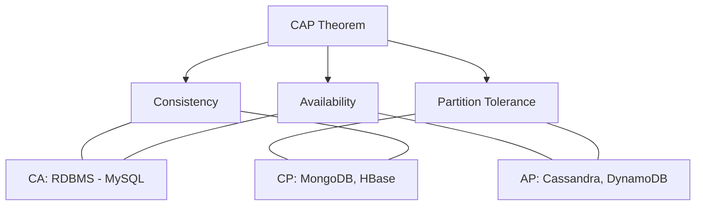

# CAP Theorem Deep-Dive

ডিস্ট্রিবিউটেড সিস্টেম ডিজাইনের সবচেয়ে মৌলিক এবং গুরুত্বপূর্ণ থিওরি হলো **CAP Theorem**। বিজ্ঞানী এরিক ব্রাওয়ার (Eric Brewer) এটি প্রথম প্রস্তাব করেছিলেন।

## CAP এর পূর্ণরূপ কি?

১. **Consistency (কন্সিস্টেন্সি):** সিস্টেমের সব নোড (Node) বা সার্ভার একই সময়ে একই ডেটা দেখাবে। মানে সব ইউজার সবসময় লেটেস্ট ডেটা পাবে।
২. **Availability (অ্যাভেইল্যাবিলিটি):** সিস্টেম সবসময় সচল থাকবে এবং প্রতিটি রিকোয়েস্টের রেসপন্স দেবে (সেটা ওল্ড ডেটা হলেও)।
৩. **Partition Tolerance (পার্টিশন টলারেন্স):** যদি নেটওয়ার্ক ফেইলুর হয় বা সার্ভারগুলোর মধ্যে যোগাযোগ বিচ্ছিন্ন হয়ে যায়, তবুও সিস্টেম কাজ চালিয়ে যাবে।

## মূল থিওরি

> [!IMPORTANT]
> একটি ডিস্ট্রিবিউটেড সিস্টেমে আপনি এই ৩টির মধ্যে সর্বোচ্চ ২টিকে পুরোপুরি বেছে নিতে পারেন। ৩টি একসাথে ১০০% পাওয়া অসম্ভব।

আধুনিক ইন্টারনেটে নেটওয়ার্ক ফেইলুর হতেই পারে, তাই **Partition Tolerance (P)** আমাদের বাধ্যতামূলকভাবে মেনে নিতে হয়। তাই লজিক্যালি যুদ্ধটি হয় **C (Consistency)** বনাম **A (Availability)** এর মধ্যে।

## ৩টি কম্বিনেশন

### ১. CP (Consistency + Partition Tolerance)
এখানে নেটওয়ার্ক ফেইলুর হলে সিস্টেম ডেটা কন্সিস্টেন্সি রক্ষার জন্য কিছু সার্ভার সাময়িকভাবে বন্ধ বা রিড-অনলি করে দেয়। ফলে কিছু রিকোয়েস্ট ফেইল করতে পারে (Availability হারায়)।
*   **উদাহরণ:** MongoDB, Redis (Shared Mode), Google Spanner.

### ၂. AP (Availability + Partition Tolerance)
এখানে নেটওয়ার্ক ফেইলুর হলেও সিস্টেম সবসময় রেসপন্স দেবে। এমনকি যদি সব সার্ভারে ডেটা আপডেট নাও হয়, তবুও সিস্টেম ইউজারকে পুরানো ডেটা হলেও দেখাবে।
*   **উদাহরণ:** Cassandra, DynamoDB, CouchDB.

### ৩. CA (Consistency + Availability)
এটি শুধুমাত্র তখনই সম্ভব যখন একটি সিঙ্গেল ডেটাবেস সার্ভার থাকে যেখানে নেটওয়ার্ক পার্টিশন হওয়ার সম্ভাবনা নেই। ডিস্ট্রিবিউটেড সিস্টেমে এটি প্র্যাকটিক্যালি অসম্ভব।
*   **উদাহরণ:** সিঙ্গেল নোড MySQL বা PostgreSQL।

## ডায়াগ্রামের মাধ্যমে বোঝা

---

## কেন এটি জানা জরুরি?

সিস্টেম ডিজাইন করার সময় আপনার রিকোয়ারমেন্ট বুঝে ডিসিশন নিতে হয়। যেমন:
- আপনি কি একটি ব্যাংকিং সিস্টেম বানাচ্ছেন? তবে আপনার **Consistency (CP)** দরকার।
- আপনি কি একটি সোশ্যাল মিডিয়া ফিড বানাচ্ছেন যেখানে ভুল তথ্য বা পুরানো তথ্য দেখালেও বড় সমস্যা নেই কিন্তু লোডিং ফাস্ট হতে হবে? তবে আপনার **Availability (AP)** দরকার।

> [!NOTE]
> আধুনিক অনেক ডেটাবেস এখন কন্সিস্টেন্সি এবং অ্যাভেইল্যাবিলিটির মধ্যে অ্যাডজাস্ট করার অপশন দেয় (যেমন: PACELC theorem)।
